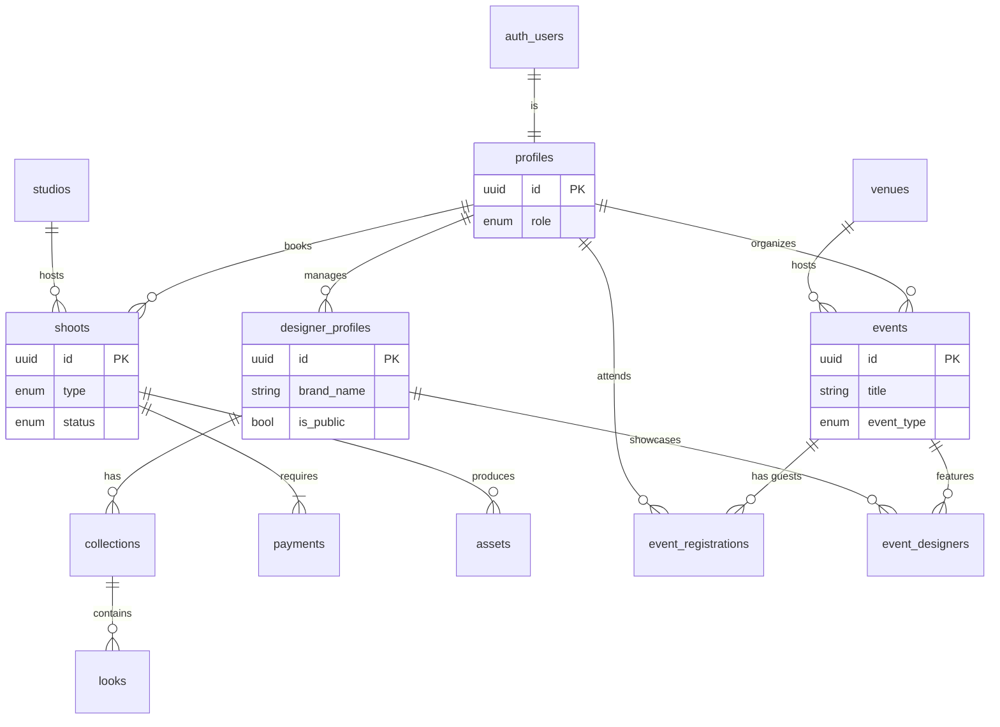

# 🗄️ FashionOS Database Schema (MVP)

**Version:** 2.0  
**Target:** Supabase (PostgreSQL 15+)  
**Scope:** MVP (Shoot Bookings + Events + Fashion Directory)

---

## 1. 🏗️ High-Level Architecture

The FashionOS database is architected around three distinct but interconnected domains, unified by a central user identity system.

### A. Core Identity
*   **Profiles:** The central node linking a Supabase Auth User to their role in the ecosystem (Designer, Model, Organizer, Admin).

### B. Shoot Bookings (Transactional)
*   **Shoots:** The core booking entity linking a Designer to a Studio.
*   **Lifecycle:** Tracks the status of a production (`draft` -> `shooting` -> `delivered`).
*   **Assets:** Secure storage for final photo/video deliverables.

### C. Events (Experiential)
*   **Events:** Manages physical or virtual fashion events (Runways, Pop-ups).
*   **Venues:** Reusable locations for events.
*   **Registrations:** Handles RSVPs and guest lists.

### D. Fashion Directory (Public Data)
*   **Designer Profiles:** Public-facing brand pages.
*   **Collections & Looks:** Hierarchical data showcasing seasonal work.

---

## 2. 🔗 Entity Relationship Diagram (ERD)



---

## 3. 💻 SQL Definition (DDL)

Copy and paste the following SQL into the Supabase SQL Editor to initialize the project.

### I. Extensions & Enums

```sql
-- Enable UUID extension
create extension if not exists "uuid-ossp";

-- 1. USER ROLES
create type user_role as enum ('designer', 'studio_admin', 'organizer', 'photographer', 'model', 'attendee', 'admin');

-- 2. SHOOT ENUMS
create type shoot_type as enum ('photo', 'video', 'hybrid');
create type shoot_status as enum ('draft', 'requested', 'confirmed', 'shooting', 'editing', 'delivered', 'cancelled');
create type location_type as enum ('virtual', 'studio');
create type payment_status as enum ('pending', 'paid', 'refunded', 'failed');
create type asset_type as enum ('image', 'video', 'document');

-- 3. EVENT ENUMS
create type event_type as enum ('runway_show', 'presentation', 'pop_up', 'trunk_show', 'workshop', 'networking', 'party');
create type event_status as enum ('draft', 'published', 'live', 'completed', 'cancelled');
create type registration_status as enum ('registered', 'waitlist', 'checked_in', 'cancelled', 'no_show');
create type registration_type as enum ('general', 'vip', 'media', 'buyer', 'staff');

-- 4. DIRECTORY ENUMS
create type season_type as enum ('ss', 'aw', 'resort', 'pre_fall', 'bridal', 'capsule');
```

### II. Core Tables

```sql
-- 1. PROFILES
-- Central identity table
create table profiles (
  id uuid references auth.users on delete cascade primary key,
  email text not null,
  full_name text,
  role user_role default 'designer',
  avatar_url text,
  created_at timestamptz default now(),
  updated_at timestamptz default now()
);

-- 2. ORGANIZATIONS (Optional for MVP, good for future scaling)
create table organizations (
  id uuid default uuid_generate_v4() primary key,
  name text not null,
  slug text unique not null,
  type text check (type in ('studio', 'agency', 'brand')),
  created_at timestamptz default now()
);
```

### III. Fashion Directory Tables

```sql
-- 3. DESIGNER PROFILES
-- Public facing brand/designer pages
create table designer_profiles (
  id uuid default uuid_generate_v4() primary key,
  owner_profile_id uuid references profiles(id), -- User who manages this brand
  display_name text not null,
  slug text unique not null,
  bio text,
  website_url text,
  instagram_handle text,
  city text,
  country text,
  aesthetic_tags text[], -- e.g. ['minimalist', 'streetwear']
  is_public boolean default false,
  featured_image_url text,
  created_at timestamptz default now(),
  updated_at timestamptz default now()
);

-- 4. COLLECTIONS
-- Grouping of looks (e.g., "Spring/Summer 2025")
create table collections (
  id uuid default uuid_generate_v4() primary key,
  designer_profile_id uuid references designer_profiles(id) on delete cascade,
  name text not null,
  season season_type not null,
  year integer not null,
  theme text,
  lookbook_url text, -- Link to PDF or external gallery
  is_public boolean default true,
  created_at timestamptz default now()
);

-- 5. LOOKS
-- Individual outfits/items
create table looks (
  id uuid default uuid_generate_v4() primary key,
  collection_id uuid references collections(id) on delete cascade,
  look_number integer,
  name text,
  category text, -- 'dress', 'outerwear'
  description text,
  image_url text,
  product_links jsonb, -- e.g. [{"store": "shopify", "url": "..."}]
  created_at timestamptz default now()
);
```

### IV. Shoot Booking Tables

```sql
-- 6. STUDIOS
create table studios (
  id uuid default uuid_generate_v4() primary key,
  name text not null,
  slug text unique not null,
  city text not null,
  address text,
  contact_email text,
  is_active boolean default true,
  features text[],
  created_at timestamptz default now()
);

-- 7. SHOOTS
create table shoots (
  id uuid default uuid_generate_v4() primary key,
  designer_id uuid references profiles(id) not null,
  studio_id uuid references studios(id), -- Nullable if virtual
  
  shoot_type shoot_type not null,
  fashion_category text not null, -- 'ecommerce', 'lookbook'
  looks_range text, -- '1-3', '4-7'
  location_type location_type default 'studio',
  
  scheduled_start timestamptz,
  scheduled_end timestamptz,
  
  status shoot_status default 'draft',
  brief_text text,
  reference_links text[],
  
  created_at timestamptz default now(),
  updated_at timestamptz default now()
);

-- 8. PAYMENTS
create table payments (
  id uuid default uuid_generate_v4() primary key,
  shoot_id uuid references shoots(id) on delete cascade,
  designer_id uuid references profiles(id),
  amount integer not null, -- in cents
  currency text default 'usd',
  status payment_status default 'pending',
  provider_payment_id text,
  created_at timestamptz default now()
);

-- 9. ASSETS
create table assets (
  id uuid default uuid_generate_v4() primary key,
  shoot_id uuid references shoots(id) on delete cascade,
  url text not null,
  asset_type asset_type not null,
  thumbnail_url text,
  status text default 'final',
  created_at timestamptz default now()
);
```

### V. Event Tables

```sql
-- 10. VENUES
create table venues (
  id uuid default uuid_generate_v4() primary key,
  name text not null,
  address text,
  city text not null,
  capacity integer,
  map_url text,
  created_at timestamptz default now()
);

-- 11. EVENTS
create table events (
  id uuid default uuid_generate_v4() primary key,
  organizer_id uuid references profiles(id) not null,
  venue_id uuid references venues(id),
  
  title text not null,
  slug text unique,
  description text,
  event_type event_type not null,
  status event_status default 'draft',
  
  start_time timestamptz not null,
  end_time timestamptz,
  
  is_public boolean default true,
  featured_image_url text,
  capacity_limit integer,
  
  created_at timestamptz default now(),
  updated_at timestamptz default now()
);

-- 12. EVENT REGISTRATIONS (RSVPs)
create table event_registrations (
  id uuid default uuid_generate_v4() primary key,
  event_id uuid references events(id) on delete cascade,
  profile_id uuid references profiles(id),
  
  type registration_type default 'general',
  status registration_status default 'registered',
  qr_code_data text,
  
  created_at timestamptz default now(),
  unique(event_id, profile_id) -- One RSVP per user per event
);

-- 13. EVENT DESIGNERS (Linking Directory to Events)
create table event_designers (
  id uuid default uuid_generate_v4() primary key,
  event_id uuid references events(id) on delete cascade,
  designer_profile_id uuid references designer_profiles(id) on delete cascade,
  role text default 'showcasing', -- 'showcasing', 'sponsor', 'host'
  created_at timestamptz default now()
);
```

### VI. Indexes

```sql
-- User lookups
create index idx_profiles_role on profiles(role);
create index idx_designer_owner on designer_profiles(owner_profile_id);

-- Shoot lookups
create index idx_shoots_designer on shoots(designer_id);
create index idx_shoots_status on shoots(status);

-- Directory lookups
create index idx_collections_designer on collections(designer_profile_id);
create index idx_looks_collection on looks(collection_id);

-- Event lookups
create index idx_events_organizer on events(organizer_id);
create index idx_events_start on events(start_time);
create index idx_registrations_event on event_registrations(event_id);
create index idx_registrations_user on event_registrations(profile_id);
```

---

## 4. 🛡️ Row Level Security (RLS) Policies

We must enable RLS on all tables to ensure data privacy and correct access control.

```sql
-- Enable RLS on all tables
alter table profiles enable row level security;
alter table designer_profiles enable row level security;
alter table collections enable row level security;
alter table looks enable row level security;
alter table shoots enable row level security;
alter table assets enable row level security;
alter table events enable row level security;
alter table event_registrations enable row level security;
```

### Policy Examples

#### A. Profiles
*   **Public:** Anyone can view basic profile info (useful for guest lists).
*   **Owner:** Only the user can update their own profile.

```sql
create policy "Profiles are viewable by everyone" 
  on profiles for select using ( true );

create policy "Users can update own profile" 
  on profiles for update using ( auth.uid() = id );
```

#### B. Fashion Directory (Public vs Private)
*   **Public Read:** Anyone can view `designer_profiles`, `collections`, `looks` if `is_public` is true.
*   **Owner Write:** Only the `owner_profile_id` can edit their directory pages.

```sql
-- READ
create policy "Public designer profiles are viewable" 
  on designer_profiles for select using ( is_public = true );

create policy "Owners see their own non-public profiles" 
  on designer_profiles for select using ( auth.uid() = owner_profile_id );

-- WRITE
create policy "Owners can update their designer profile" 
  on designer_profiles for update using ( auth.uid() = owner_profile_id );
```

#### C. Shoots (Private)
*   **Private:** Only the designer who booked it (or admins) can see.

```sql
create policy "Designers view own shoots" 
  on shoots for select using ( auth.uid() = designer_id );

create policy "Designers insert own shoots" 
  on shoots for insert with check ( auth.uid() = designer_id );
```

#### D. Events
*   **Public Read:** Published events are visible to everyone.
*   **Organizer Write:** Only the organizer can edit event details.

```sql
create policy "Published events are viewable" 
  on events for select using ( status = 'published' or status = 'live' or status = 'completed' );

create policy "Organizers view all their own events" 
  on events for select using ( auth.uid() = organizer_id );

create policy "Organizers can update own events" 
  on events for update using ( auth.uid() = organizer_id );
```

#### E. Registrations
*   **User:** Can see their own tickets.
*   **Organizer:** Can see all tickets for events they run.

```sql
create policy "Users view own registrations" 
  on event_registrations for select using ( auth.uid() = profile_id );

create policy "Organizers view registrations for their events" 
  on event_registrations for select 
  using ( exists (
    select 1 from events 
    where events.id = event_registrations.event_id 
    and events.organizer_id = auth.uid()
  ));
```