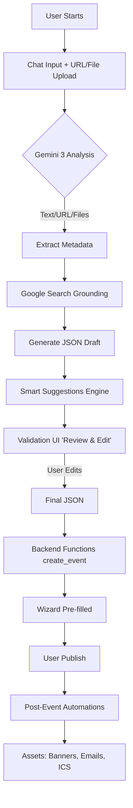
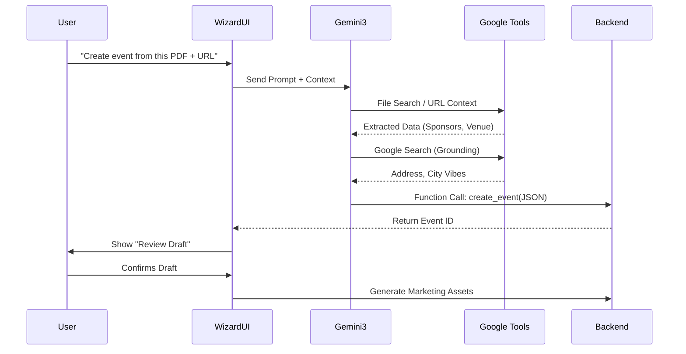

# 🪄 Event Wizard AI Integration Plan

Here’s a comprehensive plan to use **Gemini 3 + Google AI Studio** to power your **Event Wizard**, transforming a simple **chat box + URL/File** input into a fully configured event listing, workflow, and revenue system.

---

## 1. Quick Summary

**Goal:**
User types a short description, pastes a URL (old event page, venue site), or uploads files (PDF contracts, spreadsheets).
Gemini 3:
1.  **Reads** text, URLs, and files (using File Search).
2.  **Searches** the web for missing context (Google Search Grounding).
3.  **Extracts** deep metadata: Sponsors, Speakers, Audience, Budget.
4.  **Outputs** clean **event JSON** matching your schema.
5.  **Calls** backend functions (`create_event`) to pre-fill the 6-stage wizard.
6.  **Suggests** smart defaults (pricing, capacity).
7.  **Generates** post-event assets (social posts, emails).

We layer this on your existing **6-stage Event Creation Wizard** (Event Basics → Venue → Schedule → Ticketing → Payments → Review & Publish).

---

## 2. Core User Journey (The "Maria" Flow)

**Persona:** Maria, event organizer.

1.  **Start**
    *   Maria opens “Create Event with AI”.
    *   **Prompt:** “Describe your event in 2–3 sentences. Paste a URL or upload files (old event page, venue PDF, sponsor deck).”

2.  **Input**
    *   She types: *“Sustainable Fashion Night in Medellín, 300 people, runway + networking. Focus on local sustainable brands.”*
    *   She uploads: `Venue_Contract.pdf` and pastes `https://mariafashionweek.com/2024-event`.

3.  **Gemini 3: Understand & Collect**
    *   **URL Context + File Search**: Reads the website for brand tone and the PDF for capacity/rules.
    *   **Metadata Extraction**: Identifies sponsor tiers, speaker names, and target audience profiles from the docs.
    *   **Google Search**: Looks up the venue's exact address and recent reviews to populate the description.
    *   **Thinking**: Suggests a schedule based on similar successful events.

4.  **Structured Event Draft & Smart Defaults**
    *   Gemini outputs JSON and suggests:
        *   **Ticket Tiers**: "VIP (Front Row)" @ $150, "General" @ $50 (based on inferred budget).
        *   **Schedule**: 19:00 Door Open, 20:00 Runway, 21:00 Networking.

5.  **Validation & Human-Check**
    *   Maria sees a **"Review & Edit"** summary screen.
    *   She tweaks the VIP price.
    *   Gemini updates the model.

6.  **Wizard Pre-fill**
    *   The system calls `create_event` and redirects Maria to the **Event Wizard**, 90% filled.
    *   She clicks through: Basics ✅, Venue ✅, Schedule ✅, Tickets ✅.

7.  **Post-Creation & Assets**
    *   Maria clicks **Publish**.
    *   **Auto-Trigger**:
        *   **Image Gen**: Hero banner created (`gemini-3-pro-image-preview`).
        *   **Text Gen**: Email blast to invitees and WhatsApp social blurb.
        *   **Utility**: ICS calendar file generated.

---

## 3. Visual Workflows (Mermaid)

### 🌊 AI User Journey Flow



### 🧠 Gemini 3 Integration Logic



---

## 4. Feature Map: Gemini Tools

| Layer | Feature | Gemini 3 Tools | Description |
| :--- | :--- | :--- | :--- |
| **Intake** | Multi-source Input | **File Search, URL Context** | Ingests PDFs (contracts), Spreadsheets (guest lists), and URLs. |
| **Extraction** | Deep Metadata | **Document Processing** | Extracts Sponsors, Speakers, Audience profiles, and Budget KPIs. |
| **Enrichment** | Contextual Data | **Google Search Grounding** | Finds venue addresses, map coordinates, and local trends. |
| **Output** | DB-Ready Data | **Structured Output (JSON)** | Forces output to match your `events`, `tickets`, `schedule` schema. |
| **Logic** | Smart Defaults | **Thinking Models** | Reasons about optimal ticket pricing and schedule flow. |
| **Action** | System Execution | **Function Calling** | Triggers `create_event`, `create_ticket_tiers` in Supabase. |
| **Creative** | Asset Gen | **Imagen / Text Gen** | Creates marketing copy and visual assets (banners). |

---

## 5. Google AI Studio System Prompt

Use this prompt configuration in Google AI Studio or your backend code.

**System Instruction:**

You are an expert event-creation assistant integrated with the FashionOS backend.
Your goal is to convert unstructured user input (text, URLs, files) into a structured event plan.

**Trigger:**
User says: “Describe your event in 2-3 sentences. Paste a URL or upload files (old page, venue PDF).”

**Execution Steps:**
1.  **Ingest & Analyze:**
    *   Use **URL Context** and **File Search** to gather event/venue references from provided inputs.
    *   Extract critical metadata: Title, Date, Venue, Description.
    *   Extract **deep metadata**: Sponsor list & tiers, Speaker/Brand list, Target Audience, Budget estimates.
2.  **Enrich:**
    *   Use **Google Search** if needed to fill missing details (e.g., venue address, capacity, city vibes).
    *   Use **Thinking Models** to suggest **smart defaults** (ticket pricing, schedule blocks) if not specified.
3.  **Output Structure:**
    *   Produce a JSON output matching the schema:
        ```json
        {
          "event": { "title": "...", "date": "...", ... },
          "venue": { "name": "...", "address": "...", ... },
          "schedule": [ { "time": "...", "activity": "..." } ],
          "ticket_tiers": [ { "name": "VIP", "price": 150 } ],
          "sponsors": [ "Brand A", "Brand B" ],
          "assets": { "banner_prompt": "..." }
        }
        ```
4.  **Action:**
    *   Call backend functions: `create_event`, `create_ticket_tiers`, `generate_assets`.
5.  **Interaction:**
    *   Provide the organiser with a link to review the pre-filled Wizard (6 stages).
    *   Ask if they'd like to generate marketing assets (banner, social posts, copy).
    *   Upon confirmation, call `generate_assets` (Text/Image generation).
    *   Notify that the event is ready to publish.

---

## 6. Implementation Roadmap

### Phase 1 — Core MVP (The "Magic Form")
*   **Input:** Text + URL only.
*   **AI:** Gemini 3 Text Generation + Structured Output.
*   **Action:** Pre-fills Event Basics and Venue.
*   **UI:** Simple "Review" modal before entering the Wizard.

### Phase 2 — Smart Enrichment (The "Planner")
*   **Input:** File Upload (PDF/CSV) enabled.
*   **AI:** File Search + Google Search Grounding.
*   **Action:** Extracts Sponsors, fills Schedule, sets Ticket Tiers.
*   **UI:** "Smart Defaults" highlighted in the Wizard for user approval.

### Phase 3 — Full Automation (The "Agency")
*   **Post-Publish:** Auto-generate Social Media Kit (Images + Copy).
*   **Communications:** Draft email sequences for attendees.
*   **Feedback:** Post-event sentiment analysis from feedback forms.
