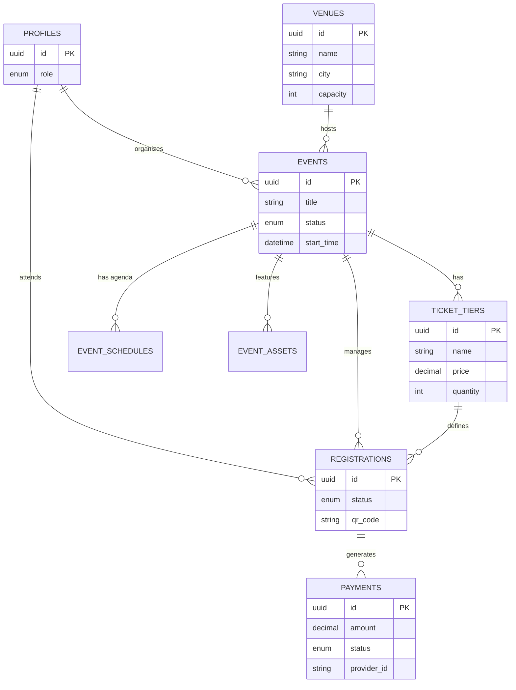
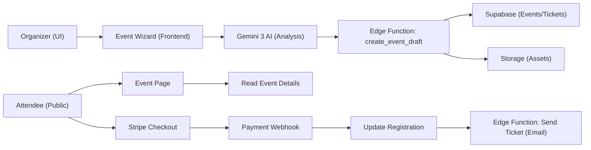

# 🗄️ FashionOS Event Wizard Schema

**Version:** 1.0
**Target:** Supabase (PostgreSQL 15+)
**Module:** Event Management & Ticketing

---

## 1. Schema Overview

This schema powers the **AI-driven Event Wizard**, handling the lifecycle from chat-based creation to ticket sales and post-event analytics.

### Core Tables
*   **`profiles`**: Central identity (referenced from Core Schema).
*   **`venues`**: Physical or virtual locations for events.
*   **`events`**: The central entity containing metadata, status, and settings.
*   **`event_schedules`**: Granular agenda items (e.g., "Doors Open", "Keynote").
*   **`ticket_tiers`**: Configuration for pricing and availability (VIP, GA).
*   **`registrations`**: Individual attendee records linked to tickets.
*   **`payments`**: Transaction records for ticket purchases.

### Advanced / Support Tables
*   **`event_assets`**: Storage for AI-generated or uploaded media (banners, trailers).
*   **`event_producers`**: Join table for multiple organizers/staff per event.

---

## 2. 📊 Visual Architecture

### Entity-Relationship Diagram (ERD)



### Data Flow Diagram (System)



---

## 3. 💻 SQL Definition (DDL)

### I. Extensions & Enums

```sql
-- Ensure UUID extension is enabled
create extension if not exists "uuid-ossp";

-- Event Status
create type event_status as enum (
  'draft', 
  'review', 
  'published', 
  'sold_out', 
  'cancelled', 
  'completed'
);

-- Ticket Types
create type ticket_tier_type as enum ('free', 'paid', 'donation');

-- Registration Status
create type registration_status as enum ('pending', 'confirmed', 'checked_in', 'cancelled', 'refunded');

-- Payment Status
create type payment_status as enum ('pending', 'succeeded', 'failed', 'refunded');
```

### II. Core Tables

```sql
-- 1. VENUES
-- Reusable venue database
create table venues (
  id uuid default uuid_generate_v4() primary key,
  owner_id uuid references auth.users(id), -- optional, if venue managed by user
  name text not null,
  description text,
  address text,
  city text not null,
  country text,
  capacity integer,
  geo_lat float,
  geo_lng float,
  amenities text[], -- e.g. ['wifi', 'parking', 'accessible']
  created_at timestamptz default now(),
  updated_at timestamptz default now()
);

-- 2. EVENTS
-- The master record
create table events (
  id uuid default uuid_generate_v4() primary key,
  organizer_id uuid references auth.users(id) not null,
  venue_id uuid references venues(id),
  
  title text not null,
  slug text unique not null, -- SEO friendly URL
  description text, -- Markdown allowed
  short_description text, -- For cards/SEO
  
  status event_status default 'draft',
  is_public boolean default false,
  
  start_time timestamptz not null,
  end_time timestamptz,
  timezone text default 'UTC',
  
  capacity_limit integer,
  
  -- Branding / AI Generated Context
  brand_color_primary text,
  brand_color_secondary text,
  ai_summary text, -- Generated by Gemini
  
  created_at timestamptz default now(),
  updated_at timestamptz default now()
);

-- 3. EVENT SCHEDULES
-- Granular agenda for the event day
create table event_schedules (
  id uuid default uuid_generate_v4() primary key,
  event_id uuid references events(id) on delete cascade not null,
  title text not null,
  description text,
  start_time timestamptz not null,
  end_time timestamptz,
  location_in_venue text, -- e.g. "Main Stage"
  speaker_names text[],
  created_at timestamptz default now()
);

-- 4. TICKET TIERS
-- Configuration for what is being sold
create table ticket_tiers (
  id uuid default uuid_generate_v4() primary key,
  event_id uuid references events(id) on delete cascade not null,
  
  name text not null, -- e.g. "VIP", "Early Bird"
  description text,
  type ticket_tier_type default 'paid',
  
  price decimal(10, 2) default 0.00,
  currency text default 'USD',
  
  quantity_total integer not null,
  quantity_sold integer default 0,
  
  sales_start_at timestamptz,
  sales_end_at timestamptz,
  
  created_at timestamptz default now()
);

-- 5. REGISTRATIONS (Tickets)
-- Individual tickets held by users
create table registrations (
  id uuid default uuid_generate_v4() primary key,
  event_id uuid references events(id) on delete cascade not null,
  ticket_tier_id uuid references ticket_tiers(id) not null,
  profile_id uuid references auth.users(id), -- Link to FashionOS profile if exists
  
  -- Snapshot data in case profile changes or user is guest
  attendee_email text not null,
  attendee_name text not null,
  
  status registration_status default 'pending',
  qr_code_data text unique, -- Unique string for QR generation
  checked_in_at timestamptz,
  
  created_at timestamptz default now(),
  updated_at timestamptz default now()
);

-- 6. PAYMENTS
-- Financial audit trail
create table payments (
  id uuid default uuid_generate_v4() primary key,
  registration_id uuid references registrations(id) on delete cascade not null,
  payer_id uuid references auth.users(id),
  
  amount decimal(10, 2) not null,
  currency text default 'USD',
  status payment_status default 'pending',
  
  provider text default 'stripe',
  provider_payment_id text, -- Stripe PaymentIntent ID
  
  created_at timestamptz default now()
);

-- 7. EVENT ASSETS
-- Media associated with the event
create table event_assets (
  id uuid default uuid_generate_v4() primary key,
  event_id uuid references events(id) on delete cascade not null,
  type text not null check (type in ('image', 'video', 'document')),
  url text not null,
  alt_text text,
  is_featured boolean default false,
  created_at timestamptz default now()
);
```

### III. Indexes

```sql
-- Optimize Event Lookups
create index idx_events_organizer on events(organizer_id);
create index idx_events_status on events(status);
create index idx_events_slug on events(slug);
create index idx_events_start_time on events(start_time);

-- Optimize Ticket/Registration Flow
create index idx_ticket_tiers_event on ticket_tiers(event_id);
create index idx_registrations_event on registrations(event_id);
create index idx_registrations_email on registrations(attendee_email);
create index idx_registrations_qr on registrations(qr_code_data);

-- Optimize Geo-search (future proofing)
create index idx_venues_city on venues(city);
```

---

## 4. 🛡️ RLS Policies

Security model:
1.  **Public**: Can view published events and ticket tiers.
2.  **Organizer**: Can view/edit ANY data related to events they created.
3.  **Attendee**: Can view their own registrations.

```sql
-- Enable RLS
alter table events enable row level security;
alter table ticket_tiers enable row level security;
alter table registrations enable row level security;

-- EVENTS POLICIES
-- 1. Public Read
create policy "Public can view published events"
  on events for select
  using ( status = 'published' );

-- 2. Organizer CRUD
create policy "Organizers can do everything with own events"
  on events for all
  using ( auth.uid() = organizer_id );

-- TICKET TIERS POLICIES
-- 1. Public Read (for purchase flow)
create policy "Public can view ticket tiers for published events"
  on ticket_tiers for select
  using ( exists (
    select 1 from events 
    where events.id = ticket_tiers.event_id 
    and events.status = 'published'
  ));

-- 2. Organizer CRUD
create policy "Organizers manage ticket tiers"
  on ticket_tiers for all
  using ( exists (
    select 1 from events 
    where events.id = ticket_tiers.event_id 
    and events.organizer_id = auth.uid()
  ));

-- REGISTRATIONS POLICIES
-- 1. Users view own tickets
create policy "Users view own registrations"
  on registrations for select
  using ( auth.uid() = profile_id );

-- 2. Organizers view event guest lists
create policy "Organizers view registrations for their events"
  on registrations for select
  using ( exists (
    select 1 from events 
    where events.id = registrations.event_id 
    and events.organizer_id = auth.uid()
  ));
```

---

## 5. ⚡ Edge Functions & Triggers (Logic)

### Database Triggers
*   **`update_updated_at`**: Standard trigger to auto-update the `updated_at` column on edits.
*   **`check_ticket_availability`**: Before insert on `registrations`, check if `ticket_tiers.quantity_sold` < `ticket_tiers.quantity_total`.

### Edge Functions (Business Logic)
These functions should be deployed to Supabase Edge Functions (Deno/TypeScript).

1.  **`create_event_draft`**:
    *   **Input**: JSON from Gemini (Title, Date, Venue, Tiers).
    *   **Action**: Transactional insert into `events` + `ticket_tiers` + `event_schedules`.
    *   **Output**: `event_id` for the frontend wizard redirection.

2.  **`generate_event_assets`**:
    *   **Input**: `event_id`, `prompt`.
    *   **Action**: Calls Gemini/Imagen/Veo APIs to generate banners/trailers. Uploads to Storage. Updates `event_assets`.

3.  **`process_ticket_payment`**:
    *   **Input**: Stripe Webhook payload.
    *   **Action**: Updates `payments.status` -> `succeeded`. Updates `registrations.status` -> `confirmed`. Increments `ticket_tiers.quantity_sold`. Sends email.
