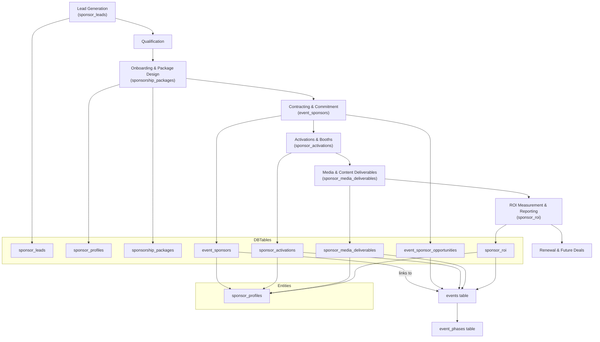

# 🤝 Sponsorship System Overview

**Status:** 🟡 In Progress (Base Implementation Completed)

This system will help you:

* Capture sponsor leads → qualify → convert → onboard → execute activations → measure ROI
* Manage booths, digital/social campaigns, videos, websites, event sponsorship
* Provide digital agents (AI workflows) for sponsor-marketing, contract drafting, activation ideas
* Tie into your fashion show planner (runway, models, designers, etc.)

---

## 🎯 Sponsorship Lifecycle & Phases

| Phase                           | Description                                                     | Key Steps                                                                              |
| ------------------------------- | --------------------------------------------------------------- | -------------------------------------------------------------------------------------- |
| **Lead Generation**             | Find potential sponsors aligned with fashion event              | Web forms, outreach, referrals, brand databases                                        |
| **Qualification**               | Assess fit and budget                                           | Score lead, match brand audience, timeline                                             |
| **Package Design & Onboarding** | Offer sponsorship tiers, sign contract                          | Create sponsorship packages (Title, Gold, Silver)                                      |
| **Contracting & Commitment**    | Sponsor signs, pays, confirms deliverables                      | Contract upload, payment status, package slot                                          |
| **Activation Planning**         | Booths, branding, digital campaigns, runway integrations        | Booth layout, signage, social posts, video content                                     |
| **Execution**                   | Event-day activations, social media, website, video, influencer | Sponsor brand appears on runway, VIP lounge, social feed                               |
| **Measurement & ROI**           | Track impressions, engagement, booth traffic, conversions       | Dashboard: sponsor ROI, renewal likelihood                                             |
| **Renewal & Future Deals**      | Post-event summary, propose next season’s sponsorship           | Report, renewal offer, next-event contract                                             |

---

## 🧱 Sponsorship System Components

### A. Database Tables (Supabase)

Some key tables (you’ll embed these into your schema):

* `sponsor_leads` (lead contact info, source, status)
* `sponsor_profiles` (company, logo, contacts, social handles)
* `sponsorship_packages` (tier name, level, cash/in-kind value, deliverables template)
* `event_sponsor_opportunities` (for each event: package offering, slots available)
* `event_sponsors` (actual sponsor commitment: package, cash value, in-kind value, contract URL, payment status)
* `sponsor_activations` (activation type: booth, VIP lounge, step-&-repeat, digital zone; event link, sponsor link, location, start/end)
* `sponsor_media_deliverables` (channel, content type, due date, status, metrics)
* `sponsor_roi` (metrics for sponsor: impressions, booth visits, digital views, conversions)

### B. Digital Agents / AI Features

* AI agent for **lead scouting**: feed brand list, auto-fill category, budget, fit score.
* AI agent for **activation ideas**: “Generate booth concept for beauty sponsor at an FW runway”
* AI agent for **contract & deliverables drafting**: auto-create contract template, list deliverables.
* AI agent for **ROI interpretation**: given metrics, generate summary and renewal recommendation.

### C. Marketing Channels & Activations

Real-world examples:

* Social Media (Instagram, TikTok) – behind-the-scenes with sponsor branding.
* Website / Event microsite – sponsor logo placement, landing page, lead capture.
* Video – recap video, sponsor mention, product placement.
* Runway integrations – sponsor lounge, logo on screen, gift bags.
* Booths/Activations – brand pop-ups, interactive installations, VIP experience.
* Influencer/Press – sponsor mention, brand ambassadors.

### D. Real-World Insights

* Many fashion show sponsors pay **$12k-$75k** or more depending on activation level.
* For best fit: ensure brand’s target audience aligns with event attendees.
* Backstage and finishing accessories are prime sponsor zones (beauty, shoes, bags).

---

## 🛠️ Integration with Runway & Fashion-Event Planner

Since your system already tracks events, models, venues, accessories etc., the sponsorship system will tie in like this:

* Link `event_sponsors.event_id` → `events.id` (your event table)
* Activation booth at venue: tie `sponsor_activations.location` → `venues.id`
* Runway sponsorship tag: in your event timeline you might have a phase “Sponsors & PR” where you track sponsor deliverables
* Media deliverables: share with your content capture pipeline (photographers/videos)
* ROI metrics: feed into your Analytics screen (in your planner UI)
* Digital agent: integrated into AI Copilot panel for planners & sponsors

---

## 🧭 Mermaid Diagram — Sponsorship System (Flow + Tables)



---

## 📄 PRD Document — Sponsorship Module

#### 1. Objectives

* Create a streamlined system to **generate, qualify, onboard, activate, and measure sponsors** for fashion events.
* Enable brand partners to clearly see value, activation opportunities, and ROI.
* Integrate seamlessly with the existing Fashion Event Planner (events, models, venues, runways).
* Support digital agents and AI-powered workflows to speed up lead qualification, activation ideas, and ROI reports.

#### 2. Stakeholders

* Event Organizer (internal)
* Sponsor Sales & Partnerships Team
* Marketing & Media Team
* Sponsors / Brand Partners
* Finance / Contracting Team
* Creative / Production Team (booths, activations)
* Analytics & Reporting Team

#### 3. User Stories

* As a Sponsor Sales rep, I want to capture a lead with company info so I can follow up.
* As a Sales rep, I want to qualify a lead (budget, fit) so I know whether to advance.
* As an Organizer, I want to create sponsorship packages (Title, Gold, Silver) so I can offer standardized deals.
* As a Sponsor Rep, I want to review available packages for an event so I can pick one.
* As a Sponsor, I want to sign a contract and upload deliverables so we’re officially committed.
* As an Activation Manager, I want to plan booths and brand experiences so the brand is visible on show day.
* As a Marketing Lead, I want to schedule media deliverables (social, video, website) so we track brand exposure.
* As an Analyst, I want to capture metrics (impressions, booth visits, conversions) so I can compute ROI.
* As a Sales rep, I want to review renewal potential after the event so I can pitch next season.

#### 4. Functional Requirements

* Capture modules: lead form, lead management dashboard
* Qualification workflow: lead scoring, status updates
* Package builder: define tier, value, slots
* Event-sponsor linking: show which sponsors are attached to which events
* Contract module: upload contract, manage payment status, deliverables checklist
* Activations module: booth location, start/end time, staffing, assets
* Media deliverables module: channel, type, due date, status, metrics
* ROI module: track metrics and compute summary for sponsor
* Renewal module: summary report, renewal proposal
* AI Agents: lead scouting, activation idea generation, ROI interpretation
* Integration: tie sponsor system to events, models, venues, timeline phases, availability

#### 5. Non-Functional Requirements

* Secure: Only authorised users can access sponsor data
* Scalable: Can handle many sponsors across many events
* Mobile-friendly: Dashboard accessible via mobile app
* Analytics: Real-time and historical reporting
* Extensible: Support new sponsor types, assets, activations

---

## 🎨 UI/UX Prompt — Sponsor Dashboards & Portal

```md
You are a senior UI/UX designer for mobile & web dashboards.

Design a **Sponsor Dashboard & Portal** for the Fashion Event Sponsorship System.

– Audience: Sponsors (brand marketing managers) and internal organizer team  
– Platforms: Mobile app + responsive web (desktop)  
– Style: high-fashion, elegant, premium look with clean cards, soft gradients, large visuals

Key screens:  
1. Sponsor Home Dashboard  
   • Sponsor logo + name  
   • Current commitments: event(s) listed with status (Onboarding / Live / Completed)  
   • Quick KPI cards: Impressions, Booth Visits, Engagements, ROI%  
   • CTA: “View Activation”, “Download Report”

2. Activation Overview  
   • List of activations for this sponsor: booth, lounge, digital zone, step-&-repeat  
   • Filter by event, type  
   • Each card: event name, activation type, location, date, status (planned/in-progress/done)  
   • CTA on each: “View Details”

3. Media Deliverables Board  
   • List of deliverables: social post, video, website banner  
   • For each: channel, due date, status, metrics so far (views/engagement)  
   • CTA: “Upload Asset”, “Mark Complete”

4. Contract & Packages  
   • Summary of sponsorship packages selected (Title/Gold/Silver)  
   • Cash + in-kind values, payment status  
   • Link to contract PDF  
   • CTA: “Download Contract”, “Pay Invoice”

5. ROI Report Screen  
   • Visual charts: bar chart for impressions, line for engagement over time, pie chart for channel breakdown  
   • Summary: “Your brand reach: 1.2M impressions, 3.4k booth visits, ROI: 135%”  
   • Recommendations: “Consider renewing for next event with VIP lounge package”

6. Next Opportunity / Renewal Module  
   • List upcoming events open for sponsorship  
   • Filter by category, audience, budget range  
   • CTA: “Express Interest”

Design details:  
- Use white cards over a soft pastel (e.g., blush, lavender) background  
- Headings: elegant serif, body: clean sans-serif  
- Icons: premium line style  
- Ensure all screens are responsive; on mobile show stacked cards, on desktop grid layout  
- Use CTA buttons with high visibility (primary color)  
- Large hero visuals: brand logos, event photos, activation snapshots  
- Navigation: side-menu (desktop), bottom nav (mobile)  
- Accessibility: sufficient contrast, readable font sizes, large tap targets  

Generate mockups / wireframes for each screen, annotations for flows between, and component library (cards, KPI tiles, deliverable tile, activation card).
```
