# 🖥️ UI/UX Specification: FashionOS Dashboards & Sponsor Portal

**Status:** Draft
**Priority:** High
**Scope:** Core Planner + Sponsor Portal + AI Control Center

---

## 1. 🎨 Visual Design Language

**Aesthetic:** "High-Fashion Tech" (Vogue meets Linear).
*   **Typography:** *Playfair Display* (Headings) + *Inter* (UI/Body).
*   **Palette:**
    *   Backgrounds: Soft pastels (Lavendar/Rose) or clean white `#FBF8F5`.
    *   Hero Areas: Vibrant Pink-Purple gradients.
    *   Cards: Pure white with soft, diffuse shadows (`shadow-lg`, `rounded-2xl`).
    *   Accents: `#E87C4D` (Orange), `#C084FC` (Purple).
*   **Layout:** Responsive grid, collapsible sidebars, glassmorphism headers.
*   **Spacing Scale:** 16px / 24px / 32px.

---

## 2. 📚 Screen Specifications

### A. Sponsor Portal (External Facing)
**Goal:** Provide sponsors real-time visibility into their investment.
1.  **Dashboard:**
    *   Hero: Gradient banner with Tier Badge (e.g., "Gold Partner").
    *   KPIs: Impressions, Engagement, ROI.
    *   Action: "Upload Assets" button.
2.  **Deliverables:** List of required files (Logos, Ads) with due dates and upload status.
3.  **Activations:** Map/details of their physical footprint (Booth, Lounge).
4.  **Reports:** Live ROI charts and downloadable PDF summaries.

### B. Fashion Show Planner (Internal Tool)
**Goal:** Central command for the production team.

1.  **Planner Dashboard:**
    *   Readiness Score (0-100%).
    *   Timeline progress bar.
    *   Critical Alerts (Missing models, Unpaid sponsors).
2.  **Timeline & Tasks:**
    *   Vertical timeline of the 15 event phases.
    *   Kanban board for "Casting", "Venue", "Backstage".
3.  **Casting & Models:**
    *   Grid view of model cards (Polaroids).
    *   Fittings schedule.
4.  **Designers & Collections:**
    *   Lookbook view.
    *   Music/Lighting cues per collection.
5.  **Venue & Logistics:**
    *   Interactive seating chart.
    *   Runway schematic (Lighting trusses, Audio zones).
6.  **Sponsors Manager:**
    *   CRM view of all sponsors.
    *   Contract status and payment tracking.
7.  **Activations Manager:**
    *   Placement map for sponsor booths.
    *   Asset requirements checklist.
8.  **Media Board:**
    *   Kanban for social assets (Planned -> Live).
    *   Live feed of hashtag usage.
9.  **ROI & Analytics:**
    *   Ticket sales velocity.
    *   Social sentiment analysis.

### C. AI Control Center (Gemini 3 Integration)
**Goal:** Centralized AI tools.
*   **Quick Actions:** One-click generators (Run-of-Show, Emails).
*   **Creative Suite:** Image/Video generation.
*   **RAG:** Chat with contracts and guest lists.
*   **Agents:** Autonomous agents for scheduling and conflict detection.

---

## 3. 🗺️ Sitemap Architecture

```mermaid
graph TD
  ROOT[FashionOS]

  %% Public / Marketing
  ROOT --> PUB[Public Site]
  PUB --> PUB_Home[Home]
  PUB --> PUB_Services[Services]
  PUB --> PUB_Events[Event Listings]
  PUB --> PUB_Directory[Fashion Directory]

  %% Auth
  ROOT --> AUTH[Auth]
  AUTH --> AUTH_Login[Login]
  AUTH --> AUTH_Signup[Sign Up]
  AUTH --> AUTH_SponsorInvite[Sponsor Invite]

  %% Main App Shell
  ROOT --> APP[App Shell]
  APP --> PLANNER[Fashion Show Planner]
  APP --> SPONSOR[ Sponsor Portal]
  APP --> ADMIN[Admin / Ops]
  APP --> AI_CENTER[AI Control Center]

  %% Planner dashboards
  PLANNER --> P_Dashboard[Planner Dashboard]
  PLANNER --> P_Timeline[Timeline & Tasks]
  PLANNER --> P_Casting[Casting & Models]
  PLANNER --> P_Designers[Designers & Brands]
  PLANNER --> P_Venue[Venue & Runway]
  PLANNER --> P_MediaBoard[Media Deliverables Board]
  PLANNER --> P_Activations[Activations]
  PLANNER --> P_Sponsors[Sponsors & Packages]
  PLANNER --> P_ROI[ROI & Reports]
  PLANNER --> P_Settings[Planner Settings]

  %% Sponsor-facing portal
  SPONSOR --> S_Dashboard[Sponsor Portal Dashboard]
  SPONSOR --> S_Deliverables[Deliverables & Uploads]
  SPONSOR --> S_Activations[My Activations]
  SPONSOR --> S_Reports[Performance & ROI]
  SPONSOR --> S_Profile[Company Profile & Team]

  %% Admin / Ops (optional)
  ADMIN --> A_Leads[Sponsor Leads & CRM]
  ADMIN --> A_Events[Event Management]
  ADMIN --> A_Users[Users & Roles]

  %% AI Control Center
  AI_CENTER --> AI_Quick[Quick AI Actions]
  AI_CENTER --> AI_Planning[Planning Assistants]
  AI_CENTER --> AI_Creative[Creative Generators]
  AI_CENTER --> AI_Docs[Document Intelligence]
  AI_CENTER --> AI_RAG[Smart Search & File RAG]
  AI_CENTER --> AI_Auto[Automations & Function Calls]
  AI_CENTER --> AI_Summary[Event Intelligence Summary]
  AI_CENTER --> AI_History[AI History & Saved Outputs]
```



---

## 4. ⚛️ Component Architecture

```text
src/
  app/
    App.tsx
    routes.tsx
  layouts/
    MainLayout.tsx
    AuthLayout.tsx
    PlannerLayout.tsx
    SponsorLayout.tsx
  screens/
    auth/
      LoginScreen.tsx
      SignupScreen.tsx
      SponsorInviteScreen.tsx

    planner/
      PlannerDashboardScreen.tsx
      TimelineTasksScreen.tsx
      CastingModelsScreen.tsx
      DesignersBrandsScreen.tsx
      VenueRunwayScreen.tsx
      MediaBoardScreen.tsx
      ActivationsScreen.tsx
      SponsorsPackagesScreen.tsx
      RoiReportsScreen.tsx
      PlannerSettingsScreen.tsx

    sponsorPortal/
      SponsorDashboardScreen.tsx
      SponsorDeliverablesScreen.tsx
      SponsorActivationsScreen.tsx
      SponsorReportsScreen.tsx
      SponsorProfileScreen.tsx

    admin/
      AdminLeadsScreen.tsx
      AdminEventsScreen.tsx
      AdminUsersScreen.tsx

    aiControlCenter/
      AiControlCenterScreen.tsx   // uses Ai* section components

  components/
    navigation/
      SidebarNav.tsx
      TopBar.tsx
      BottomNav.tsx
      Breadcrumbs.tsx

    layout/
      PageHeader.tsx
      PageSection.tsx
      StatGrid.tsx

    ui/
      Button.tsx
      IconButton.tsx
      Card.tsx
      Tabs.tsx
      Tag.tsx
      Badge.tsx
      Tooltip.tsx
      Modal.tsx
      Drawer.tsx
      BottomSheet.tsx
      Dropdown.tsx
      ProgressBar.tsx
      Avatar.tsx
      PillToggle.tsx
      EmptyState.tsx
      Skeleton.tsx

    tables/
      DataTable.tsx
      SortableHeader.tsx
      Pagination.tsx

    charts/
      KpiTile.tsx
      LineChart.tsx
      BarChart.tsx
      PieChart.tsx
      Sparkline.tsx

    planner/
      EventSummaryCard.tsx
      PhaseProgressList.tsx
      TaskList.tsx
      TaskItem.tsx
      TaskFilters.tsx
      TimelinePhaseCard.tsx
      ModelCard.tsx
      FittingScheduleList.tsx
      DesignerCard.tsx
      CollectionSummaryCard.tsx
      VenueInfoCard.tsx
      RunwayMap.tsx
      CheckList.tsx

    sponsors/
      SponsorCard.tsx
      PackageTierCard.tsx
      ContractStatusBadge.tsx
      DeliverableItem.tsx
      ActivationCard.tsx
      RoiSummaryCard.tsx
      UploadTile.tsx

    ai/
      AiQuickActions.tsx
      AiPlanningAssistants.tsx
      AiCreativeGenerators.tsx
      AiDocumentIntelligence.tsx
      AiSmartSearchRag.tsx
      AiAutomations.tsx
      AiEventIntelligence.tsx
      AiHistoryPanel.tsx
      AiPromptInput.tsx
      JsonPreview.tsx
```
