# 🧠 FashionOS x Gemini 3 Pro: Product Requirements Document (PRD)

**Version:** 1.0  
**Status:** 🟢 Approved Strategy  
**Target:** Fashion Show Planning & Management System  
**AI Core:** Google Gemini 3 (Pro, Flash, Veo, Imagen)

---

## 1. Executive Summary

**FashionOS** is the first AI-native operating system designed to manage the end-to-end lifecycle of fashion production. It replaces the fragmented ecosystem of spreadsheets, emails, and disconnected tools with a unified, intelligent platform.

By integrating **Google Gemini 3 Pro**, FashionOS moves beyond simple data entry to autonomous reasoning. It acts as an intelligent agent that can scout venues using real-world data (Maps Grounding), draft complex production schedules (Thinking Mode), score sponsorship leads (Reasoning), and generate cinematic assets (Veo/Imagen). This system democratizes high-end production logistics, allowing independent designers to execute runway shows with the precision of major fashion houses.

---

## 2. Product Vision

FashionOS leverages Gemini's multimodal and reasoning capabilities to deliver:
1.  **Predictive Logistics:** Anticipating schedule conflicts and budget overruns before they happen using Gemini 3's reasoning capabilities.
2.  **Grounded Intelligence:** Sourcing real-world venues and vendors via Google Maps and Search Grounding, ensuring actionable data, not hallucinations.
3.  **Visual Creativity:** Instantly generating moodboards, runway visualizations, and video trailers to align creative teams.
4.  **Commercial Automation:** Autonomous negotiation support, contract analysis, and ROI reporting for sponsorship deals.

---

## 3. User Personas

1.  **The Designer (Creative Owner):** Focuses on the collection. Needs the AI to handle "boring" logistics and visualize their creative concepts instantly.
2.  **The Show Producer (Ops Lead):** Manages the critical path. Needs Gemini to optimize the Run-of-Show, detect conflicts, and manage vendor communication.
3.  **The Sponsor Manager (Sales):** Needs AI to score leads, draft pitches based on brand DNA, and prove ROI through data analysis.
4.  **The Venue Manager:** Needs to visualize floorplans and manage technical riders.
5.  **The Vendor Coordinator:** Manages AV, lighting, and staffing. Needs automated call sheets and requirement extraction.
6.  **The Media Director:** Needs instant social assets (Veo trailers) and real-time content tagging.

---

## 4. Use Case Catalog (Fashion-AI)

### 🎭 Event Wizard & Planning
1.  **Concept-to-Plan:** Convert a 1-sentence idea ("Cyberpunk rave in Brooklyn") into a full 14-phase project plan.
2.  **Timeline Auto-Build:** Generate a Gantt chart with dependencies based on the event date.
3.  **Critical Path Analysis:** Identify bottlenecks (e.g., "Models not cast 2 weeks out").
4.  **Budget Projection:** Estimate costs based on venue location and guest count (Code Execution).
5.  **Run-of-Show Gen:** Create a minute-by-minute schedule (Lighting cues + Audio track).
6.  **Risk Assessment:** Scan plans for logistical gaps (e.g., "Load-in time insufficient").

### 📍 Venue Scouting (Maps Grounding)
7.  **Semantic Venue Search:** "Find industrial warehouses in Shoreditch with >500 capacity."
8.  **Logistics Calculation:** Calculate travel times between hotel and venue for 50 models.
9.  **Verification:** Confirm venue existence and address via Google Maps.
10. **Vibe Matching:** Analyze venue photos to see if they match the Designer's moodboard.

### 🤝 Sponsor CRM
11. **Lead Scoring:** Analyze a brand's website/news to determine fit (0-100).
12. **Contract Extraction:** Upload PDF contracts -> Extract deliverables JSON.
13. **Activation Ideation:** Suggest booth ideas based on Sponsor Brand + Event Theme.
14. **Pitch Drafting:** Write personalized emails referencing the sponsor's latest campaigns.
15. **ROI Prediction:** Forecast impressions based on guest list and media plan.

### 🚚 Vendor & Staffing
16. **Rider Extraction:** Read Tech Rider PDF -> Generate equipment list.
17. **Staffing Calculator:** "500 guests = how many security guards?" (Code Execution).
18. **Vendor Matching:** Match AV needs to local vendor capabilities.

### 📸 Media & Deliverables
19. **Asset Verification:** Check if uploaded photos meet "High Res" criteria (Vision).
20. **Video Trailers:** Generate 8s Veo teasers for social media.
21. **Shot List Gen:** Create a photographer's shot list from the collection lineup.
22. **Missing Asset Detection:** "You are missing headshots for 3 models."

---

## 5. Architecture Diagrams

### Diagram A — End-to-End Workflow

```mermaid
flowchart LR
    CONCEPT[Concept & Vision] --> VENUE[Venue & Logistics]
    VENUE --> CASTING[Casting & Fittings]
    CASTING --> SPONSORS[Sponsors & CRM]
    SPONSORS --> VENDORS[Production & Vendors]
    VENDORS --> ROS[Run of Show]
    ROS --> SHOW[Show Execution]
    SHOW --> MEDIA[Media Capture]
    MEDIA --> ANALYTICS[ROI & Analytics]
```


### Diagram B — AI Architecture (Gemini Integration)
```mermaid
flowchart TD
    UI[FashionOS React UI] --> EDGE[Supabase Edge Functions]
    EDGE --> G3[Gemini 3 Pro]
    
    subgraph Gemini Capabilities
        G3 --> THINK[Thinking Mode\n(Planning)]
        G3 --> SEARCH[Search Grounding\n(Trends/Brands)]
        G3 --> MAPS[Maps Grounding\n(Venues)]
        G3 --> VISION[Vision / Multimodal\n(Casting/Assets)]
        G3 --> CODE[Code Execution\n(Budgets)]
        G3 --> VEO[Veo / Imagen\n(Creative)]
    end
    
    G3 --> JSON[Structured JSON Output]
    JSON --> DB[(Supabase Database)]
    DB --> UI
```

---

## 6. Event Wizard Spec

**Objective:** Create a complete event record from natural language.

1.  **Input:** User types "Launch my SS26 collection, sustainability focus, London, September."
2.  **Gemini Reasoning:**
    *   Identifies "London" + "September" -> Suggests "London Fashion Week" timing.
    *   Identifies "Sustainability" -> Suggests eco-friendly venues.
3.  **Tools:**
    *   `googleSearch`: Find exact LFW dates.
    *   `googleMaps`: Find venues in London suitable for fashion shows.
4.  **Output (Structured JSON):**
    *   Event Title, Date, Location.
    *   Draft Schedule.
    *   Ticket Tiers.
    *   Suggested Sponsors (e.g., Reformation, Stella McCartney).

---

## 7. Sponsor CRM & Lead Scoring

**Objective:** Automate the sales pipeline.

1.  **Input:** Sponsor Website URL (e.g., `glossier.com`).
2.  **Tool:** `urlContext` / Google Search.
3.  **Analysis:**
    *   Extract Brand DNA (Colors, Tone, Audience).
    *   Check recent news ("Just launched new foundation").
4.  **Scoring Model:**
    *   Fit Score: 95/100 (Beauty brand + Fashion audience).
    *   Budget Tier: Gold/Platinum.
5.  **Action:** Call `create_lead` function in DB.

---

## 8. Venue Management (Maps Grounding)

**Objective:** Find and validate physical spaces.

1.  **Query:** "Rooftop venues in NYC with rain cover."
2.  **Tool:** `googleMaps` grounding.
3.  **Response:** List of 5 real venues with:
    *   `place_id`
    *   Address
    *   Rating
    *   Photos
4.  **Logistics:** AI calculates distance from "Model Hotel" to "Venue" to set call times.

---

## 9. Vendor Management

**Objective:** Coordinate technical requirements.

1.  **Input:** "We have a live band and 50 models."
2.  **Thinking Mode:**
    *   Band needs: Audio monitors, mics, sound check time.
    *   Models need: 50 chairs backstage, 5 HMU stations, catering.
3.  **Output:**
    *   Generated `Tech Rider` document.
    *   Staffing requirements list (Security, Dressers, Tech).

---

## 10. Casting & Talent

**Objective:** Visualize the show.

1.  **Input:** 20 Model Comp Cards (Images).
2.  **Tool:** Gemini Vision (`gemini-3-pro-preview`).
3.  **Analysis:**
    *   Extract measurements (Height, Bust, Waist).
    *   Tag features (Hair color, vibe).
4.  **Matching:** Compare Model Vibe vs. Collection Moodboard.
5.  **Output:** "Recommended Cast List" sorted by fit.

---

## 11. Media Management

**Objective:** Automate creative assets.

1.  **Pre-Event:**
    *   **Imagen 3:** Generate "Moodboard" for lighting crew.
    *   **Veo 3.1:** Generate "Save the Date" video teaser.
2.  **Post-Event:**
    *   **Vision:** Analyze runway photos. "Is the logo visible?"
    *   **RAG:** Search through thousands of raw photos to find "Look 12".

---

## 12. AI Features (18 Gemini Capabilities)

| # | Capability | FashionOS Use Case | Implementation |
|---|------------|--------------------|----------------|
| 1 | **Gemini 3 Pro Reasoning** | Complex schedule conflict resolution. | `generateContent` (default) |
| 2 | **Gemini 3 Flash** | High-volume email drafting / notification text. | `generateContent` (fast model) |
| 3 | **Image Gen (Pro/Nano)** | Moodboards (Pro), Thumbnail drafts (Nano). | `generateImages` |
| 4 | **Thinking Mode** | Logistics planning ("How to fit 3 shows in 1 day?"). | `thinking_config: { budget: 4096 }` |
| 5 | **Structured Outputs** | Enforcing strict JSON for Database inserts. | `responseSchema` |
| 6 | **Function Calling** | Creating DB records (`createTask`, `addSponsor`). | `tools: [functions]` |
| 7 | **Google Search Grounding** | Finding trends, verifying brand news. | `tools: [{ googleSearch: {} }]` |
| 8 | **Google Maps Grounding** | Venue scouting and address verification. | `tools: [{ googleMaps: {} }]` |
| 9 | **Code Execution** | Calculating budgets, taxes, and capacities. | `tools: [{ codeExecution: {} }]` |
| 10 | **URL Context** | analyzing brand websites for DNA extraction. | System prompt + fetch |
| 11 | **File Search (RAG)** | Q&A with uploaded Vendor Contracts. | `files.create` + Retrieval |
| 12 | **Multimodal Inputs** | Analyzing casting videos/photos. | `inlineData` (Base64) |
| 13 | **Live API** | (Future) Real-time voice assistant for backstage. | Live Connect |
| 14 | **Embeddings** | Semantic search for "Edgy models" in directory. | `embedContent` |
| 15 | **Agents** | "Sponsor Agent" that autonomously follows up. | Chain of thought loops |
| 16 | **Safety Settings** | Preventing generation of unsafe content. | `safetySettings` |
| 17 | **Observability** | Logging AI reasoning chains. | System Logs Table |
| 18 | **Context Caching** | Caching heavy context (Runway Script) for chat. | `cachedContent` |

---

## 13. API Design (Function Calling)

Gemini will be equipped with these tools to interact with Supabase:

```typescript
// Tool Definitions
const tools = [
  {
    name: "create_event",
    description: "Initialize a new fashion event in the database",
    parameters: { ... } // title, date, venue_id
  },
  {
    name: "search_venues",
    description: "Find venues based on capacity and location",
    parameters: { location: "string", capacity: "number" }
  },
  {
    name: "score_sponsor",
    description: "Calculate fit score for a brand",
    parameters: { brand_name: "string", website: "string" }
  },
  {
    name: "add_task",
    description: "Add a todo item to the critical path",
    parameters: { title: "string", due_date: "string", assignee: "string" }
  }
]
```

---

## 14. UI/UX Layouts

### Event Command Center
*   **Header:** Event countdown, Budget burn rate.
*   **Main:** Kanban board of tasks (AI prioritized).
*   **Sidebar:** AI Copilot (Chat interface).

### Sponsor CRM
*   **View:** Pipeline (Kanban).
*   **Card:** Logo, Lead Score (Color-coded), Estimated Value.
*   **AI Overlay:** "Suggestion: Send follow-up email regarding [News Topic]."

### Venue Designer
*   **View:** Map split-screen with List.
*   **AI Action:** "Show me venues within 15 mins of [Hotel]."

---

## 15. Risk Analysis

*   **Hallucination:** AI inventing venues. **Mitigation:** Strict Google Maps Grounding.
*   **Latency:** Video generation taking too long. **Mitigation:** Async polling + Email notification.
*   **Cost:** High token usage. **Mitigation:** Use Flash for text, Pro only for reasoning/vision.

---

## 16. Rollout Plan

1.  **Phase 1 (Alpha):** Event Wizard + Basic Chat (Text Only).
2.  **Phase 2 (Beta):** Visual Intelligence (Moodboards, Casting) + Sponsor CRM.
3.  **Phase 3 (Launch):** Veo Integration + Maps Grounding + Full Automation.

---

## 17. KPIs & Success Metrics

1.  **Planning Speed:** Reduce time-to-draft from 3 days to < 10 minutes.
2.  **Sponsor Conversion:** Increase deal close rate by 20% via AI targeting.
3.  **Usage:** % of events created using the Wizard vs. Manual.
4.  **Quality:** User rating of AI suggestions (Thumbs up/down).

---
