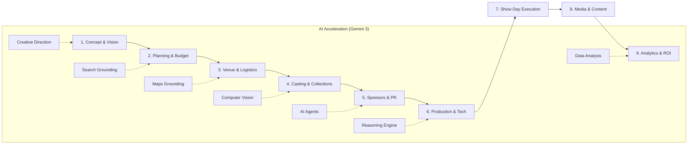
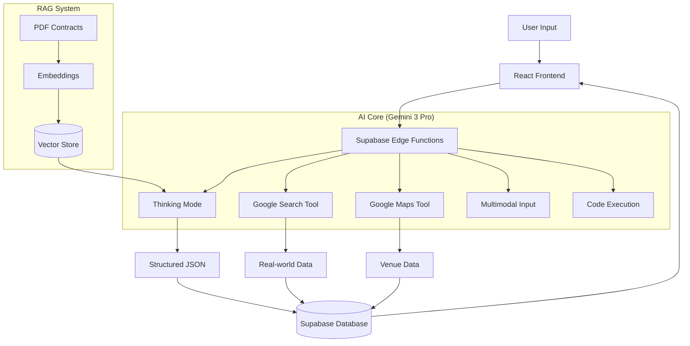

# Architecture Diagrams

## Diagram 1 — Full Fashion Show Lifecycle



## Diagram 2 — Event Context Navigation

```mermaid
graph TD
    Root[FashionOS] --> Global[Global Dashboard]
    Global --> EventsList[Event List]
    EventsList -->|Select Event| EventContext[Event Context (ID:123)]
    
    subgraph "Event Workspace"
        EventContext --> Cmd[Command Center]
        EventContext --> TL[Timeline]
        EventContext --> RoS[Run of Show]
        EventContext --> Cast[Casting Board]
        EventContext --> Ven[Venue Map]
        EventContext --> Fin[Financials]
    end
    
    Ven --> Floor[Floorplan Editor]
    Cast --> Model[Model Details]
    Fin --> Budg[Budget Tracker]
```

## Diagram 3 — AI / Gemini Architecture

