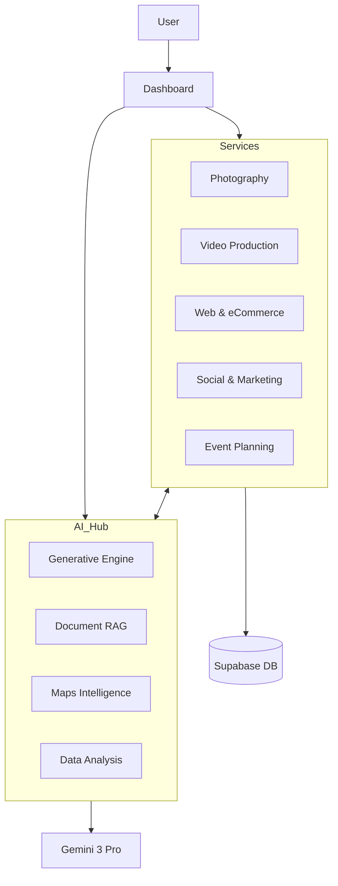
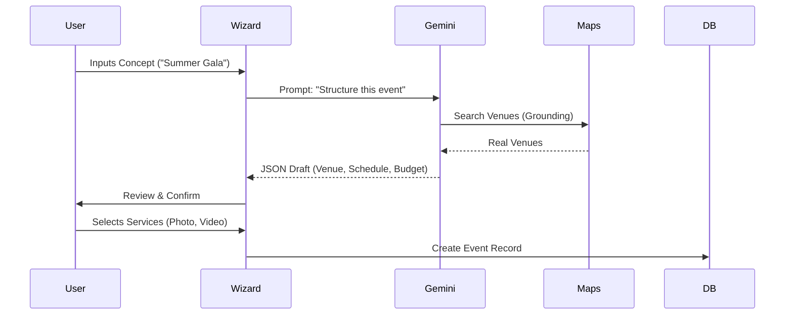
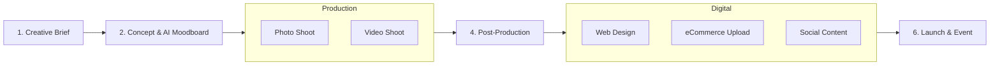
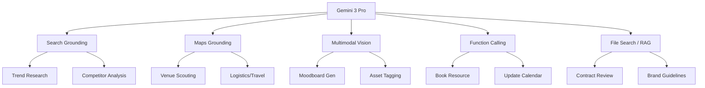

# Architecture Diagrams

## Diagram 1 — Global Platform Architecture

## Diagram 2 — AI Event Wizard Flow

## Diagram 3 — Multi-Service Production Pipeline

## Diagram 4 — AI Integrations (Gemini 3 Pro)

