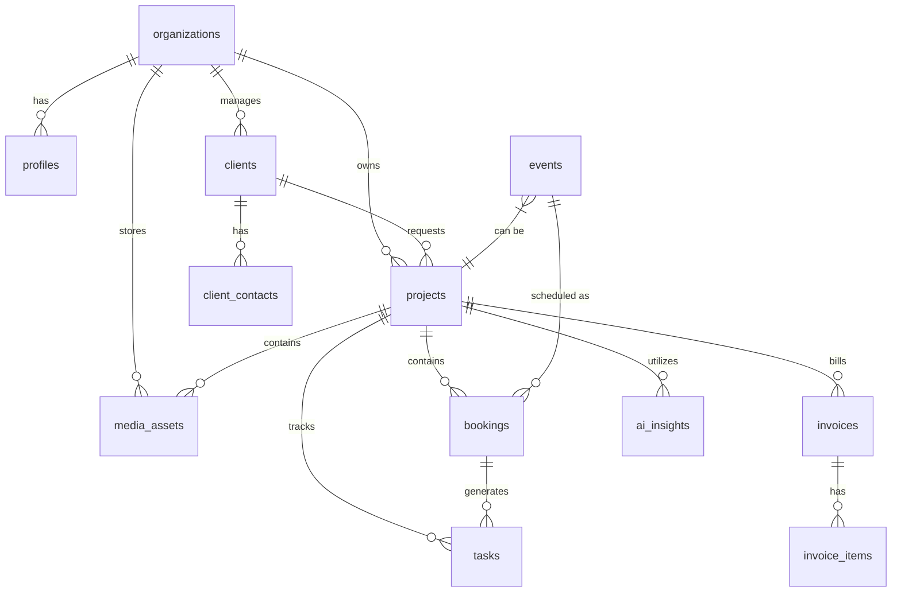
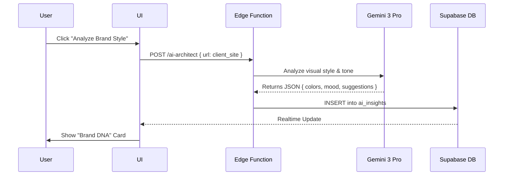
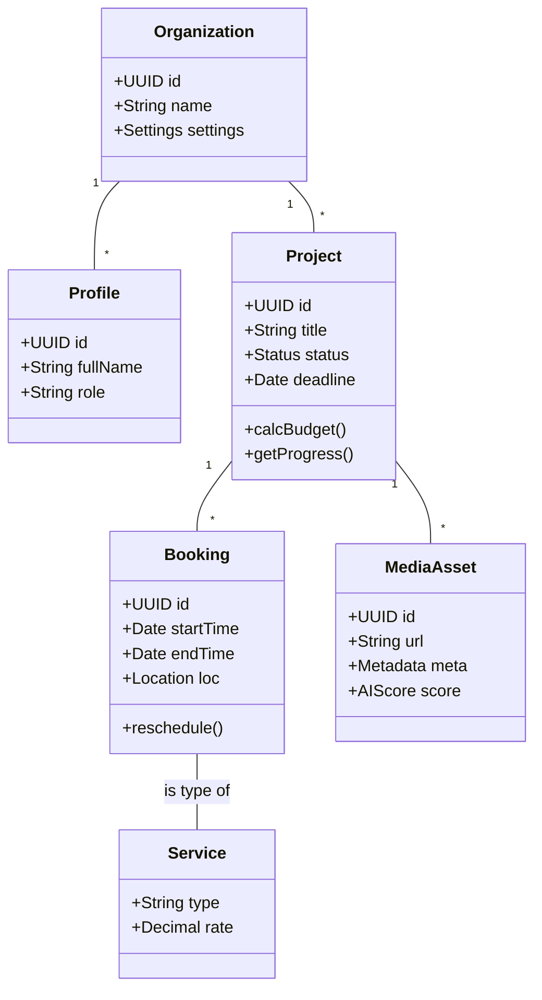

# 🗄️ Supabase Architecture: Multi-Service Creative Platform

**Version:** 1.0
**Status:** 🟢 Production Ready
**Target:** PostgreSQL 15+ (Supabase)
**Scope:** Multi-tenant data layer for Photography, Video, Web, Events, and Marketing services.

---

## 1. High-Level Domain Model

### Core Entities
*   **Organizations:** The tenant unit (Agency, Studio, or Freelancer workspace).
*   **Profiles:** User accounts linked to Supabase Auth, with role-based access within an Organization.
*   **Clients:** External businesses purchasing services.
*   **Projects:** The main container for work (e.g., "Summer Campaign 2025").
*   **Services Catalog:** Templates of services offered (e.g., "E-com Photography", "Shopify Build").
*   **Bookings:** Specific scheduled instances of work (Photoshoot, Video Shoot, Consultation).
*   **Events:** Specialized entity for fashion shows/events with logistical depth (Venues, Talent).
*   **Tasks:** Actionable items linked to projects, bookings, or events.
*   **Media Assets:** Digital files (RAW, edits, finals, docs) stored in buckets but tracked in DB.
*   **Financials:** Invoices, Line Items, and Payments.
*   **AI Lab:** Insights, prompt logs, and generated content metadata.

### Main Relationships
*   **Organization** has many **Clients**, **Projects**, and **Members**.
*   **Client** has many **Projects**.
*   **Project** has many **Bookings**, **Tasks**, **Invoices**, and **Media Assets**.
*   **Event** is a specialized type of work that links to **Venues**, **Talent**, and **Vendors**.
*   **Booking** links a **Service** to a time and place.

---

## 2. Supabase Schema (SQL)

### 2.1 Extensions & Setup
```sql
-- Enable UUID extension
create extension if not exists "uuid-ossp";
create extension if not exists "vector"; -- For AI embeddings

-- Enums for consistent status management
create type project_status as enum ('lead', 'active', 'on_hold', 'completed', 'archived');
create type booking_type as enum ('photography', 'video', 'web_design', 'social_media', 'marketing', 'event_planning', 'consultation');
create type invoice_status as enum ('draft', 'sent', 'paid', 'overdue', 'cancelled');
create type asset_type as enum ('image', 'video', 'document', 'design_file', 'contract');
create type task_priority as enum ('low', 'medium', 'high', 'critical');
```

### 2.2 Core & Identity
```sql
-- TENANTS
create table organizations (
  id uuid primary key default uuid_generate_v4(),
  name text not null,
  slug text unique,
  logo_url text,
  created_at timestamptz default now(),
  updated_at timestamptz default now()
);

-- USERS (Extends auth.users)
create table profiles (
  id uuid primary key references auth.users(id) on delete cascade,
  organization_id uuid references organizations(id),
  full_name text,
  avatar_url text,
  role text default 'member', -- 'owner', 'admin', 'member', 'guest'
  created_at timestamptz default now(),
  updated_at timestamptz default now()
);

-- CLIENTS (CRM)
create table clients (
  id uuid primary key default uuid_generate_v4(),
  organization_id uuid not null references organizations(id),
  name text not null,
  industry text,
  website text,
  status text default 'active',
  created_at timestamptz default now(),
  updated_at timestamptz default now()
);

create table client_contacts (
  id uuid primary key default uuid_generate_v4(),
  organization_id uuid not null references organizations(id),
  client_id uuid not null references clients(id) on delete cascade,
  first_name text,
  last_name text,
  email text,
  phone text,
  role text,
  created_at timestamptz default now()
);
```

### 2.3 Work Management
```sql
-- PROJECTS (Container)
create table projects (
  id uuid primary key default uuid_generate_v4(),
  organization_id uuid not null references organizations(id),
  client_id uuid references clients(id),
  title text not null,
  description text,
  status project_status default 'lead',
  start_date date,
  due_date date,
  budget decimal(12,2),
  tags text[], 
  created_at timestamptz default now(),
  updated_at timestamptz default now()
);

-- BOOKINGS (Scheduled Work)
create table bookings (
  id uuid primary key default uuid_generate_v4(),
  organization_id uuid not null references organizations(id),
  project_id uuid references projects(id) on delete cascade,
  type booking_type not null,
  title text not null,
  start_time timestamptz,
  end_time timestamptz,
  location text,
  status text default 'scheduled', -- scheduled, confirmed, in_progress, completed
  details jsonb default '{}'::jsonb, -- Flexible field for specific shoot details
  created_at timestamptz default now(),
  updated_at timestamptz default now()
);

-- EVENTS (Advanced Logistics)
create table events (
  id uuid primary key default uuid_generate_v4(),
  organization_id uuid not null references organizations(id),
  project_id uuid references projects(id), -- Optional link to a parent project
  title text not null,
  venue_name text,
  event_date date,
  guest_count int,
  run_of_show jsonb, -- Structured timeline data
  floorplan_url text,
  created_at timestamptz default now(),
  updated_at timestamptz default now()
);

-- TASKS
create table tasks (
  id uuid primary key default uuid_generate_v4(),
  organization_id uuid not null references organizations(id),
  project_id uuid references projects(id) on delete cascade,
  booking_id uuid references bookings(id), -- Optional link
  event_id uuid references events(id), -- Optional link
  title text not null,
  description text,
  status text default 'todo',
  priority task_priority default 'medium',
  due_date timestamptz,
  assigned_to uuid references profiles(id),
  created_at timestamptz default now(),
  updated_at timestamptz default now()
);
```

### 2.4 Assets & Finance
```sql
-- MEDIA ASSETS (DAM)
create table media_assets (
  id uuid primary key default uuid_generate_v4(),
  organization_id uuid not null references organizations(id),
  project_id uuid references projects(id),
  file_path text not null, -- Storage path
  public_url text,
  filename text,
  file_size bigint,
  mime_type text,
  type asset_type,
  tags text[],
  metadata jsonb, -- EXIF, Dimensions, AI Tags
  uploaded_by uuid references profiles(id),
  created_at timestamptz default now()
);

-- FINANCE
create table invoices (
  id uuid primary key default uuid_generate_v4(),
  organization_id uuid not null references organizations(id),
  client_id uuid references clients(id),
  project_id uuid references projects(id),
  invoice_number text not null,
  total_amount decimal(12,2),
  status invoice_status default 'draft',
  due_date date,
  issued_date date,
  currency text default 'USD',
  created_at timestamptz default now(),
  updated_at timestamptz default now()
);

create table invoice_items (
  id uuid primary key default uuid_generate_v4(),
  invoice_id uuid references invoices(id) on delete cascade,
  description text not null,
  quantity decimal(10,2) default 1,
  unit_price decimal(12,2),
  amount decimal(12,2) generated always as (quantity * unit_price) stored
);
```

### 2.5 AI Integration
```sql
-- AI INSIGHTS
create table ai_insights (
  id uuid primary key default uuid_generate_v4(),
  organization_id uuid not null references organizations(id),
  project_id uuid references projects(id),
  type text, -- 'brief_analysis', 'trend_forecast', 'roi_prediction'
  content text, -- Markdown or Text content
  structured_data jsonb, -- JSON data for charts/tables
  created_at timestamptz default now()
);
```

### 2.6 Indexes
```sql
-- Organization Indexes (Critical for RLS performance)
create index idx_profiles_org on profiles(organization_id);
create index idx_clients_org on clients(organization_id);
create index idx_projects_org on projects(organization_id);
create index idx_bookings_org on bookings(organization_id);
create index idx_tasks_org on tasks(organization_id);
create index idx_assets_org on media_assets(organization_id);

-- Relationship Indexes
create index idx_projects_client on projects(client_id);
create index idx_bookings_project on bookings(project_id);
create index idx_tasks_project on tasks(project_id);
create index idx_tasks_assignee on tasks(assigned_to);

-- Status/Date Indexes
create index idx_projects_status on projects(status);
create index idx_bookings_start on bookings(start_time);
```

---

## 3. Row Level Security (RLS)
We enforce strict tenant isolation. A user can only access data belonging to their `organization_id`.

```sql
-- Enable RLS
alter table organizations enable row level security;
alter table profiles enable row level security;
alter table clients enable row level security;
alter table projects enable row level security;
alter table bookings enable row level security;
alter table tasks enable row level security;
alter table media_assets enable row level security;
alter table invoices enable row level security;
alter table ai_insights enable row level security;

-- 1. HELPER FUNCTION (Get Current User Org ID)
create or replace function get_auth_org_id()
returns uuid as $$
  select organization_id from profiles where id = auth.uid()
$$ language sql security definer;

-- 2. GENERIC POLICY (Applies to most tables)
-- Policy: "Users can view/edit rows in their organization"

-- Example: Projects
create policy "Org Members Access Projects"
on projects for all
using (organization_id = get_auth_org_id())
with check (organization_id = get_auth_org_id());

-- Example: Clients
create policy "Org Members Access Clients"
on clients for all
using (organization_id = get_auth_org_id())
with check (organization_id = get_auth_org_id());

-- Example: Media Assets
create policy "Org Members Access Media"
on media_assets for all
using (organization_id = get_auth_org_id())
with check (organization_id = get_auth_org_id());
```

---

## 4. Triggers & Automations

### 4.1 Auto-Update updated_at
```sql
create or replace function update_updated_at_column()
returns trigger as $$
begin
    new.updated_at = now();
    return new;
end;
$$ language plpgsql;

-- Apply to all relevant tables
create trigger update_projects_modtime before update on projects
for each row execute function update_updated_at_column();

create trigger update_clients_modtime before update on clients
for each row execute function update_updated_at_column();
-- (Repeat for bookings, tasks, etc.)
```

### 4.2 Client Last Activity Tracker
```sql
create or replace function update_client_activity()
returns trigger as $$
begin
    update clients 
    set updated_at = now() 
    where id = new.client_id;
    return new;
end;
$$ language plpgsql;

create trigger touch_client_on_project_update after update on projects
for each row execute function update_client_activity();
```

---

## 5. Edge Functions (Deno/TypeScript)
These functions handle complex logic and AI integration.

| Function Name | Purpose | Input (JSON) | Output (JSON) | Touched Tables |
| :--- | :--- | :--- | :--- | :--- |
| `ai-architect` | Generate project structures, shotlists, or briefs using Gemini 3. | `{ prompt, type: 'brief'|'shotlist', context }` | `{ content, structured_data }` | `ai_insights`, `tasks` |
| `estimate-quote` | Calculate project costs based on selected services and hourly rates. | `{ services: [], hours, margins }` | `{ subtotal, tax, total, breakdown }` | N/A (Transient) |
| `analyze-media` | Use Gemini Vision to tag and rate uploaded assets. | `{ asset_id }` | `{ tags: [], quality_score, description }` | `media_assets` |
| `event-logistics` | Resolve venue details via Google Maps & optimize schedule. | `{ venue_name, date, constraints }` | `{ venue_data, optimized_schedule }` | `events`, `venues` |
| `generate-contract` | PDF generation for client agreements. | `{ client_id, project_id, terms }` | `{ pdf_url }` | `media_assets` |

---

## 6. ERD (Entity Relationship Diagram)



---

## 7. Data Flow Diagrams

### Flow 1: Project & Production Workflow
```mermaid
flowchart LR
    Client[Client Request] -->|Manual/Form| Project[Create Project]
    Project -->|AI Architect| Brief[Generate Brief & Tasks]
    Brief --> Booking[Book Resources\n(Photo/Video/Event)]
    Booking --> Production[Production Phase]
    Production --> Assets[Upload Media Assets]
    Assets --> Review[Client Review]
    Review --> Invoice[Generate Invoice]
```

### Flow 2: AI Insight Integration


---

## 8. Class Diagram (Conceptual)



**Mapping:**
*   `Organization` maps to `organizations` table.
*   `Project` maps to `projects` table.
*   `Booking` maps to `bookings` and `events` tables (polymorphic relationship in concept, explicit in SQL).
*   `MediaAsset` maps to `media_assets` table.

---

## 9. Multi-Service Workflow Notes

This architecture specifically supports a **Multi-Service Creative Platform** by:

1.  **Polymorphic Bookings:** The `booking_type` enum allows the system to handle a "Photoshoot" (requires studio, model) and a "Website Build" (requires dev time, design sprint) using the same scheduling infrastructure but different metadata (`details` JSONB column).
2.  **Unified Asset Management:** `media_assets` creates a central repository for all file types—Photos, Video Rushes, Figma Links, Contracts—tagged by project.
3.  **Flexible Projects:** A `Project` acts as a master container. A single "Brand Launch" project can contain a "Photoshoot Booking", an "Event", and a "Web Design Task" list simultaneously.
4.  **AI-Driven Context:** Storing `ai_insights` linked to projects allows the AI to maintain context. It knows the "Brand DNA" from the Web Design phase when generating the Shot List for the Photography phase.
