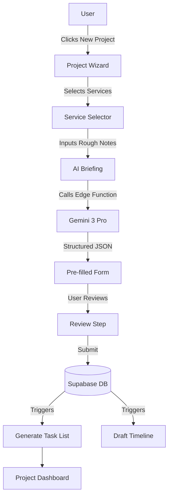
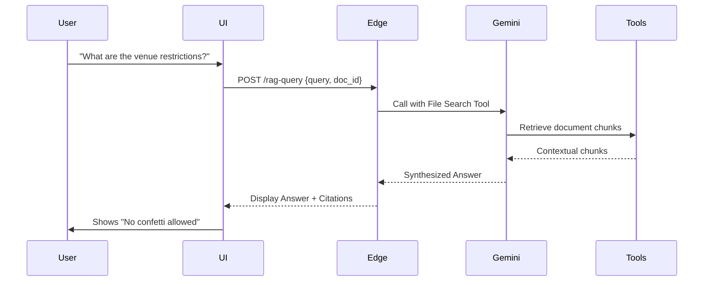

# 🚀 Multi-Service Creative Platform: Architecture & Planning

**Version:** 1.0
**Stack:** React, Supabase, Gemini 3 Pro
**Scope:** Photography, Video, Web, Marketing, Events

---

## 1️⃣ Product Overview & Personas

### Product Summary
The **Creative OS** is a unified operating system for modern creative agencies and production houses. Unlike fragmented toolstacks (Asana for tasks, Dropbox for files, Salesforce for CRM), this platform consolidates the entire lifecycle of creative work into one multi-tenant system. It handles high-volume asset production (photography/video), digital projects (web/eCom), and complex logistical events (fashion shows).

At its core is an **AI Production Agent** powered by **Gemini 3 Pro**. This agent acts as a "Digital Producer," automating administrative friction—drafting briefs from messy client emails, scouting venues via Google Maps, optimizing production schedules using reasoning models, and analyzing campaign ROI.

### User Personas

1.  **The Creative Director (Admin)**
    *   *Role:* Owner of the agency or studio.
    *   *Goal:* High-level oversight, maintaining brand quality, financial health.
    *   *Jobs:* Review dashboard KPIs, approve final assets, manage high-value client relationships.

2.  **The Senior Producer (Power User)**
    *   *Role:* Project Manager handling logistics.
    *   *Goal:* On-time delivery, budget adherence, conflict resolution.
    *   *Jobs:* Build run-of-show schedules, cast talent, book vendors, manage tasks, generate contracts.

3.  **The Brand Manager (Client)**
    *   *Role:* External client requesting work.
    *   *Goal:* Transparency and speed.
    *   *Jobs:* Submit briefs, approve creative direction, download final assets, pay invoices.

4.  **The Freelancer (Collaborator)**
    *   *Role:* Photographer, Developer, or Model.
    *   *Goal:* Clarity on tasks and schedules.
    *   *Jobs:* View call sheets, upload raw assets, mark tasks as complete.

---

## 2️⃣ Frontend Planning Docs

### 2.1 Tech & Architecture
*   **Framework:** React 19 + Vite + TypeScript.
*   **Styling:** Tailwind CSS + `clsx`/`tailwind-merge` for component variants.
*   **State Management:**
    *   **Server State:** `TanStack Query` (React Query) for caching Supabase data and handling loading/error states.
    *   **Global UI State:** `Zustand` for lightweight client state (e.g., sidebar toggles, modal stacks).
*   **AI Integration:** The frontend **never** calls Gemini directly. It calls Supabase Edge Functions to protect API keys and enforce business logic.

### 2.2 Sitemap & Routes

| Route | Page Title | Purpose | Key Actions |
| :--- | :--- | :--- | :--- |
| `/login` | Auth | Entry point | Login, Sign up, Reset Password |
| `/dashboard` | Command Center | Global overview | View KPIs, Active Projects, Upcoming Deadlines |
| `/clients` | Client Directory | CRM | Add Client, View Client List |
| `/clients/:id` | Client 360 | Specific client details | View history, projects, invoices, AI Summary |
| `/projects` | Projects | Kanban/List of work | Filter by status, Create Project |
| `/projects/:id` | Project Detail | Workspace for a job | Manage tasks, briefs, team, assets |
| `/bookings` | Shoot/Prod Calendar | Production schedule | View calendar, Book studio time |
| `/events` | Event Manager | Fashion shows & live events | Create Event, View Timeline |
| `/events/:id` | Event Command | Specific event logistics | Run-of-Show, Guest List, Venue Map |
| `/services` | Service Catalog | Menu of offerings | Define pricing, packages (Photo/Web/Video) |
| `/media` | Asset Library | DAM (Digital Asset Mgmt) | Search assets, AI Tagging, Collections |
| `/invoices` | Finance | Billing & Estimates | Create Invoice, Track Payments |
| `/tasks` | My Tasks | Personal todo list | View assigned tasks across all projects |

### 2.3 Screen-Level Planning (Core Examples)

#### A. Create Project Wizard (`/projects/new`)
*   **Layout:** Stepper Modal (Centered).
*   **Step 1: Client & Type:** Select Client, choose Service (Photo, Video, Web, Campaign).
*   **Step 2: AI Intake:**
    *   *Input:* "Paste client email or type rough notes."
    *   *Action:* "✨ Generate Brief" button.
    *   *Result:* AI populates structured fields (Budget, Deadline, Mood, Deliverables).
*   **Step 3: Resources:** Assign team members, estimate hours.
*   **Step 4: Review:** Confirm and Create.

#### B. Event Command Center (`/events/:id`)
*   **Header:** Event Name, Countdown Clock, Budget Burn Bar.
*   **Tabs:**
    *   *Overview:* Critical Alerts (AI generated), KPIs.
    *   *Logistics:* Venue Map (Google Maps Grounding), Vendor List.
    *   *Schedule:* Run-of-Show builder (Drag & drop).
    *   *Casting:* Model grid with status (Booked/Pending).
*   **Sidebar:** AI Copilot (Chat interface for "Suggest catering options", "Draft invite email").

#### C. Client 360 View (`/clients/:id`)
*   **Left Col:** Client Details, Brand DNA (AI extracted from their URL), Key Contacts.
*   **Main Col:**
    *   *Active Projects:* List view.
    *   *Recent Activity:* Timeline of emails/uploads.
    *   *Financials:* Unpaid invoices summary.
*   **AI Insight Card:** "Client hasn't booked a shoot in 3 months. Suggest a seasonal refresh?"

### 2.4 Component Library

| Component | Description | Usage | Notes |
| :--- | :--- | :--- | :--- |
| `KpiCard` | Stat display with trend indicator | Dashboard, Analytics | Supports loading skeletons |
| `ServiceIcon` | Dynamic icon for service type | Project Lists | Camera, Video, Code, Megaphone icons |
| `StatusPill` | Colored badge for state | Tables, headers | Pending (Yellow), Active (Green), etc. |
| `AiMagicButton` | Button with sparkle icon/animation | Any form input | Triggers AI generation |
| `MediaGrid` | Masonry layout for images/video | Media Library | Supports selection, lazy load |
| `KanbanBoard` | Drag-and-drop columns | Projects, Tasks | Uses `dnd-kit` or similar |
| `RunOfShow` | Time-block scheduler | Event details | Linear timeline visualization |
| `MapWidget` | Google Maps embed | Venue details | Shows pins for venue/hotels |
| `ChatInterface` | Conversational UI | AI Copilot | Message bubbles, typing indicators |

---

## 3️⃣ Backend Planning Docs (Supabase)

### 3.1 Data Domains (Schema Map)

*   **Tenant (Multi-tenancy):** `organizations`, `organization_members`.
*   **Identity:** `profiles` (extends `auth.users`), `roles`.
*   **CRM:** `clients`, `client_contacts`, `brand_profiles` (AI extracted DNA).
*   **Work:** `projects`, `project_phases`, `tasks`, `deliverables`.
*   **Bookings (Production):** `shoots`, `shoot_days`, `call_sheets`.
*   **Events (Logistics):** `events`, `venues`, `event_schedules`, `guest_lists`.
*   **Assets:** `media_assets` (references Storage buckets), `collections`.
*   **Finance:** `invoices`, `invoice_items`, `expenses`.
*   **Intelligence:** `ai_logs` (audit trail), `ai_insights` (cached suggestions).

### 3.2 API / Edge Functions Plan

All AI and complex business logic runs on Supabase Edge Functions (Deno).

| Function Name | Purpose | Inputs | Outputs |
| :--- | :--- | :--- | :--- |
| `generate-brief` | Converts unstructured text to structured project brief | `{ text, type }` | `{ title, description, requirements[], budget }` |
| `estimate-project` | Calculates dynamic pricing based on service rules | `{ services[], complexity, rush }` | `{ total, breakdown[], margin }` |
| `scout-venues` | Finds venues via Google Search/Maps Grounding | `{ location, capacity, vibe }` | `{ venues: [{ name, address, rating, maps_link }] }` |
| `optimize-schedule` | **Gemini Thinking:** Resolves logistical conflicts | `{ event_date, constraints[] }` | `{ run_of_show[], warnings[] }` |
| `extract-brand-dna` | **URL Context:** Scrapes site for brand identity | `{ url }` | `{ colors[], tone, keywords, summary }` |
| `rag-query` | **File Search:** Answers Qs from uploaded PDFs | `{ query, doc_ids[] }` | `{ answer, citations }` |
| `generate-assets` | Calls Imagen/Veo for mockups | `{ prompt, type }` | `{ media_url }` |

---

## 4️⃣ Gemini 3 Pro + AI Features

### Feature 1: The "Auto-Producer" (Event Planning)
*   **Trigger:** User types "Plan a launch party for 200 people in Soho next month, $50k budget."
*   **Tools:**
    *   **Gemini Thinking:** Deconstructs request into tasks (Venue, Catering, AV).
    *   **Google Maps Grounding:** Finds real venues in Soho matching capacity.
    *   **Structured Output:** Returns a JSON object creating the `Event` record and draft `Tasks`.
*   **UI:** Chat interface in the "Create Event" wizard.

### Feature 2: Brand DNA Extraction
*   **Trigger:** User adds a new Client and pastes their website URL.
*   **Tools:**
    *   **URL Context:** Gemini reads the landing page.
    *   **Text Gen:** Extracts "Tone of Voice", "Primary Colors", "Target Audience".
*   **UI:** "Analyze Website" button on Client form. Populates the `Brand Profile` card automatically.

### Feature 3: Intelligent Asset Search (RAG)
*   **Trigger:** User asks "Did the venue contract mention overtime fees?"
*   **Tools:**
    *   **File Search (RAG):** Index uploaded PDF contracts.
    *   **Text Gen:** Retrieval and summarization.
*   **UI:** AI Sidebar panel available in the Event/Project detail view.

### Feature 4: Production Scheduler
*   **Trigger:** "Optimize this run of show. Models need 30 mins for H&M, rehearsals take 1 hour."
*   **Tools:**
    *   **Gemini Thinking:** Solves the constraint satisfaction problem.
    *   **Code Execution:** Calculates exact timestamps to ensure no overlap.
*   **UI:** "Magic Optimize" button on the Timeline view.

---

## 5️⃣ Flow Diagrams (Mermaid)

### Diagram 1: Project Creation Flow

### Diagram 2: Fashion Show / Event Flow

```mermaid
flowchart LR
    Init[Concept] -->|AI Scout| Venue[Venue Selection]
    Venue -->|Maps Grounding| Logistics[Logistics Plan]
    
    Logistics -->|Casting Agent| Models[Model Casting]
    Models -->|Vision API| Fit[Fittings]
    
    Fit -->|Reasoning Engine| Sched[Run of Show]
    
    Sched --> Exec[Show Day]
    Exec -->|Upload Media| Assets[Asset Mgmt]
    Assets -->|AI Analysis| ROI[ROI Report]
```

### Diagram 3: AI Insight & RAG Flow

---

## 6️⃣ Non-Functional Requirements

### Security & RLS
*   **Tenant Isolation:** Every table must have an `organization_id` column. RLS policy: `auth.uid() IN (select user_id from members where organization_id = current_row.organization_id)`.
*   **AI Privacy:** Client data sent to Gemini is transient. Stored files for RAG are in private Supabase Storage buckets with signed URLs.

### Performance
*   **Optimistic Updates:** Frontend should reflect task changes immediately before DB confirmation.
*   **Edge Caching:** Heavy AI responses (like venue lists) should be cached for 1 hour if identical parameters are used.

### Observability
*   **AI Logging:** Every call to `gemini-*-*` edge functions must log: Input Token Count, Output Token Count, Latency, and Model Used (for cost tracking).

---

## 7️⃣ Summary: Real-World Application
This design explicitly supports a **Multi-Service Agency** by decoupling the "Project" container from the specific "Service" logic.
*   A **Web Build** project triggers a Kanban board and GitHub integration.
*   A **Fashion Show** project triggers the Venue Map, Run-of-Show builder, and Model Casting grid.
*   A **Retainer** client allows for continuous task requests without separate contracts.

The Gemini 3 Pro integration is not a gimmick; it replaces the role of a "Junior Producer." By handing off venue scouting (Maps), scheduling math (Thinking), and contract reading (RAG) to AI, the agency can operate with a leaner team and higher margins.
