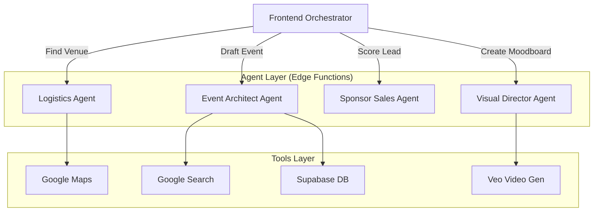

# 🤖 AI Agent Orchestration & Tooling

**Version:** 1.0
**Core Model:** Gemini 1.5 Pro / 2.5 Flash
**Architecture:** Stateless Edge Functions + Client-Side Orchestration

---

## 1. The Agent Pattern

FashionOS uses a **Hub-and-Spoke** agent model. The Frontend acts as the Orchestrator, calling specific specialized agents (Edge Functions) based on user intent.



---

## 2. Agent Definitions

### 2.1 Event Architect Agent (`generate-event-draft`)
*   **Role:** Turn unstructured text into structured plan.
*   **Model:** `gemini-2.5-flash` (Speed) or `gemini-1.5-pro` (Complex reasoning).
*   **Tools:** `googleSearch` (Grounding).
*   **System Prompt:**
    > "You are an expert Fashion Event Producer. Your goal is to extract metadata (Title, Date, Venue, Budget) and infer missing details based on industry standards (e.g., NYFW is usually in Sept/Feb)."
*   **Output Guardrails:** JSON Schema validation via Zod.

### 2.2 Visual Director Agent (`generate-media`)
*   **Role:** Create visual assets.
*   **Model:** `imagen-3` (Images), `veo-3.1` (Video).
*   **Inputs:** Brand DNA (Colors, Vibes) + Scene Description.
*   **Safety:** Strict safety filters for "Hate Speech" and "Sexually Explicit" content (Fashion can be edgy, but must remain safe).

### 2.3 Sponsor Sales Agent (`sponsor-ai`)
*   **Role:** Analyst & Copywriter.
*   **Capabilities:**
    1.  **Lead Scoring:** Search brand news -> Score 0-100.
    2.  **Activation Ideation:** Match [Sponsor Industry] + [Event Theme] -> Generate Booth Ideas.
    3.  **Email Writer:** Draft personalized outreach.

---

## 3. Tool Definitions (JSON Schemas)

Standardized schemas used across all agents to ensure database compatibility.

### `venue_object`
```json
{
  "name": "string",
  "address": "string",
  "place_id": "string",
  "capacity": "number",
  "vibe_tags": ["string"]
}
```

### `budget_object`
```json
{
  "total": "number",
  "currency": "USD",
  "breakdown": {
    "venue": "number",
    "catering": "number",
    "marketing": "number",
    "production": "number"
  }
}
```

---

## 4. Error Handling & Fallbacks

### 4.1 Hallucination Handling (Search Grounding)
*   **Rule:** If the AI suggests a venue, it **must** provide a Google Maps Place ID.
*   **Validation:** Edge Function verifies `place_id` exists via Places API before returning to client.

### 4.2 JSON Repair
*   If Gemini returns malformed JSON (rare but possible), the Edge Function attempts a **"Repair Retry"**:
    1.  Catch JSON Parse Error.
    2.  Feed error + raw text back to Gemini Flash.
    3.  Prompt: "Fix this JSON syntax error and return only JSON."

### 4.3 Rate Limiting
*   Implement token buckets per user in Supabase (Redis/Table) to prevent API abuse.
*   Client receives `429 Too Many Requests` -> UI shows "AI is cooling down."

