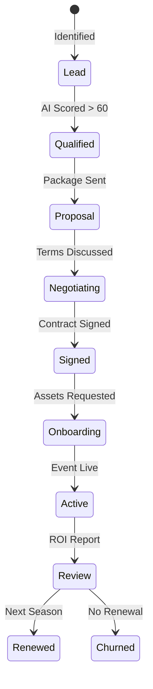

# 🤝 FashionOS Sponsor CRM System Plan

**Version:** 1.0
**Status:** 🟢 Proposed Strategy
**Scope:** Sponsorship, Sales Pipeline, Brand Intelligence, ROI

---

## 1. Executive Summary

The **FashionOS Sponsor CRM** is a specialized relationship management engine designed to transform how fashion events secure, manage, and retain brand partners. Unlike generic CRMs (Salesforce, HubSpot), this system is "Fashion Native"—it understands concepts like *Runway Activations*, *Backstage Access*, and *Collection Alignment*.

By integrating **Gemini 3 AI**, the system moves beyond simple contact storage to become an active revenue driver. It autonomously scores leads based on brand fit, suggests creative activation ideas, and calculates real-time ROI, solving the biggest pain point in event sponsorship: **proving value**.

---

## 2. System Overview

The CRM sits at the intersection of **Commercial Operations** and **Event Production**.

### Integration Points
*   **Events Module:** Sponsors are linked to specific `events` via `event_sponsors` (The Deal).
*   **Venue System:** Activations (Booths/Lounges) are mapped to `venue_floorplans`.
*   **Media & Assets:** Sponsor logos and deliverables feed directly into the **Event Wizard** and **Social Planner**.
*   **Finance:** Deal values (`cash_value`, `in_kind_value`) aggregate into the **Financials Dashboard**.

### The Feedback Loop
1.  **Acquisition:** AI helps find and qualify brands.
2.  **Activation:** Planner tools ensure the brand is visible during the show.
3.  **Analysis:** ROI sensors track impact.
4.  **Retention:** Data proves value for next season's renewal.

---

## 3. Use Cases (Real World)

### 🛍️ Finding New Sponsors (The "Hunter" Flow)
*   **Scenario:** An organizer is planning a "Sustainable Streetwear" show.
*   **Action:** They input the event moodboard into the CRM.
*   **System Response:** The AI suggests 10 target brands (e.g., "Allbirds", "Patagonia", "Local Upcycling Startups") and drafts personalized outreach emails highlighting the "Sustainability" alignment.

### 📊 Qualifying Leads (The "Filter" Flow)
*   **Scenario:** A beauty brand applies via the website.
*   **Action:** The system scans their website and Instagram.
*   **System Response:** Lead Score: **85/100**. *Reasoning: High aesthetic match, recent posts about fashion week, estimated budget fits 'Gold' tier.*

### 🎨 Building Activation Packages (The "Creative" Flow)
*   **Scenario:** A tech sponsor wants "something cool."
*   **Action:** Organizer uses the AI Creative Assistant.
*   **System Response:** Suggests: "VR Runway Experience in the Foyer" or "Live NFT Minting Station." The system auto-generates a visual mockup to include in the proposal.

### 📈 ROI Tracking (The "Proof" Flow)
*   **Scenario:** Post-event, the sponsor asks, "Was it worth it?"
*   **Action:** CRM aggregates data: 3.2M Social Impressions (Social Module) + 450 Booth Scans (Venue Module) + Logo visibility time (Video Analysis).
*   **System Response:** Generates a PDF "Success Report" showing 4.5x ROI.

---

## 4. Workflows

### 🟢 1. Sponsor Lead Intake & Enrichment
1.  **Input:** Manual entry, CSV import, or Public Inquiry Form.
2.  **AI Enrichment (Gemini + Search):**
    *   Fetch logo, website, LinkedIn headcount.
    *   Identify key decision-makers (CMO, Brand Director).
    *   Detect recent news (e.g., "Just raised Series B").
3.  **Scoring:** Assign `lead_score` (0-100) and `lead_category` (High/Med/Low).

### 🟡 2. The Deal Pipeline
1.  **Proposal:** Organizer selects a `sponsorship_package` (e.g., Gold).
2.  **Negotiation:** Track versioned changes to `cash_value` and `deliverables`.
3.  **Contract:**
    *   Generate PDF via Edge Function.
    *   Send for e-signature.
    *   Status update: `Negotiating` → `Signed`.

### 🟣 3. Activation & Execution
1.  **Onboarding:** Trigger automated email requesting Logo (EPS) and Brand Guidelines.
2.  **Placement:** Assign booth space on the Venue Floorplan.
3.  **Deliverables:** Track `sponsor_deliverables` (Logos, Ads, Swag Bags) with due dates.
4.  **Alerts:** Notify Ops team if deliverables are late 48h before show.

### 🔵 4. Post-Event ROI & Renewal
1.  **Data Ingest:** Collect metrics from Social, Ticket Scans, and Post-event Surveys.
2.  **AI Analysis:** "Sentiment was 98% positive for the Brand Activation."
3.  **Renewal:** Create a "Draft Deal" for the next season automatically.

---

## 5. Architecture & Data Flow

### High-Level Architecture

```mermaid
graph TD
    Sources[Lead Sources\n(Web/Manual/AI)] --> CRM[Sponsor CRM Core]
    CRM --> Enrichment[AI Enrichment Engine]
    Enrichment --> Pipeline[Sales Pipeline]
    
    Pipeline --> Contract[Contract & Finance]
    Contract --> Ops[Operations & Logistics]
    
    Ops --> Activation[Event Activation]
    Activation --> Analytics[ROI & Reporting]
    
    Analytics --> Retention[Renewal Loop]
    Retention --> CRM
```

### Sponsor Pipeline Flowchart



---

## 6. Database Schema Plan

This schema extends the existing `05_sponsorship_crm.sql` migration.

### `sponsors` (Global Brand Registry)
*   *Extends `sponsor_profiles`*
*   `enrichment_data` (JSONB): Full dump of AI findings (revenue, competitors, recent news).
*   `brand_affinity` (JSONB): Tags describing their vibe (e.g., "Sustainable", "Luxury", "Street").

### `sponsor_contacts` (People)
*   `id`, `sponsor_id`, `name`, `role`, `email`, `linkedin_url`, `last_contacted`.

### `sponsor_leads` (The Pipeline)
*   `id`, `sponsor_id`, `event_id` (optional), `source`, `status`, `notes`.
*   `ai_score` (Int), `ai_reasoning` (Text).

### `sponsor_interactions` (Activity Log)
*   `id`, `sponsor_id`, `type` (email, call, meeting, ai_insight).
*   `summary` (AI-generated summary of the interaction).
*   `date`.

### `sponsor_packages`
*   *Enhancement to existing table*
*   `inventory_limit` (e.g., Only 1 Title Sponsor per event).
*   `rules` (JSONB): e.g., "No competing Beverage sponsors".

---

## 7. AI Features (Gemini 3 Integration)

### 🧠 Core Intelligence
*   **Fit Score:** Analyze Sponsor's "About Us" page vs. Event's "Moodboard". Return a 0-100 compatibility score.
*   **Risk Signals:** Scan news for controversy before signing (Brand Safety).

### 🗣️ Outreach & Communication
*   **Hyper-Personalized Pitch:** "Write an email to [Contact] at [Brand] pitching [Event]. Mention their recent campaign [Campaign Name] and how it aligns with our runway theme."
*   **Negotiation Coach:** "Sponsor wants to lower fee by 20%. Suggest 3 counter-offers involving non-monetary value (e.g., extra social posts)."

### 📊 Predictive Analytics
*   **Revenue Forecasting:** Predict final sponsorship revenue based on pipeline velocity and historical conversion rates.
*   **Churn Prediction:** Flag sponsors unlikely to renew based on engagement metrics.

---

## 8. UI/UX Screens (Mockup Descriptions)

### 1. The "War Room" (CRM Dashboard)
*   **Visual:** Kanban board (Leads -> Qualified -> Proposal -> Signed).
*   **Key Data:** Total Pipeline Value, Weighted Revenue (Value * Probability).
*   **AI Insight:** "Focus on 'Tech' sector; currently under-represented compared to targets."

### 2. Sponsor 360° Profile
*   **Header:** Huge logo, stock ticker (if public), recent news ticker.
*   **Left Col:** Contact info, Relationship Health Score (Green/Yellow/Red).
*   **Right Col:** Interaction Timeline, Active Deals, AI Suggested Actions.

### 3. Package Builder & Visualizer
*   **Interface:** Drag-and-drop deliverables into a tier.
*   **Preview:** Real-time preview of what the "Sponsor Deck" PDF looks like.

### 4. Activation Planner
*   **Visual:** Floorplan map showing where the booth is.
*   **Checklist:** Electrical needs, Wifi, Furniture, Staff passes.

---

## 9. KPIs & Success Metrics

1.  **Sponsorship Yield:** Total Revenue / Event Capacity.
2.  **Sales Velocity:** Avg. days from Lead to Signed.
3.  **Activation Success:** % of deliverables approved on time.
4.  **Retention Rate:** % of sponsors renewing for the next season.
5.  **AI Attribution:** Revenue influenced by AI suggestions.

---

## 10. Recommended Roadmap Additions

### 🔮 Predictive Matching
*   **Idea:** "People who liked [Brand A] also liked [Brand B]."
*   **Feature:** Suggest sponsors based on attendee demographics and past ticket purchase history.

### 📄 AI Contract Summarization
*   **Idea:** Ingest redlined contracts.
*   **Feature:** "The sponsor changed the exclusivity clause. Here is a summary of the risk."

### 🤖 Multi-Agent Sponsor Planning
*   **Idea:** Three AI agents working together.
    1.  **Researcher:** Finds data.
    2.  **Strategist:** Plans the pitch.
    3.  **Copywriter:** Writes the email.
*   **Feature:** One-click "Prepare Pitch" that runs this entire chain.

### 🌐 Direct Booking Portal
*   **Idea:** "Airbnb for Booths."
*   **Feature:** Allow pre-vetted sponsors to book small activations directly via credit card without a sales call.
