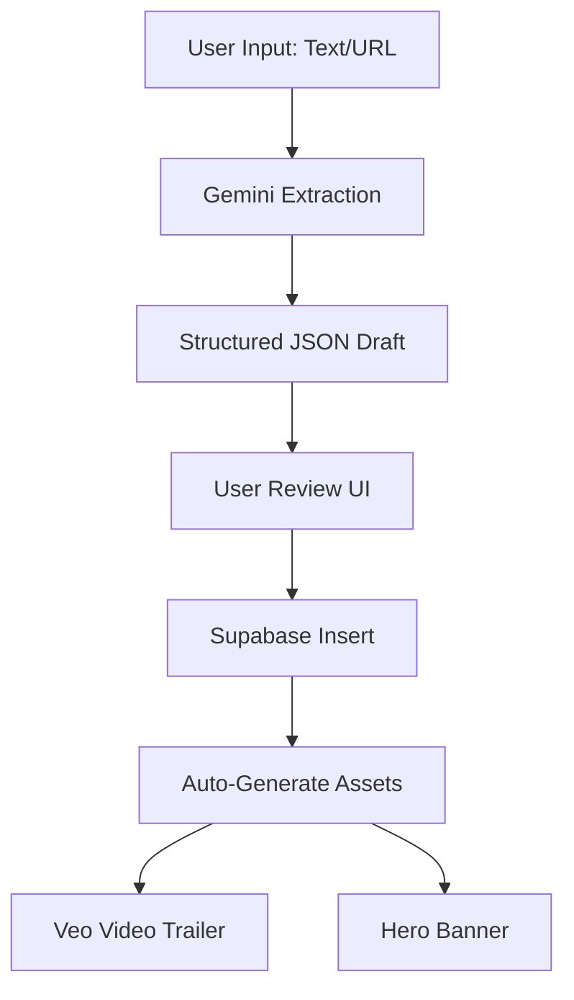
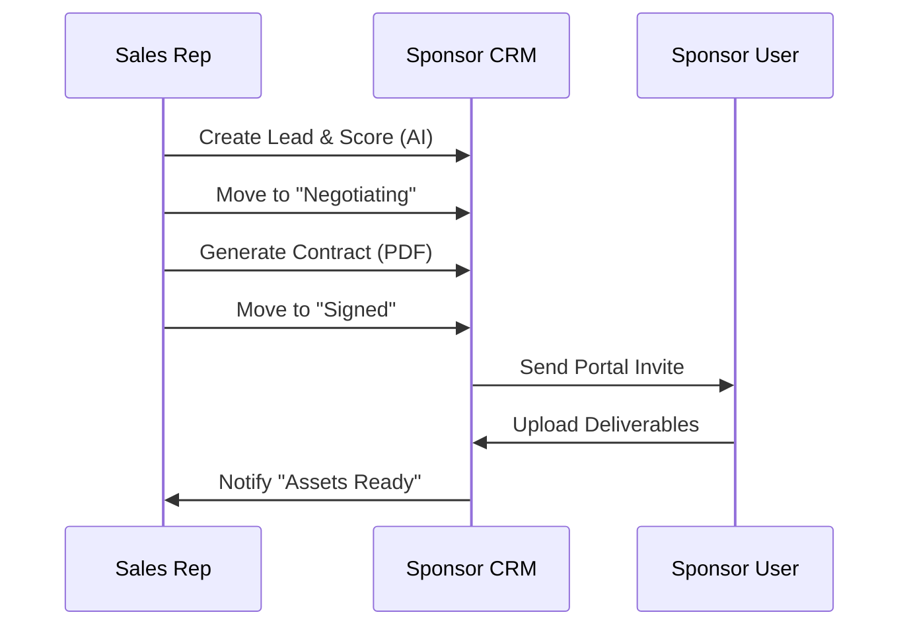

# 📋 Product Requirements Document (PRD): FashionOS

**Version:** 2.0  
**Status:** 🟢 Ready for Production  
**Product:** FashionOS — The Operating System for Fashion Production & Events

---

## 1. 📝 Executive Summary
FashionOS is a vertical SaaS platform designed to modernize the fashion industry's production workflow. It consolidates fragmented processes—photoshoot bookings, runway event planning, talent casting, and sponsorship management—into a single, AI-powered operating system.

By leveraging **Google Gemini 3** models, FashionOS automates manual tasks (contract drafting, schedule optimization, creative briefing) and provides data-driven insights (Sponsor ROI, Brand DNA analysis), transforming how agencies and brands collaborate.

---

## 2. 🚩 Problem Statement
The fashion production industry currently operates on "Chaos & Spreadsheets."
*   **Fragmentation:** Booking a shoot requires 50+ emails.
*   **Opacity:** Sponsors have no visibility into their ROI.
*   **Manual Labor:** Organizers manually format schedules, call sheets, and guest lists.
*   **Disconnected Data:** Talent data, venue specs, and financial records live in isolated silos.

---

## 3. 🎯 Target Users

| User Persona | Role | Needs |
| :--- | :--- | :--- |
| **The Organizer** | Event Producers / Agencies | Central command for timeline, budget, and logistics. |
| **The Brand** | Designers / Fashion Houses | Easy booking for shoots; clear visibility on event participation. |
| **The Sponsor** | Corporate Partners | Real-time data on activation performance and asset delivery. |
| **The Creative** | Photographers / Models | Clear call sheets, centralized asset delivery. |

---

## 4. ⚙️ Core Features

### A. Studio Booking Engine
*   **13-Step Wizard:** Interactive flow to configure service type, style, volume, and logistics.
*   **Pricing Calculator:** Real-time estimates based on complexity and volume.
*   **Checkout:** Deposit handling via Stripe integration.

### B. Event Management
*   **Context-Aware Dashboard:** Sidebar adapts to the specific event being managed.
*   **Timeline Tracker:** 14-phase Gantt-style progress tracking.
*   **Run of Show:** Minute-by-minute schedule builder.
*   **Guest List:** RSVP and check-in management.

### C. Sponsorship CRM
*   **Pipeline Kanban:** Drag-and-drop deal flow (Lead -> Signed).
*   **Sponsor Portal:** External view for partners to upload assets and view ROI.
*   **Deliverables Tracker:** Automated checklist for logos, ads, and activations.

### D. Logistics & Operations
*   **Venue Directory:** Google Maps integration for location scouting.
*   **Casting Board:** Visual grid for managing models and looks.
*   **Asset Gallery:** Digital Asset Management (DAM) for final delivery.

---

## 5. 🧠 Advanced & AI Features (Gemini 3)

| Feature | Model | Functionality |
| :--- | :--- | :--- |
| **Event Architect** | `gemini-2.5-flash` | Generates a complete event draft (JSON) from a single text sentence or URL paste. |
| **Visual Intelligence** | `gemini-3-pro-image` | Creates moodboards and upscales draft concepts to 4K. |
| **Veo Trailers** | `veo-3.1` | Generates cinematic 8-second video teasers for social media from event descriptions. |
| **Smart Scheduler** | `gemini-thinking` | Detects conflicts in availability and optimizes run-of-show timings. |
| **Sponsor Agent** | `gemini-2.5-flash` | Scores leads (0-100), drafts personalized pitches, and summarizes ROI reports. |
| **Brief Polisher** | `gemini-2.5-flash` | Rewrites messy client notes into professional creative briefs. |

---

## 6. 🌍 Use Cases

### Use Case 1: The Indie Designer Shoot
*   **Scenario:** A designer needs 20 e-commerce shots for a new drop.
*   **Flow:** Enters Wizard -> Uploads moodboard -> AI suggests "High-Key Lighting" -> Pays Deposit -> Studio executes -> Assets delivered via Portal.

### Use Case 2: Fashion Week Runway
*   **Scenario:** Agency planning a 500-person show.
*   **Flow:** Generates Draft via AI ("Runway in Brooklyn") -> AI suggests schedule -> Casting module manages 30 models -> Sponsors access portal to upload logos -> Veo generates teaser video.

### Use Case 3: Corporate Sponsorship
*   **Scenario:** Beauty brand sponsors the VIP Lounge.
*   **Flow:** Sales rep moves deal to "Signed" -> System auto-creates "Deliverables" tasks -> Sponsor uploads branding -> Post-event AI generates "Success Report" PDF.

---

## 7. 📖 User Stories

1.  "As an **Organizer**, I want to generate a run-of-show from a PDF contract so I don't have to type it manually."
2.  "As a **Sponsor**, I want to see exactly how many people saw my logo so I can justify the spend to my boss."
3.  "As a **Photographer**, I want a clear shot list generated before I arrive on set."
4.  "As a **Brand**, I want to book a shoot as easily as I book an Airbnb."

---

## 8. 🛤️ User Journey (Organizer)

1.  **Login:** Authenticates via dashboard.
2.  **Creation:** Clicks "New Event". Types "Summer Gala at The Plaza".
3.  **Refinement:** AI pre-fills capacity, schedule, and ticket tiers. User confirms.
4.  **Logistics:** Adds venue (Google Maps grounded). Casts models.
5.  **Commercial:** Adds sponsors to the CRM. Generates contracts.
6.  **Execution:** Manages live run-of-show.
7.  **Review:** Checks "System Health" and "Financials" for profitability.

---

## 9. 🔄 Workflows & Diagrams

### A. Event Creation Flow

### B. Sponsorship Lifecycle

---

## 10. 🖥️ Website Structure

### Public Pages
*   **Home:** Value proposition, hero video, feature highlights.
*   **Services:** Detailed breakdown of Photography, Video, Web.
*   **Directory:** Searchable talent network (Profiles, Portfolios).
*   **Events:** Public calendar and ticket purchasing.
*   **Pricing:** SaaS subscription tiers.

### Dashboard Pages (Private)
*   **Overview:** High-level KPIs (Revenue, Active Shoots).
*   **Events (Context):**
    *   *Command Center:* Critical path.
    *   *Logistics:* Venue map & Guest list.
    *   *Casting:* Model board.
*   **Sponsors:** CRM pipeline and ROI analytics.
*   **Studio:** Kanban board for shoot production.
*   **System:** Health check and infrastructure status.

---

## 11. 🗄️ Data Model

### Core Tables
*   **`profiles`**: Users and roles.
*   **`events`**: Master event records.
*   **`shoots`**: Production bookings.
*   **`companies`**: Brand/Sponsor entities.

### Relational Tables
*   **`event_sponsors`**: Links Companies to Events (The Deal).
*   **`event_phases`**: 14-step timeline for events.
*   **`shoot_assets`**: Deliverables linked to shoots.
*   **`ticket_tiers`**: Pricing configurations.

---

## 12. 🤖 AI Functions (Edge)

| Function Name | Trigger | Output |
| :--- | :--- | :--- |
| `generate-event-draft` | Wizard Input | JSON Event Object |
| `sponsor-ai` | Button Click | Lead Score / Activation Ideas / Social Plan |
| `generate-media` | Button Click | Veo Video / Image Upscale |
| `resolve-venue` | Input Blur | Validated Address + Place ID |
| `schedule-optimizer` | Button Click | Conflict-free Agenda |

---

## 13. ✅ Success Criteria

1.  **Efficiency:** Event draft creation < 10 seconds.
2.  **Reliability:** 99.9% uptime on Booking Wizard.
3.  **Adoption:** 40% of users utilize AI Copilot features.
4.  **Performance:** Dashboard loads < 500ms.

---

## 14. ⚠️ Risks & Constraints

*   **AI Latency:** Video generation takes ~60s. *Mitigation: Polling & Email notification.*
*   **Cost:** High usage of Gemini Pro/Veo. *Mitigation: Rate limiting & Tiered pricing.*
*   **Hallucination:** AI might suggest fake venues. *Mitigation: Google Search Grounding.*

---

## 15. 💡 Suggested Improvements
*   **Mobile App:** Native wrapper for push notifications.
*   **Offline Mode:** For backstage areas with poor wifi.
*   **VR Walkthrough:** 3D generation of venue floorplans.
*   **Payment Splits:** Allow sponsors to pay in milestones.

---

## 16. 📝 Implementation Notes

**Stack:**
*   **Frontend:** React 18, Vite, Tailwind CSS, Lucide Icons.
*   **Backend:** Supabase (Auth, DB, Storage, Realtime).
*   **Logic:** Supabase Edge Functions (Deno/TypeScript).
*   **AI:** Google Gemini API (Vertex AI / AI Studio).

**Security:**
*   Row Level Security (RLS) is mandatory.
*   API Keys must be stored in Supabase Vault/Secrets.
*   Public pages are read-only via anon key policies.
