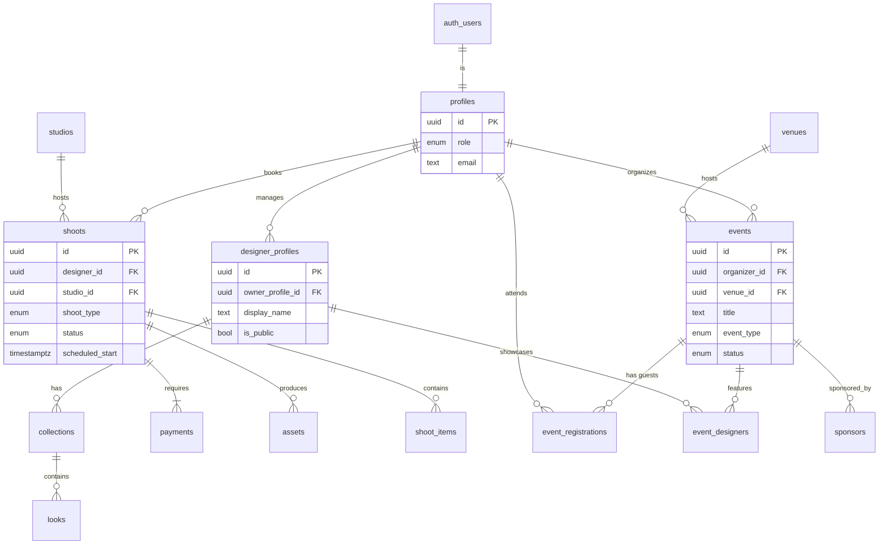

# 🗄️ FashionOS Database Schema (Production-Ready)

**Version:** 3.0  
**Target:** Supabase (PostgreSQL 15+)  
**Scope:** Complete Shoot Bookings + Events + Fashion Directory + Sponsor Management  
**Schema Management:** Declarative (supabase/schemas/)

---

## 1. 🏗️ High-Level Architecture

The FashionOS database is architected around four distinct but interconnected domains, unified by a central user identity system.

### A. Core Identity
*   **Profiles:** The central node linking a Supabase Auth User to their role in the ecosystem (Designer, Studio Admin, Organizer, Photographer, Model, Attendee, Admin).

### B. Shoot Bookings (Transactional)
*   **Shoots:** The core booking entity linking a Designer to a Studio.
*   **Lifecycle:** Tracks the status of a production (`draft` -> `ready_for_payment` -> `confirmed` -> `shooting` -> `delivered`).
*   **Assets:** Secure storage for final photo/video deliverables.
*   **Payments:** Stripe integration for booking payments.

### C. Events (Experiential)
*   **Events:** Manages physical or virtual fashion events (Runways, Pop-ups).
*   **Venues:** Reusable locations for events.
*   **Registrations:** Handles RSVPs and guest lists.
*   **Sponsors:** Sponsor management and activation tracking.

### D. Fashion Directory (Public Data)
*   **Designer Profiles:** Public-facing brand pages.
*   **Collections & Looks:** Hierarchical data showcasing seasonal work.

---

## 2. 🔗 Entity Relationship Diagram (ERD)



---

## 3. 💻 Complete SQL Schema Definition

### I. Extensions & Enums

```sql
-- ============================================================================
-- EXTENSIONS
-- ============================================================================

-- Enable UUID generation
create extension if not exists "uuid-ossp";

-- Enable pg_trgm for fuzzy text search (useful for search functionality)
create extension if not exists "pg_trgm";

-- ============================================================================
-- ENUMS
-- ============================================================================

-- User roles in the system
create type user_role as enum (
  'designer',
  'studio_admin',
  'organizer',
  'photographer',
  'model',
  'attendee',
  'admin'
);
comment on type user_role is 'User roles in the FashionOS platform';

-- Shoot service types
create type shoot_service_type as enum ('photo', 'video', 'hybrid');
comment on type shoot_service_type is 'Type of shoot service requested';

-- Shoot status lifecycle
create type shoot_status as enum (
  'draft',
  'ready_for_payment',
  'confirmed',
  'shooting',
  'editing',
  'delivered',
  'cancelled'
);
comment on type shoot_status is 'Lifecycle status of a shoot booking';

-- Location types for shoots
create type location_mode as enum ('virtual', 'studio', 'hybrid');
comment on type location_mode is 'Location type for shoot execution';

-- Payment status
create type payment_status as enum ('pending', 'paid', 'refunded', 'failed');
comment on type payment_status is 'Status of payment transactions';

-- Asset types
create type asset_type as enum ('image', 'video', 'document');
comment on type asset_type is 'Type of media asset';

-- Distribution channels for shoots
create type distribution_channel as enum (
  'instagram_feed',
  'instagram_reels',
  'instagram_stories',
  'tiktok',
  'youtube',
  'amazon_listing',
  'shopify_pdp',
  'facebook',
  'pinterest',
  'email_campaign',
  'print'
);
comment on type distribution_channel is 'Channels where shoot assets will be used';

-- Shot style types
create type shot_style_type as enum (
  'packshot',
  'flat_lay',
  'on_model',
  'lifestyle',
  'detail',
  'creative_splash',
  'editorial',
  'beauty'
);
comment on type shot_style_type is 'Visual style of individual shots';

-- Talent types
create type talent_type as enum ('hand', 'full_body', 'pet', 'none');
comment on type talent_type is 'Type of talent/model required';

-- Event types
create type event_type as enum (
  'runway_show',
  'presentation',
  'pop_up',
  'trunk_show',
  'workshop',
  'networking',
  'party'
);
comment on type event_type is 'Type of fashion event';

-- Event status lifecycle
create type event_status as enum (
  'draft',
  'published',
  'live',
  'completed',
  'cancelled'
);
comment on type event_status is 'Lifecycle status of an event';

-- Registration status
create type registration_status as enum (
  'registered',
  'waitlist',
  'checked_in',
  'cancelled',
  'no_show'
);
comment on type registration_status is 'Status of event registration';

-- Registration types
create type registration_type as enum ('general', 'vip', 'media', 'buyer', 'staff');
comment on type registration_type is 'Type of event registration';

-- Season types for collections
create type season_type as enum (
  'ss',
  'aw',
  'resort',
  'pre_fall',
  'bridal',
  'capsule'
);
comment on type season_type is 'Fashion season classification';
```

### II. Core Identity Tables

```sql
-- ============================================================================
-- CORE IDENTITY
-- ============================================================================

-- Profiles table: Central identity linking auth.users to platform roles
create table public.profiles (
  id uuid references auth.users(id) on delete cascade primary key,
  email text not null,
  full_name text,
  role user_role default 'designer' not null,
  avatar_url text,
  phone text,
  company_name text,
  created_at timestamptz default now() not null,
  updated_at timestamptz default now() not null,
  
  -- Constraints
  constraint profiles_email_check check (char_length(email) > 0)
);
comment on table public.profiles is 'Central user profile table linking Supabase auth to platform roles and metadata';

-- Organizations: Optional for multi-user brands/studios
create table public.organizations (
  id uuid default uuid_generate_v4() primary key,
  name text not null,
  slug text unique not null,
  type text check (type in ('studio', 'agency', 'brand')) not null,
  description text,
  website_url text,
  logo_url text,
  created_at timestamptz default now() not null,
  updated_at timestamptz default now() not null,
  
  -- Constraints
  constraint organizations_name_check check (char_length(name) > 0),
  constraint organizations_slug_check check (slug ~ '^[a-z0-9-]+$')
);
comment on table public.organizations is 'Organizations that can have multiple users (studios, agencies, brands)';
```

### III. Fashion Directory Tables

```sql
-- ============================================================================
-- FASHION DIRECTORY
-- ============================================================================

-- Designer profiles: Public-facing brand/designer pages
create table public.designer_profiles (
  id uuid default uuid_generate_v4() primary key,
  owner_profile_id uuid references public.profiles(id) on delete cascade not null,
  display_name text not null,
  slug text unique not null,
  bio text,
  website_url text,
  instagram_handle text,
  city text,
  country text,
  aesthetic_tags text[] default '{}',
  is_public boolean default false not null,
  featured_image_url text,
  created_at timestamptz default now() not null,
  updated_at timestamptz default now() not null,
  
  -- Constraints
  constraint designer_profiles_display_name_check check (char_length(display_name) > 0),
  constraint designer_profiles_slug_check check (slug ~ '^[a-z0-9-]+$')
);
comment on table public.designer_profiles is 'Public-facing designer/brand profiles in the fashion directory';

-- Collections: Grouping of looks (e.g., "Spring/Summer 2025")
create table public.collections (
  id uuid default uuid_generate_v4() primary key,
  designer_profile_id uuid references public.designer_profiles(id) on delete cascade not null,
  name text not null,
  season season_type not null,
  year integer not null,
  theme text,
  lookbook_url text,
  is_public boolean default true not null,
  created_at timestamptz default now() not null,
  updated_at timestamptz default now() not null,
  
  -- Constraints
  constraint collections_name_check check (char_length(name) > 0),
  constraint collections_year_check check (year >= 2000 and year <= 2100)
);
comment on table public.collections is 'Fashion collections grouping looks by season and year';

-- Looks: Individual outfits/items in a collection
create table public.looks (
  id uuid default uuid_generate_v4() primary key,
  collection_id uuid references public.collections(id) on delete cascade not null,
  look_number integer,
  name text,
  category text,
  description text,
  image_url text,
  product_links jsonb default '[]'::jsonb,
  created_at timestamptz default now() not null,
  updated_at timestamptz default now() not null
);
comment on table public.looks is 'Individual fashion looks/outfits within a collection';
```

### IV. Shoot Booking Tables

```sql
-- ============================================================================
-- SHOOT BOOKING SYSTEM
-- ============================================================================

-- Studios: Photography/video studios available for booking
create table public.studios (
  id uuid default uuid_generate_v4() primary key,
  name text not null,
  slug text unique not null,
  city text not null,
  address text,
  contact_email text,
  contact_phone text,
  is_active boolean default true not null,
  features text[] default '{}',
  hourly_rate integer,
  created_at timestamptz default now() not null,
  updated_at timestamptz default now() not null,
  
  -- Constraints
  constraint studios_name_check check (char_length(name) > 0),
  constraint studios_slug_check check (slug ~ '^[a-z0-9-]+$')
);
comment on table public.studios is 'Photography and video studios available for shoot bookings';

-- Shoots: Core booking entity
create table public.shoots (
  id uuid default uuid_generate_v4() primary key,
  designer_id uuid references public.profiles(id) on delete restrict not null,
  studio_id uuid references public.studios(id) on delete set null,
  
  -- Shoot details
  shoot_type shoot_service_type not null,
  fashion_category text not null,
  looks_count integer,
  location_mode location_mode default 'studio' not null,
  
  -- Scheduling
  scheduled_start timestamptz,
  scheduled_end timestamptz,
  
  -- Status and brief
  status shoot_status default 'draft' not null,
  brief_text text,
  polished_brief_text text,
  reference_links text[] default '{}',
  distribution_channels distribution_channel[] default '{}',
  
  -- Pricing
  estimated_price integer,
  final_price integer,
  
  -- Metadata
  created_at timestamptz default now() not null,
  updated_at timestamptz default now() not null,
  completed_at timestamptz,
  
  -- Constraints
  constraint shoots_looks_count_check check (looks_count is null or looks_count > 0),
  constraint shoots_scheduled_end_after_start check (
    scheduled_end is null or scheduled_start is null or scheduled_end > scheduled_start
  )
);
comment on table public.shoots is 'Shoot bookings linking designers to studios with full booking details';

-- Shoot items: Individual items/garments in a shoot
create table public.shoot_items (
  id uuid default uuid_generate_v4() primary key,
  shoot_id uuid references public.shoots(id) on delete cascade not null,
  item_number integer not null,
  description text not null,
  special_instructions text,
  shot_styles shot_style_type[] default '{}',
  talent_type talent_type default 'none' not null,
  created_at timestamptz default now() not null,
  
  -- Constraints
  constraint shoot_items_item_number_check check (item_number > 0),
  unique(shoot_id, item_number)
);
comment on table public.shoot_items is 'Individual items/garments to be shot in a shoot booking';

-- Payments: Payment transactions for shoots
create table public.payments (
  id uuid default uuid_generate_v4() primary key,
  shoot_id uuid references public.shoots(id) on delete cascade,
  designer_id uuid references public.profiles(id) on delete restrict not null,
  amount integer not null,
  currency text default 'usd' not null,
  status payment_status default 'pending' not null,
  provider text default 'stripe',
  provider_payment_id text,
  provider_customer_id text,
  metadata jsonb default '{}'::jsonb,
  created_at timestamptz default now() not null,
  updated_at timestamptz default now() not null,
  paid_at timestamptz,
  
  -- Constraints
  constraint payments_amount_check check (amount > 0)
);
comment on table public.payments is 'Payment transactions for shoot bookings, integrated with Stripe';

-- Assets: Final deliverables from shoots
create table public.assets (
  id uuid default uuid_generate_v4() primary key,
  shoot_id uuid references public.shoots(id) on delete cascade not null,
  url text not null,
  asset_type asset_type not null,
  thumbnail_url text,
  file_size bigint,
  mime_type text,
  width integer,
  height integer,
  status text default 'final' not null,
  tags text[] default '{}',
  metadata jsonb default '{}'::jsonb,
  created_at timestamptz default now() not null,
  updated_at timestamptz default now() not null,
  
  -- Constraints
  constraint assets_url_check check (char_length(url) > 0)
);
comment on table public.assets is 'Media assets (images, videos) delivered from completed shoots';
```

### V. Event Tables

```sql
-- ============================================================================
-- EVENT MANAGEMENT
-- ============================================================================

-- Venues: Reusable event locations
create table public.venues (
  id uuid default uuid_generate_v4() primary key,
  name text not null,
  address text,
  city text not null,
  state text,
  country text,
  postal_code text,
  capacity integer,
  map_url text,
  contact_email text,
  contact_phone text,
  created_at timestamptz default now() not null,
  updated_at timestamptz default now() not null,
  
  -- Constraints
  constraint venues_name_check check (char_length(name) > 0),
  constraint venues_capacity_check check (capacity is null or capacity > 0)
);
comment on table public.venues is 'Event venues that can be reused across multiple events';

-- Events: Fashion events (runways, pop-ups, etc.)
create table public.events (
  id uuid default uuid_generate_v4() primary key,
  organizer_id uuid references public.profiles(id) on delete restrict not null,
  venue_id uuid references public.venues(id) on delete set null,
  
  -- Event details
  title text not null,
  slug text unique,
  description text,
  event_type event_type not null,
  status event_status default 'draft' not null,
  
  -- Scheduling
  start_time timestamptz not null,
  end_time timestamptz,
  
  -- Public settings
  is_public boolean default true not null,
  featured_image_url text,
  capacity_limit integer,
  
  -- Metadata
  created_at timestamptz default now() not null,
  updated_at timestamptz default now() not null,
  published_at timestamptz,
  
  -- Constraints
  constraint events_title_check check (char_length(title) > 0),
  constraint events_end_after_start check (
    end_time is null or end_time > start_time
  ),
  constraint events_capacity_check check (
    capacity_limit is null or capacity_limit > 0
  )
);
comment on table public.events is 'Fashion events including runways, pop-ups, and networking events';

-- Event registrations: RSVPs and attendee management
create table public.event_registrations (
  id uuid default uuid_generate_v4() primary key,
  event_id uuid references public.events(id) on delete cascade not null,
  profile_id uuid references public.profiles(id) on delete restrict,
  
  -- Registration details
  type registration_type default 'general' not null,
  status registration_status default 'registered' not null,
  qr_code_data text,
  checked_in_at timestamptz,
  
  -- Metadata
  created_at timestamptz default now() not null,
  updated_at timestamptz default now() not null,
  
  -- Constraints
  unique(event_id, profile_id)
);
comment on table public.event_registrations is 'Event registrations/RSVPs linking users to events';

-- Event designers: Linking directory to events
create table public.event_designers (
  id uuid default uuid_generate_v4() primary key,
  event_id uuid references public.events(id) on delete cascade not null,
  designer_profile_id uuid references public.designer_profiles(id) on delete cascade not null,
  role text default 'showcasing' not null,
  created_at timestamptz default now() not null,
  
  -- Constraints
  unique(event_id, designer_profile_id)
);
comment on table public.event_designers is 'Junction table linking designer profiles to events they participate in';
```

### VI. Indexes for Performance

```sql
-- ============================================================================
-- INDEXES FOR PERFORMANCE
-- ============================================================================

-- Profiles indexes
create index idx_profiles_role on public.profiles(role);
create index idx_profiles_email on public.profiles(email);
create index idx_profiles_created_at on public.profiles(created_at desc);

-- Designer profiles indexes
create index idx_designer_profiles_owner on public.designer_profiles(owner_profile_id);
create index idx_designer_profiles_slug on public.designer_profiles(slug);
create index idx_designer_profiles_public on public.designer_profiles(is_public) where is_public = true;
create index idx_designer_profiles_city on public.designer_profiles(city);
create index idx_designer_profiles_tags on public.designer_profiles using gin(aesthetic_tags);

-- Collections indexes
create index idx_collections_designer on public.collections(designer_profile_id);
create index idx_collections_season_year on public.collections(season, year desc);
create index idx_collections_public on public.collections(is_public) where is_public = true;

-- Looks indexes
create index idx_looks_collection on public.looks(collection_id);
create index idx_looks_category on public.looks(category);

-- Studios indexes
create index idx_studios_city on public.studios(city);
create index idx_studios_active on public.studios(is_active) where is_active = true;
create index idx_studios_slug on public.studios(slug);

-- Shoots indexes
create index idx_shoots_designer on public.shoots(designer_id);
create index idx_shoots_studio on public.shoots(studio_id);
create index idx_shoots_status on public.shoots(status);
create index idx_shoots_scheduled_start on public.shoots(scheduled_start) where scheduled_start is not null;
create index idx_shoots_created_at on public.shoots(created_at desc);
create index idx_shoots_designer_status on public.shoots(designer_id, status);
create index idx_shoots_studio_scheduled on public.shoots(studio_id, scheduled_start) where scheduled_start is not null;

-- Shoot items indexes
create index idx_shoot_items_shoot on public.shoot_items(shoot_id);

-- Payments indexes
create index idx_payments_shoot on public.payments(shoot_id);
create index idx_payments_designer on public.payments(designer_id);
create index idx_payments_status on public.payments(status);
create index idx_payments_provider_id on public.payments(provider_payment_id) where provider_payment_id is not null;
create index idx_payments_created_at on public.payments(created_at desc);

-- Assets indexes
create index idx_assets_shoot on public.assets(shoot_id);
create index idx_assets_type on public.assets(asset_type);
create index idx_assets_status on public.assets(status);
create index idx_assets_tags on public.assets using gin(tags);

-- Venues indexes
create index idx_venues_city on public.venues(city);

-- Events indexes
create index idx_events_organizer on public.events(organizer_id);
create index idx_events_venue on public.events(venue_id);
create index idx_events_status on public.events(status);
create index idx_events_start_time on public.events(start_time);
create index idx_events_public on public.events(is_public, start_time) where is_public = true;
create index idx_events_type_status on public.events(event_type, status);
create index idx_events_slug on public.events(slug) where slug is not null;

-- Event registrations indexes
create index idx_event_registrations_event on public.event_registrations(event_id);
create index idx_event_registrations_profile on public.event_registrations(profile_id);
create index idx_event_registrations_status on public.event_registrations(status);
create index idx_event_registrations_event_status on public.event_registrations(event_id, status);

-- Event designers indexes
create index idx_event_designers_event on public.event_designers(event_id);
create index idx_event_designers_designer on public.event_designers(designer_profile_id);
```

### VII. Triggers for Automatic Updates

```sql
-- ============================================================================
-- TRIGGERS
-- ============================================================================

-- Function to update updated_at timestamp
create or replace function public.handle_updated_at()
returns trigger
language plpgsql
security invoker
set search_path = ''
as $$
begin
  new.updated_at := now();
  return new;
end;
$$;
comment on function public.handle_updated_at() is 'Trigger function to automatically update updated_at timestamp';

-- Apply updated_at triggers to all tables with updated_at column
create trigger update_profiles_updated_at
  before update on public.profiles
  for each row
  execute function public.handle_updated_at();

create trigger update_organizations_updated_at
  before update on public.organizations
  for each row
  execute function public.handle_updated_at();

create trigger update_designer_profiles_updated_at
  before update on public.designer_profiles
  for each row
  execute function public.handle_updated_at();

create trigger update_collections_updated_at
  before update on public.collections
  for each row
  execute function public.handle_updated_at();

create trigger update_looks_updated_at
  before update on public.looks
  for each row
  execute function public.handle_updated_at();

create trigger update_studios_updated_at
  before update on public.studios
  for each row
  execute function public.handle_updated_at();

create trigger update_shoots_updated_at
  before update on public.shoots
  for each row
  execute function public.handle_updated_at();

create trigger update_payments_updated_at
  before update on public.payments
  for each row
  execute function public.handle_updated_at();

create trigger update_assets_updated_at
  before update on public.assets
  for each row
  execute function public.handle_updated_at();

create trigger update_venues_updated_at
  before update on public.venues
  for each row
  execute function public.handle_updated_at();

create trigger update_events_updated_at
  before update on public.events
  for each row
  execute function public.handle_updated_at();

create trigger update_event_registrations_updated_at
  before update on public.event_registrations
  for each row
  execute function public.handle_updated_at();
```

### VIII. Database Functions

```sql
-- ============================================================================
-- DATABASE FUNCTIONS
-- ============================================================================

-- Function: Get user's shoots with status filter
create or replace function public.get_user_shoots(
  user_id uuid,
  status_filter shoot_status default null
)
returns table (
  id uuid,
  shoot_type shoot_service_type,
  fashion_category text,
  status shoot_status,
  scheduled_start timestamptz,
  estimated_price integer,
  studio_name text,
  created_at timestamptz
)
language plpgsql
security invoker
set search_path = ''
stable
as $$
begin
  return query
  select
    s.id,
    s.shoot_type,
    s.fashion_category,
    s.status,
    s.scheduled_start,
    s.estimated_price,
    st.name as studio_name,
    s.created_at
  from public.shoots s
  left join public.studios st on s.studio_id = st.id
  where s.designer_id = get_user_shoots.user_id
    and (get_user_shoots.status_filter is null or s.status = get_user_shoots.status_filter)
  order by s.created_at desc;
end;
$$;
comment on function public.get_user_shoots(uuid, shoot_status) is 'Get all shoots for a user, optionally filtered by status';

-- Function: Calculate shoot price based on parameters
create or replace function public.calculate_shoot_price(
  p_shoot_type shoot_service_type,
  p_looks_count integer,
  p_location_mode location_mode,
  p_distribution_channels distribution_channel[]
)
returns integer
language plpgsql
security invoker
set search_path = ''
immutable
as $$
declare
  base_price integer := 0;
  looks_multiplier numeric := 1.0;
  location_multiplier numeric := 1.0;
  channel_multiplier numeric := 1.0;
begin
  -- Base prices by shoot type
  case p_shoot_type
    when 'photo' then base_price := 500;
    when 'video' then base_price := 1000;
    when 'hybrid' then base_price := 1200;
  end case;
  
  -- Looks multiplier (bulk discount)
  if p_looks_count > 10 then
    looks_multiplier := 0.85;
  elsif p_looks_count > 5 then
    looks_multiplier := 0.90;
  end if;
  
  -- Location multiplier
  if p_location_mode = 'virtual' then
    location_multiplier := 0.75;
  end if;
  
  -- Channel multiplier (more channels = higher price)
  if array_length(p_distribution_channels, 1) > 5 then
    channel_multiplier := 1.15;
  elsif array_length(p_distribution_channels, 1) > 3 then
    channel_multiplier := 1.10;
  end if;
  
  return round(base_price * p_looks_count * looks_multiplier * location_multiplier * channel_multiplier);
end;
$$;
comment on function public.calculate_shoot_price(shoot_service_type, integer, location_mode, distribution_channel[]) is 'Calculate estimated price for a shoot based on parameters';

-- Function: Get event registration count
create or replace function public.get_event_registration_count(
  p_event_id uuid
)
returns integer
language plpgsql
security invoker
set search_path = ''
stable
as $$
declare
  reg_count integer;
begin
  select count(*)
  into reg_count
  from public.event_registrations
  where event_id = p_event_id
    and status in ('registered', 'checked_in');
  
  return coalesce(reg_count, 0);
end;
$$;
comment on function public.get_event_registration_count(uuid) is 'Get count of active registrations for an event';
```

### IX. Row Level Security (RLS) Policies

```sql
-- ============================================================================
-- ROW LEVEL SECURITY
-- ============================================================================

-- Enable RLS on all tables
alter table public.profiles enable row level security;
alter table public.organizations enable row level security;
alter table public.designer_profiles enable row level security;
alter table public.collections enable row level security;
alter table public.looks enable row level security;
alter table public.studios enable row level security;
alter table public.shoots enable row level security;
alter table public.shoot_items enable row level security;
alter table public.payments enable row level security;
alter table public.assets enable row level security;
alter table public.venues enable row level security;
alter table public.events enable row level security;
alter table public.event_registrations enable row level security;
alter table public.event_designers enable row level security;

-- ============================================================================
-- PROFILES POLICIES
-- ============================================================================

-- Anonymous users can view profiles
create policy "anon_select_profiles"
  on public.profiles for select
  to anon
  using (true);

-- Authenticated users can view all profiles
create policy "authenticated_select_profiles"
  on public.profiles for select
  to authenticated
  using (true);

-- Users can update their own profile
create policy "authenticated_update_own_profile"
  on public.profiles for update
  to authenticated
  using (auth.uid() = id)
  with check (auth.uid() = id);

-- Users can insert their own profile (via trigger)
create policy "authenticated_insert_own_profile"
  on public.profiles for insert
  to authenticated
  with check (auth.uid() = id);

-- ============================================================================
-- DESIGNER PROFILES POLICIES
-- ============================================================================

-- Anonymous users can view public designer profiles
create policy "anon_select_public_designer_profiles"
  on public.designer_profiles for select
  to anon
  using (is_public = true);

-- Authenticated users can view public profiles and their own
create policy "authenticated_select_designer_profiles"
  on public.designer_profiles for select
  to authenticated
  using (is_public = true or owner_profile_id = auth.uid());

-- Owners can insert their own designer profiles
create policy "authenticated_insert_own_designer_profile"
  on public.designer_profiles for insert
  to authenticated
  with check (owner_profile_id = auth.uid());

-- Owners can update their own designer profiles
create policy "authenticated_update_own_designer_profile"
  on public.designer_profiles for update
  to authenticated
  using (owner_profile_id = auth.uid())
  with check (owner_profile_id = auth.uid());

-- ============================================================================
-- COLLECTIONS POLICIES
-- ============================================================================

-- Anonymous users can view public collections
create policy "anon_select_public_collections"
  on public.collections for select
  to anon
  using (is_public = true);

-- Authenticated users can view public collections and their own
create policy "authenticated_select_collections"
  on public.collections for select
  to authenticated
  using (
    is_public = true
    or exists (
      select 1 from public.designer_profiles
      where designer_profiles.id = collections.designer_profile_id
        and designer_profiles.owner_profile_id = auth.uid()
    )
  );

-- Owners can insert collections
create policy "authenticated_insert_own_collections"
  on public.collections for insert
  to authenticated
  with check (
    exists (
      select 1 from public.designer_profiles
      where designer_profiles.id = collections.designer_profile_id
        and designer_profiles.owner_profile_id = auth.uid()
    )
  );

-- Owners can update their collections
create policy "authenticated_update_own_collections"
  on public.collections for update
  to authenticated
  using (
    exists (
      select 1 from public.designer_profiles
      where designer_profiles.id = collections.designer_profile_id
        and designer_profiles.owner_profile_id = auth.uid()
    )
  );

-- ============================================================================
-- SHOOTS POLICIES
-- ============================================================================

-- Designers can view their own shoots
create policy "authenticated_select_own_shoots"
  on public.shoots for select
  to authenticated
  using (designer_id = auth.uid());

-- Studio admins can view shoots for their studios (if studio_id is set)
create policy "authenticated_select_studio_shoots"
  on public.shoots for select
  to authenticated
  using (
    exists (
      select 1 from public.profiles
      where profiles.id = auth.uid()
        and profiles.role = 'studio_admin'
        and shoots.studio_id is not null
    )
  );

-- Designers can insert their own shoots
create policy "authenticated_insert_own_shoots"
  on public.shoots for insert
  to authenticated
  with check (designer_id = auth.uid());

-- Designers can update their own shoots
create policy "authenticated_update_own_shoots"
  on public.shoots for update
  to authenticated
  using (designer_id = auth.uid())
  with check (designer_id = auth.uid());

-- ============================================================================
-- SHOOT ITEMS POLICIES
-- ============================================================================

-- Users can view shoot items for shoots they have access to
create policy "authenticated_select_shoot_items"
  on public.shoot_items for select
  to authenticated
  using (
    exists (
      select 1 from public.shoots
      where shoots.id = shoot_items.shoot_id
        and (shoots.designer_id = auth.uid() or shoots.studio_id is not null)
    )
  );

-- Designers can insert items for their shoots
create policy "authenticated_insert_shoot_items"
  on public.shoot_items for insert
  to authenticated
  with check (
    exists (
      select 1 from public.shoots
      where shoots.id = shoot_items.shoot_id
        and shoots.designer_id = auth.uid()
    )
  );

-- ============================================================================
-- PAYMENTS POLICIES
-- ============================================================================

-- Users can view their own payments
create policy "authenticated_select_own_payments"
  on public.payments for select
  to authenticated
  using (designer_id = auth.uid());

-- Users can insert payments for their shoots
create policy "authenticated_insert_own_payments"
  on public.payments for insert
  to authenticated
  with check (designer_id = auth.uid());

-- ============================================================================
-- ASSETS POLICIES
-- ============================================================================

-- Users can view assets for shoots they have access to
create policy "authenticated_select_assets"
  on public.assets for select
  to authenticated
  using (
    exists (
      select 1 from public.shoots
      where shoots.id = assets.shoot_id
        and (shoots.designer_id = auth.uid() or shoots.studio_id is not null)
    )
  );

-- ============================================================================
-- EVENTS POLICIES
-- ============================================================================

-- Anonymous users can view published events
create policy "anon_select_published_events"
  on public.events for select
  to anon
  using (is_public = true and status in ('published', 'live', 'completed'));

-- Authenticated users can view published events and their own
create policy "authenticated_select_events"
  on public.events for select
  to authenticated
  using (
    is_public = true and status in ('published', 'live', 'completed')
    or organizer_id = auth.uid()
  );

-- Organizers can insert events
create policy "authenticated_insert_own_events"
  on public.events for insert
  to authenticated
  with check (organizer_id = auth.uid());

-- Organizers can update their events
create policy "authenticated_update_own_events"
  on public.events for update
  to authenticated
  using (organizer_id = auth.uid())
  with check (organizer_id = auth.uid());

-- ============================================================================
-- EVENT REGISTRATIONS POLICIES
-- ============================================================================

-- Users can view their own registrations
create policy "authenticated_select_own_registrations"
  on public.event_registrations for select
  to authenticated
  using (profile_id = auth.uid());

-- Organizers can view registrations for their events
create policy "authenticated_select_event_registrations"
  on public.event_registrations for select
  to authenticated
  using (
    exists (
      select 1 from public.events
      where events.id = event_registrations.event_id
        and events.organizer_id = auth.uid()
    )
  );

-- Users can insert their own registrations
create policy "authenticated_insert_own_registrations"
  on public.event_registrations for insert
  to authenticated
  with check (profile_id = auth.uid());

-- Users can update their own registrations
create policy "authenticated_update_own_registrations"
  on public.event_registrations for update
  to authenticated
  using (profile_id = auth.uid())
  with check (profile_id = auth.uid());
```

### X. Edge Function References

The following Supabase Edge Functions interact with this schema:

1. **`polish-brief`** - Enhances shoot briefs using Gemini AI
   - Reads: `shoots.brief_text`
   - Updates: `shoots.polished_brief_text`

2. **`calculate-shoot-price`** - Calculates pricing for shoots
   - Uses: `calculate_shoot_price()` database function
   - Updates: `shoots.estimated_price`

3. **`create-shoot-payment`** - Creates Stripe payment intents
   - Inserts: `payments` table
   - Updates: `shoots.status` to `ready_for_payment`

4. **`generate-image-preview`** - Generates preview images for events
   - Reads: `events` table data
   - Uses: Event description, brand URLs

5. **`resolve-venue`** - Resolves venue information using Google Search
   - Inserts/Updates: `venues` table

6. **`schedule-optimizer`** - Optimizes shoot schedules
   - Reads: `shoots` table
   - Updates: `shoots.scheduled_start`, `shoots.scheduled_end`

---

## 4. 📋 Migration Instructions

### Using Declarative Schema Management

1. **Create schema files** in `supabase/schemas/` directory:
   - `01_extensions_enums.sql`
   - `02_core_tables.sql`
   - `03_directory_tables.sql`
   - `04_shoot_tables.sql`
   - `05_event_tables.sql`
   - `06_indexes.sql`
   - `07_triggers.sql`
   - `08_functions.sql`
   - `09_rls_policies.sql`

2. **Stop Supabase:**
   ```bash
   supabase stop
   ```

3. **Generate migration:**
   ```bash
   supabase db diff -f initial_schema
   ```

4. **Review generated migration** in `supabase/migrations/`

5. **Apply migration:**
   ```bash
   supabase start
   ```

---

## 5. ✅ Best Practices Implemented

- ✅ **Naming:** snake_case for all tables and columns
- ✅ **Comments:** All tables, columns, and functions documented
- ✅ **Constraints:** Data validation at database level
- ✅ **Indexes:** Comprehensive indexing for performance
- ✅ **RLS:** Complete row-level security policies (one per operation per role)
- ✅ **Triggers:** Automatic `updated_at` timestamp management
- ✅ **Functions:** Reusable database functions for common operations
- ✅ **Foreign Keys:** Proper referential integrity
- ✅ **Timestamps:** Consistent `created_at` and `updated_at` columns
- ✅ **Soft Deletes:** Consider adding `deleted_at` for future soft-delete support

---

**Last Updated:** 2025-01-27  
**Version:** 3.0  
**Status:** Production-Ready

**⚠️ Important Notes:**
- **Ecommerce Booking System:** For the simplified 7-step ecommerce booking (see `05-design-prompts.md` Section 19), additional tables may be needed:
  - `scenes` - Available scene/set options
  - `models` - Model type inventory
  - `upgrades` - Add-on services
  - `bookings` - Ecommerce-specific booking records (or extend `shoots` table)
- **Schema Consistency:** This is the source of truth for shoot booking schema. All other documents should reference this.
- **Migration Management:** Use declarative schema management (see Section 4) - create files in `supabase/schemas/`, not direct migrations.