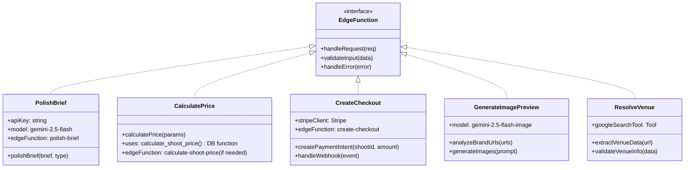

# 📊 FashionOS Mermaid Diagrams & AI Development Guide

**Purpose:** Visual documentation to assist AI models in understanding system architecture, data flow, and user journeys  
**Reference:** [Cursor Mermaid Diagrams Cookbook](https://cursor.com/docs/cookbook/mermaid-diagrams)  
**Mermaid Docs:** [Official Mermaid Documentation](https://mermaid.js.org/)

---

## 🎯 How Mermaid Diagrams Assist AI Development

### Why Diagrams Matter for AI

Diagrams help AI models:
- **Understand System Architecture:** See how components connect and interact
- **Trace Data Flow:** Follow data from input to output across systems
- **Map User Journeys:** Understand complete user workflows
- **Identify Dependencies:** See relationships between components
- **Debug Issues:** Visualize where problems might occur
- **Generate Code:** Create implementations that match the intended architecture

### Best Practices for AI-Assisted Development

1. **Start Small:** Begin with low-level component diagrams, then abstract upward
2. **Be Specific:** Include actual table names, function names, and data structures
3. **Show Relationships:** Connect components with clear labels
4. **Document States:** Show state transitions and lifecycle flows
5. **Include Context:** Add notes about business logic and constraints

---

## 1. 📈 Flowchart Diagrams

### 1.0 Ecommerce Photography Booking Flow (7 Steps)


**Note:** This is the simplified 7-step ecommerce booking flow. For the full 13-phase wizard, see diagram 1.1 below.

### 1.1 Shoot Booking Flow (High-Level Process - 13 Phases)


### 1.2 Pricing Calculation Flow


### 1.3 AI Brief Polishing Flow


### 1.4 Payment Processing Flow


---

## 2. 🔄 Sequence Diagrams

### 2.1 Complete Shoot Booking Sequence (13-Phase Wizard)


### 2.1b Ecommerce Booking Sequence (7 Steps)


### 2.2 Real-Time Pricing Update Sequence


**Note:** The `calculate_shoot_price()` database function is defined in `03-shoot-schema.md` Section VIII.

### 2.3 Brand URL Analysis Sequence


---

## 3. 🏛️ Class Diagrams

### 3.1 Database Schema Class Diagram


### 3.2 Edge Functions Class Diagram



---

## 4. 🔀 State Diagrams

### 4.1 Shoot Status Lifecycle


### 4.2 Payment Status Lifecycle


### 4.3 Event Status Lifecycle


---

## 5. 🗄️ Enhanced Entity Relationship Diagram


---

## 6. 👤 User Journey Diagrams

### 6.1 First-Time User Booking Journey


### 6.2 Returning User Quick Booking


---

## 7. 🏗️ C4 Architecture Diagrams

### 7.1 System Context (Level 1)


### 7.2 Container Diagram (Level 2)


### 7.3 Component Diagram - Booking System (Level 3)


---

## 8. 🔧 How to Use These Diagrams for AI Development

### 8.1 Prompting Strategies

#### For Understanding Architecture
```
"Using the C4 container diagram, explain how data flows from the React web app 
to the database when a user creates a shoot booking."
```

#### For Implementing Features
```
"Based on the sequence diagram for shoot booking, implement the polish-brief 
edge function that calls Gemini AI and updates the database."
```

#### For Debugging
```
"Using the state diagram for shoot status, identify where a booking might get 
stuck if payment succeeds but status doesn't update to 'confirmed'."
```

#### For Code Generation
```
"Generate TypeScript types for the Shoots table based on the class diagram, 
including all relationships and enums."
```

### 8.2 Step-by-Step Development Workflow

1. **Start with Low-Level Diagrams**
   - Begin with sequence diagrams for specific features
   - Use class diagrams to understand data structures
   - Reference state diagrams for business logic

2. **Build Upward**
   - Combine multiple sequence diagrams into flowcharts
   - Use C4 diagrams to understand system boundaries
   - Reference ERD for database relationships

3. **Validate Implementation**
   - Compare generated code to sequence diagrams
   - Verify state transitions match state diagrams
   - Check data flow matches flowcharts

### 8.3 Example AI Prompts

#### Prompt 1: Implement Brief Polishing
```
"Using the AI Brief Polishing Flow diagram and the polish-brief sequence diagram, 
implement the edge function that:
1. Receives a brief text from the frontend
2. Calls Gemini 2.5 Flash API with structured output
3. Returns a polished, professional brief
4. Updates the shoots table with polished_brief_text

Follow the exact flow shown in the diagrams."
```

#### Prompt 2: Create Pricing Component
```
"Based on the Real-Time Pricing Update sequence diagram, create a React hook 
that:
1. Debounces user input (300ms)
2. Calls the calculate-shoot-price edge function
3. Updates the UI with estimated price and breakdown
4. Handles loading and error states

Use the flowchart to understand the pricing calculation logic."
```

#### Prompt 3: Implement Payment Flow
```
"Using the Payment Processing Flow diagram and sequence diagram, implement:
1. Frontend component that calls create-checkout
2. Edge function that creates Stripe payment intent
3. Webhook handler that updates payment and shoot status
4. Error handling for failed payments

Follow the exact state transitions shown in the Payment Status Lifecycle."
```

### 8.4 Diagram Maintenance

- **Update diagrams when code changes:** Keep diagrams in sync with implementation
- **Add new diagrams for new features:** Create diagrams before implementing
- **Use diagrams for code reviews:** Visualize changes before merging
- **Document edge cases:** Add notes to diagrams for special scenarios

---

## 9. 📚 Quick Reference

### Diagram Types by Use Case

| Use Case | Recommended Diagram | Example |
|----------|-------------------|---------|
| **Process Flow** | Flowchart | Booking wizard steps |
| **API Interactions** | Sequence Diagram | Payment processing |
| **Data Structure** | Class Diagram | Database schema |
| **State Management** | State Diagram | Shoot status lifecycle |
| **Database Design** | ERD | Table relationships |
| **User Experience** | User Journey | First-time booking |
| **System Architecture** | C4 Diagrams | Overall system design |
| **Component Design** | Class Diagram | Edge functions structure |

### Mermaid Syntax Quick Reference

- **Flowchart:** `flowchart TD` (top-down) or `flowchart LR` (left-right)
- **Sequence:** `sequenceDiagram` with `participant` and arrows `->>`
- **Class:** `classDiagram` with `class` and relationships
- **State:** `stateDiagram-v2` with states and transitions
- **ERD:** `erDiagram` with entities and relationships
- **Journey:** `journey` with sections and steps
- **C4:** `C4Context`, `C4Container`, `C4Component`

### Tools & Extensions

- **Cursor Extension:** [Markdown Mermaid](https://marketplace.cursorapi.com/items?itemName=bierner.markdown-mermaid)
- **Online Editor:** [Mermaid Live Editor](https://mermaid.live/)
- **Documentation:** [Mermaid.js.org](https://mermaid.js.org/)

---

## 10. 🎨 Visual Style Guide for Diagrams

### Color Coding
- **Purple (#C084FC):** AI/ML operations
- **Green (#10B981):** Success states, payments
- **Blue (#3B82F6):** Data operations, database
- **Orange (#F59E0B):** Warnings, pending states
- **Red (#EF4444):** Errors, cancelled states
- **Gray (#6B7280):** Neutral operations

### Best Practices
- Use consistent naming across all diagrams
- Include actual table/function names from codebase
- Add notes for complex business logic
- Show error paths and edge cases
- Keep diagrams focused (one diagram = one concern)

---

**Last Updated:** 2025-01-27  
**Version:** 1.1  
**Status:** Production-Ready Documentation

**Recent Updates:**
- Added ecommerce booking flow diagram (7 steps)
- Updated edge function references to match actual codebase
- Fixed table/function names to match `03-shoot-schema.md`
- Added note about two booking systems (full wizard vs ecommerce)
