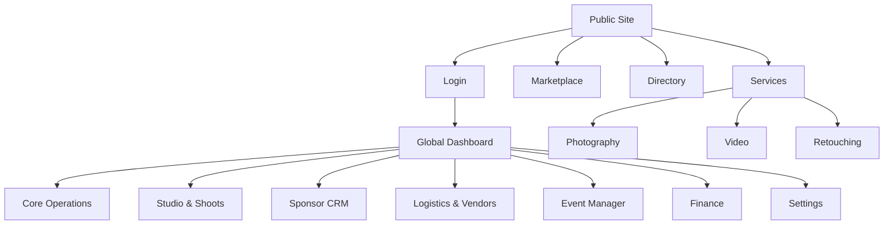
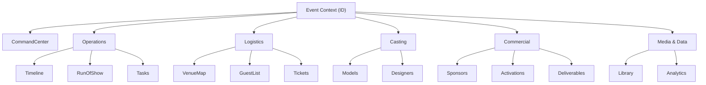
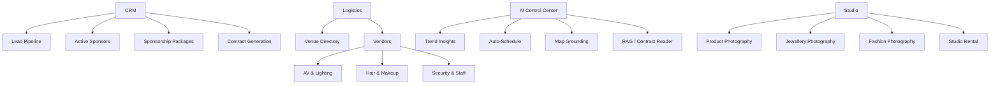

# 🗺️ FashionOS Sitemap & Architecture

## 1. Full Sitemap Structure

### A) CORE SITEMAP (Essential / Beginner View)
*Designed for quick navigation and essential workflows.*

*   **Public Website**
    *   Home
    *   About Us
    *   Contact
    *   **Services**
        *   Fashion Photography
        *   Product Photography
        *   Jewellery Photography
        *   Video Production
        *   Retouching Services
    *   **Marketplace** (Shop)
    *   **Fashion Directory** (Talent Search)
    *   **Events** (Public Calendar)
    *   **Event Detail** (Public View / Ticket Purchase)
    *   **Login / Sign Up**
*   **Dashboard (Private)**
    *   **Overview** (Stats & Upcoming)
    *   **My Events** (List View)
    *   **Event Context** (Active Event)
        *   Command Center
        *   Timeline & Run of Show
        *   Venue Map
        *   Casting Board
        *   Sponsors
        *   Tasks
    *   **Media Library** (DAM)
    *   **Settings**

### B) ADVANCED SITEMAP (Enterprise / Power User View)
*Includes CRM, Logistics, AI Tools, and Studio Operations.*

*   **Global Command Center**
    *   **Core**
        *   Dashboard Overview
        *   Master Calendar
        *   Messages / Inbox
    *   **Studio & Production** (Service Management)
        *   Bookings (Photography/Video Shoots)
        *   Studio Schedule
        *   Retouching Queue
    *   **Commercial (CRM)**
        *   Sponsors List
        *   Lead Pipeline
        *   Packages & Inventory
        *   Contracts Repository
    *   **Logistics**
        *   Venue Directory (Global Maps)
        *   Vendor Database (AV, Lighting, Security, Staff)
        *   Talent Network (Models, HMU, Stylists)
    *   **Finance**
        *   Invoices & Payments
        *   Budget Tracker
    *   **AI Hub**
        *   Insights & Trends
        *   RAG Document Center (Uploads/Parsing)
*   **Event Context** (Inside specific Event ID)
    *   **Management**
        *   Command Center
        *   Timeline (14-Phase)
        *   Run of Show (Minute-by-minute)
    *   **Logistics**
        *   Venue & Floorplan
        *   Guest List & Seating
        *   Tickets & RSVPs
    *   **Casting**
        *   Model Board
        *   Designer Collections
    *   **Commercial**
        *   Active Sponsors
        *   Activations & Booths
        *   Deliverables Tracker
    *   **Post-Event**
        *   Analytics & ROI
        *   Media Recap

---

## 2. Visual Architecture (Mermaid Diagrams)

### Diagram 1 — HIGH-LEVEL SITEMAP (Global)



### Diagram 2 — EVENT-CONTEXT SITEMAP (Inside an Event)



### Diagram 3 — ADVANCED MODULES SITEMAP



---

## 3. Navigation Configuration (JSON)

```json
{
  "public_navigation": [
    { "label": "Home", "path": "/", "icon": "Home" },
    { "label": "About", "path": "/about", "icon": "Info" },
    { 
      "label": "Services", 
      "path": "/services", 
      "icon": "Camera",
      "children": [
        { "label": "Fashion Photography", "path": "/services/fashion-photography" },
        { "label": "Product Photography", "path": "/services/product-photography" },
        { "label": "Jewellery Photography", "path": "/services/jewellery-photography" },
        { "label": "Video Production", "path": "/services/video" },
        { "label": "Retouching", "path": "/services/retouching" }
      ]
    },
    { "label": "Marketplace", "path": "/shop", "icon": "ShoppingBag" },
    { "label": "Directory", "path": "/directory", "icon": "Users" },
    { "label": "Events", "path": "/events", "icon": "Calendar" },
    { "label": "Contact", "path": "/contact", "icon": "Mail" }
  ],
  "dashboard_global": [
    {
      "category": "Core",
      "items": [
        { "label": "Overview", "path": "/dashboard", "icon": "LayoutDashboard" },
        { "label": "Calendar", "path": "/dashboard/calendar", "icon": "Calendar" },
        { "label": "Messages", "path": "/dashboard/messages", "icon": "MessageSquare" }
      ]
    },
    {
      "category": "Studio & Shoots",
      "items": [
        { "label": "Bookings", "path": "/dashboard/bookings", "icon": "Camera" },
        { "label": "Photography Studio", "path": "/dashboard/studio", "icon": "Aperture" },
        { "label": "Retouching", "path": "/dashboard/retouching", "icon": "Wand2" },
        { "label": "Media Gallery", "path": "/dashboard/gallery", "icon": "Image" }
      ]
    },
    {
      "category": "Commercial",
      "items": [
        { "label": "Sponsors", "path": "/dashboard/sponsors", "icon": "Users" },
        { "label": "Pipeline", "path": "/dashboard/leads", "icon": "Target" },
        { "label": "Contracts", "path": "/dashboard/contracts", "icon": "FileText" }
      ]
    },
    {
      "category": "Logistics",
      "items": [
        { "label": "Venue Directory", "path": "/dashboard/venues", "icon": "MapPin" },
        { "label": "Vendors", "path": "/dashboard/vendors", "icon": "Truck" },
        { "label": "Talent Network", "path": "/dashboard/talent", "icon": "Star" }
      ]
    },
    {
      "category": "System",
      "items": [
        { "label": "AI Hub", "path": "/dashboard/ai", "icon": "Sparkles" },
        { "label": "Financials", "path": "/dashboard/financials", "icon": "DollarSign" },
        { "label": "Settings", "path": "/dashboard/settings", "icon": "Settings" }
      ]
    }
  ],
  "event_context": [
    {
      "category": "Management",
      "items": [
        { "label": "Command Center", "path": "", "icon": "Activity" },
        { "label": "Timeline", "path": "timeline", "icon": "Clock" },
        { "label": "Run of Show", "path": "schedule", "icon": "ListVideo" }
      ]
    },
    {
      "category": "Logistics",
      "items": [
        { "label": "Venue & Floorplan", "path": "venue", "icon": "Map" },
        { "label": "Guest List", "path": "guests", "icon": "Users" },
        { "label": "Tickets", "path": "tickets", "icon": "Ticket" }
      ]
    },
    {
      "category": "Casting",
      "items": [
        { "label": "Models", "path": "models", "icon": "Scissors" },
        { "label": "Designers", "path": "designers", "icon": "Shirt" }
      ]
    },
    {
      "category": "Commercial",
      "items": [
        { "label": "Sponsors", "path": "sponsors", "icon": "DollarSign" },
        { "label": "Activations", "path": "activations", "icon": "Zap" },
        { "label": "Deliverables", "path": "deliverables", "icon": "CheckSquare" }
      ]
    }
  ]
}
```

---

## 4. Architectural Logic

### 1. Global Navigation (The Business View)
This layer sits at `/dashboard`. It manages the **assets, people, and money** that span across multiple projects.
*   **Studio & Shoots:** Manages specific service lines like Product Photography or Jewellery Photography bookings that are independent of large events.
*   **CRM:** Manages global relationships with Sponsors and Vendors that might be used across different events (e.g., a long-term contract with LVMH).
*   **Logistics:** The master database of Venues and Talent available to be booked.

### 2. Event Context Mode (The Project View)
When a user selects a specific event (e.g., "NYFW Spring Gala"), the interface shifts focus. All navigation items (Timeline, Models, Sponsors) become filtered **specifically for that event ID**.
*   *Example:* Clicking "Models" inside Event Context shows the Casting Board for *that specific runway show*, not the global database of all models.

### 3. Advanced & AI Modules
*   **AI Hub:** Centralizes tools like Document RAG (chatting with contracts) and Venue Intelligence (Maps integration) to provide insights across the platform.
*   **Vendors:** Detailed management for specialized teams like AV, Lighting, Hair/Makeup, and Security.
*   **Marketplace/Services:** The public-facing pages (e.g., `/services/jewellery-photography`) act as lead-gen funnels that feed directly into the "Bookings" module in the dashboard, connecting the public site to the internal OS.
