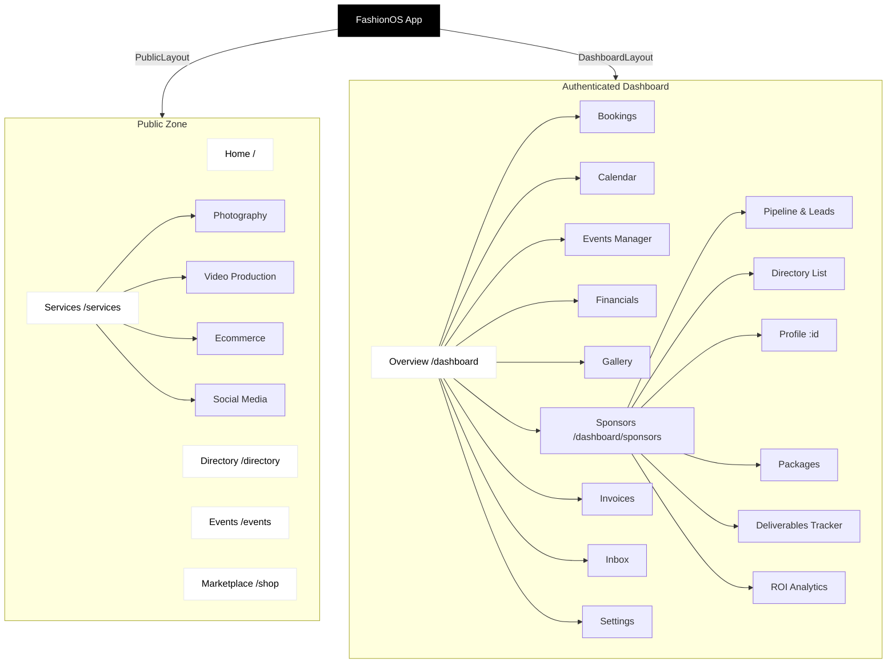

# 🗺️ FashionOS Sitemap

## 🌳 Visual Hierarchy

## 🌐 Public Application
The public-facing side of FashionOS serves as the landing and discovery platform for the fashion industry.

### 1.0 Home (`/`)
*   **Hero Section**: "Operating System for Fashion" value proposition.
*   **Feature Highlights**: Links to Unified Dashboard and Global Directory.
*   **Testimonials**: Social proof.

### 2.0 Services (`/services`)
*   **Overview**: General agency capabilities.
*   **Sub-Pages**:
    *   `/services/photography`: Product & Editorial photography packages.
    *   `/services/video-production`: Campaign films, social content, and showreels.
    *   `/services/ecommerce`: Amazon A+ content, packshots, and AI studio tools.
    *   `/services/social`: Social media management and strategy.
    *   `/services/web-design`: (Link redirects to main Services for now).

### 3.0 Directory (`/directory`)
*   **Functionality**: Talent discovery network.
*   **Filters**:
    *   Category (All, Designers, Photographers, Stylists, Models, Brands, Venues).
    *   Location/Country (USA, Spain, UK, Australia).
    *   Specialty.
*   **View Modes**:
    *   **Grid View**: Visual card layout with rating and role.
    *   **List View**: Compact linear layout for rapid scanning.

### 4.0 Events (`/events`)
*   **Search**: Keyword search for events.
*   **Calendar Filtering**: `CalendarPicker` component for date range selection.
*   **Event Feed**: Chronological listing of fashion shows and meetups.
*   **Concierge**: Info on tickets, venues, and transport.

### 5.0 Marketplace (`/shop` -> `/services/ecommerce`)
*   **Offerings**: Standardized content packs (e.g., "Lookbook Starter", "Amazon A+").

---

## 🔒 Private Dashboard (`/dashboard`)
The authenticated workspace for agency owners and creators. Wrapped in `DashboardLayout`.

### Core Modules

#### 1. Overview (`/dashboard`)
*   **KPI Cards**: Quick stats for Upcoming Events, Bookings, Revenue, Social Growth.
*   **Analytics**: Ticket sales breakdown and Revenue trends.
*   **AI Copilot**: Contextual assistant for creative direction.

#### 2. Bookings (`/dashboard/bookings`)
*   **KPIs**: Total Bookings, Tickets Sold, Earnings, Cancelled.
*   **Ledger**: List of recent booking transactions.

#### 3. Calendar (`/dashboard/calendar`)
*   **Views**: Month, Week, Content.
*   **Filtering**: Event type (Schedules, Event, Meeting, Setup, Deadlines).
*   **Interaction**: Click-to-view event details modal.

#### 4. Events (`/dashboard/events`)
*   **Management**: Organizer view for hosted events.
*   **Analytics**: Ticket sales velocity, revenue per event, attendee demographics.
*   **Activity Feed**: Recent registrations and updates.

#### 5. Sponsors (`/dashboard/sponsors`)
*   **Pipeline**: Visual Kanban board for deal stages.
*   **Directory**: CRM list view of all brand partners.
*   **Packages**: Builder for sponsorship tiers.
*   **Analytics**: ROI and revenue reporting.

#### 6. Financials (`/dashboard/financials`)
*   **Overview**: Total Balance, Income vs Expenses.
*   **Cashflow**: Monthly bar charts.
*   **Transactions**: Detailed table of payments and invoices.

#### 7. Gallery (`/dashboard/gallery`)
*   **Media Library**: Grid view of uploaded assets.
*   **Organization**: Folders and Collections.
*   **Filtering**: By date, type (Image/Video), and tags.

### Placeholder / Planned Modules
*   **Invoices** (`/dashboard/invoices`): Billing management.
*   **Inbox** (`/dashboard/messages`): Direct messaging with talent/clients.
*   **Feedback** (`/dashboard/feedback`): Client review tool.
*   **Social** (`/dashboard/social`): Social media scheduler and analytics.
*   **Directory** (`/dashboard/directory`): Personal address book / CRM.
*   **Shop** (`/dashboard/shop`): E-commerce store settings.
*   **Settings** (`/dashboard/settings`): Account configuration.
