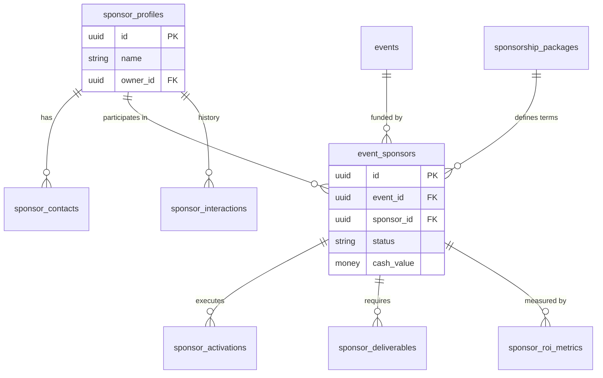
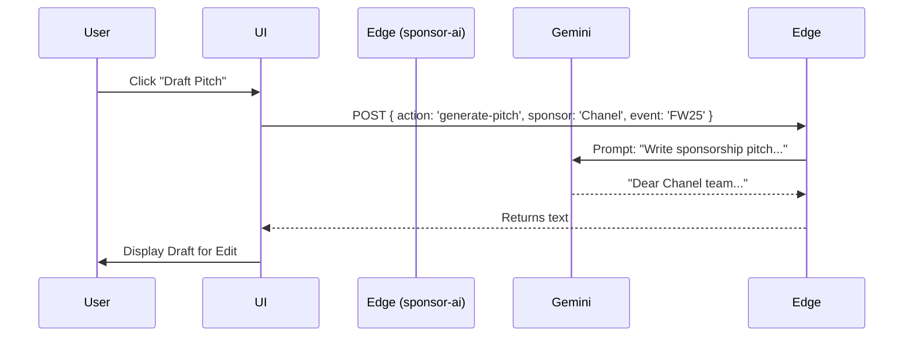
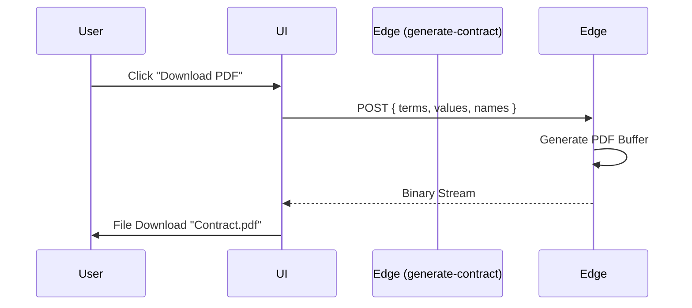

# 🗄️ FashionOS Sponsor CRM - Supabase Architecture Plan

**Version:** 1.0
**Target:** PostgreSQL 15+ (Supabase)
**Module:** Sponsorship & CRM
**Status:** 🟢 Production Ready

---

## 📘 Purpose
This document defines the complete backend architecture for the **Sponsor CRM System** within FashionOS. It details the database schema, security model (RLS), automation logic (Triggers/Edge Functions), and API contracts required to support the full sponsorship lifecycle—from lead acquisition to ROI reporting.

---

## 🧱 Section 1 — Schema Overview

The CRM module resides within the `public` schema but is logically grouped. It connects deeply with the **Events Module** and **Auth System**.

| Table Name | Purpose | Key Relationships |
| :--- | :--- | :--- |
| **`sponsor_profiles`** | The core CRM entity (Brand/Company). | `users` (owner), `event_sponsors` (deals) |
| **`sponsor_contacts`** | Individual stakeholders at the sponsor company. | `sponsor_profiles` |
| **`sponsorship_packages`** | Global templates for tiers (Gold, Silver, etc.). | `event_sponsors` (template source) |
| **`event_sponsors`** | **The Deal.** Links a Sponsor to an Event. | `events`, `sponsor_profiles`, `activations` |
| **`sponsor_activations`** | Physical/Digital footprints (Booths, Lounges). | `event_sponsors` |
| **`sponsor_deliverables`** | Tasks/Assets required (Logos, Ads). | `event_sponsors` |
| **`sponsor_roi_metrics`** | Data points for reporting (Impressions, Leads). | `event_sponsors` |
| **`sponsor_interactions`** | Activity log (Emails, Meetings, Notes). | `sponsor_profiles`, `users` (author) |

---

## 🧩 Section 2 — Table Definitions

### 1. `sponsor_profiles`
**Purpose:** Global registry of brands and companies.
*   **RLS:** Organizers can view/edit their leads. Sponsors can view/edit their own profile if `owner_id` matches.

| Column | Type | Constraints | Description |
| :--- | :--- | :--- | :--- |
| `id` | `uuid` | `PK, default=gen_random_uuid()` | Unique ID |
| `name` | `text` | `NOT NULL` | Company Name (e.g. "Chanel") |
| `industry` | `text` | | e.g. "Fashion", "Beauty", "Tech" |
| `sponsor_type` | `text` | | Enum: 'Luxury', 'Retail', 'Media', etc. |
| `website_url` | `text` | | |
| `logo_url` | `text` | | |
| `contact_email` | `text` | | Primary email for notifications |
| `owner_id` | `uuid` | `FK(auth.users)` | Link to Sponsor User (for Portal access) |
| `lead_score` | `int` | `default=0` | AI-calculated fit score (0-100) |
| `lead_category` | `text` | | 'High', 'Medium', 'Low' |
| `brand_story` | `text` | | AI-generated summary |
| `created_at` | `timestamptz` | `default=now()` | |

### 2. `event_sponsors` (The Deal)
**Purpose:** Represents a specific commercial agreement between a Sponsor and an Event.
*   **RLS:** Organizers view all. Sponsors view ONLY their own deals.

| Column | Type | Constraints | Description |
| :--- | :--- | :--- | :--- |
| `id` | `uuid` | `PK` | Unique Deal ID |
| `event_id` | `uuid` | `FK(events) NOT NULL` | The Event being sponsored |
| `sponsor_id` | `uuid` | `FK(sponsor_profiles) NOT NULL` | The Brand |
| `status` | `text` | `default='Lead'` | 'Lead', 'Negotiating', 'Signed', 'Paid', 'Churned' |
| `level` | `text` | | Tier Name (e.g. "Gold Partner") |
| `cash_value` | `numeric` | `default=0` | Monetary value |
| `in_kind_value` | `numeric` | `default=0` | Value of goods/services |
| `contract_url` | `text` | | Link to signed PDF in Storage |
| `created_at` | `timestamptz` | | |

### 3. `sponsor_activations`
**Purpose:** Tangible execution items linked to a deal.

| Column | Type | Constraints | Description |
| :--- | :--- | :--- | :--- |
| `id` | `uuid` | `PK` | |
| `event_sponsor_id` | `uuid` | `FK(event_sponsors) DELETE CASCADE` | Parent Deal |
| `title` | `text` | `NOT NULL` | e.g. "VIP Lounge Booth" |
| `type` | `text` | | 'Booth', 'Digital', 'Runway', 'GiftBag' |
| `status` | `text` | `default='planning'` | 'planning', 'approved', 'ready', 'completed' |
| `location_in_venue` | `text` | | e.g. "Foyer Zone A" |
| `description` | `text` | | Details for ops team |

### 4. `sponsor_deliverables`
**Purpose:** Assets required to fulfill the contract.

| Column | Type | Constraints | Description |
| :--- | :--- | :--- | :--- |
| `id` | `uuid` | `PK` | |
| `event_sponsor_id` | `uuid` | `FK(event_sponsors)` | Parent Deal |
| `title` | `text` | `NOT NULL` | e.g. "High Res Logo" |
| `type` | `text` | | 'logo', 'video', 'image', 'doc' |
| `status` | `text` | `default='pending'` | 'pending', 'uploaded', 'approved' |
| `due_date` | `timestamptz` | | Deadline |
| `asset_url` | `text` | | Link to file in `sponsor-assets` bucket |

### 5. `sponsor_roi_metrics`
**Purpose:** Analytics data points for reporting.

| Column | Type | Constraints | Description |
| :--- | :--- | :--- | :--- |
| `id` | `uuid` | `PK` | |
| `event_sponsor_id` | `uuid` | `FK(event_sponsors)` | Parent Deal |
| `metric_name` | `text` | `NOT NULL` | e.g. "Booth Visits", "Impressions" |
| `metric_value` | `numeric` | `NOT NULL` | The number |
| `unit` | `text` | `default='count'` | 'count', 'currency', 'percent' |
| `source` | `text` | | 'manual', 'sensor', 'social_api' |
| `created_at` | `timestamptz` | | Timestamp of recording |

### 6. `sponsor_interactions`
**Purpose:** Timeline of touchpoints.

| Column | Type | Constraints | Description |
| :--- | :--- | :--- | :--- |
| `id` | `uuid` | `PK` | |
| `sponsor_id` | `uuid` | `FK(sponsor_profiles)` | |
| `created_by` | `uuid` | `FK(auth.users)` | Who logged it |
| `type` | `text` | | 'email', 'call', 'meeting', 'note' |
| `summary` | `text` | | Short headline |
| `details` | `text` | | Full notes |
| `date` | `timestamptz` | | When it happened |

---

## 🔐 Section 3 — RLS Policies (Multi-Tenant)

We use a mixed model:
1.  **Organizers (Admins/Staff):** Can access all data related to their events.
2.  **Sponsors (External):** Can access ONLY data where `sponsor_profiles.owner_id == auth.uid()`.

### Policy Examples

#### `sponsor_profiles`
```sql
-- Sponsors see their own profile
CREATE POLICY "Sponsors view own profile" ON sponsor_profiles
FOR SELECT USING (owner_id = auth.uid());

-- Organizers see all (assuming admin role check or event link)
CREATE POLICY "Admins view all profiles" ON sponsor_profiles
FOR ALL USING (
  EXISTS (SELECT 1 FROM profiles WHERE id = auth.uid() AND role IN ('admin', 'organizer'))
);
```

#### `event_sponsors`
```sql
-- Sponsors see their own deals
CREATE POLICY "Sponsors view own deals" ON event_sponsors
FOR SELECT USING (
  EXISTS (
    SELECT 1 FROM sponsor_profiles 
    WHERE id = event_sponsors.sponsor_id AND owner_id = auth.uid()
  )
);
```

#### `sponsor_deliverables`
```sql
-- Sponsors can UPLOAD (Update) deliverables linked to them
CREATE POLICY "Sponsors update own deliverables" ON sponsor_deliverables
FOR UPDATE USING (
  EXISTS (
    SELECT 1 FROM event_sponsors es
    JOIN sponsor_profiles sp ON es.sponsor_id = sp.id
    WHERE es.id = sponsor_deliverables.event_sponsor_id
    AND sp.owner_id = auth.uid()
  )
);
```

---

## 🧨 Section 4 — Triggers & Automations

### 1. `auto_create_deliverables`
*   **Trigger:** AFTER UPDATE on `event_sponsors`.
*   **Condition:** `OLD.status != 'Signed'` AND `NEW.status == 'Signed'`.
*   **Logic:**
    1.  Fetch `sponsorship_packages` definition matching `level`.
    2.  Read `deliverables_template` JSON.
    3.  Insert rows into `sponsor_deliverables` for this deal.
    4.  Calculates `due_date` based on offsets (e.g. `NOW() + interval '14 days'`).

### 2. `update_timestamps`
*   **Trigger:** BEFORE UPDATE on all tables.
*   **Logic:** Set `updated_at = NOW()`.

---

## 🛰 Section 5 — Edge Functions

### 1. `sponsor-ai`
*   **Purpose:** Intelligence layer for the CRM.
*   **Actions:**
    *   `score-lead`: Analyzes industry fit + budget. Returns `{ score: 85, category: 'High' }`.
    *   `activation-ideas`: Generates creative concepts based on brand + event theme.
    *   `generate-pitch`: Drafts cold outreach emails.
    *   `generate-roi-report`: Summarizes metrics into an executive summary.
*   **Input:** JSON with `action`, `sponsorName`, `eventDetails`, `metrics` (optional).

### 2. `manage-sponsors`
*   **Purpose:** Business logic transaction handler.
*   **Actions:**
    *   `calculate-roi`: Aggregates `sponsor_roi_metrics` and compares to `cash_value` to determine CPM/ROI.
    *   `update-status`: Handles complex status transitions (e.g. notifying stakeholders).

### 3. `generate-contract`
*   **Purpose:** Document generation.
*   **Input:** Sponsor details, deal terms, event info.
*   **Output:** Binary PDF stream (using `jspdf` or similar).

### 4. `invite-sponsor-user`
*   **Purpose:** User onboarding.
*   **Logic:** Uses `supabaseAdmin.auth.admin.inviteUserByEmail` to create a user account linked to a `sponsor_profile`.

---

## 🧼 Section 6 — Optimized Index Strategy

| Table | Columns | Type | Reason |
| :--- | :--- | :--- | :--- |
| `sponsor_profiles` | `name` | `GIN (trigram)` | Fuzzy search for brands. |
| `sponsor_profiles` | `industry` | `BTREE` | Filtering lists. |
| `event_sponsors` | `event_id` | `BTREE` | Filtering deals by event. |
| `event_sponsors` | `status` | `BTREE` | Kanban board columns. |
| `sponsor_deliverables` | `event_sponsor_id` | `BTREE` | Fetching task lists. |
| `sponsor_roi_metrics` | `created_at` | `BTREE` | Time-series charts. |

---

## 🗺 Section 7 — ERD Diagram



---

## 🔄 Section 8 — Data Flow Diagrams

### 1. Sponsor Pipeline Flow
```mermaid
flowchart TD
    A[Lead Identified] -->|Manual/Import| B(sponsor_profiles created)
    B -->|AI Analysis| C[Lead Scored]
    C --> D{Qualifies?}
    D -- No --> E[Churned]
    D -- Yes --> F[Create Deal (event_sponsors)]
    F -->|Negotiation| G[Status: Signed]
    G -->|Trigger| H[Auto-create Deliverables]
    H --> I[Sponsor Uploads Assets]
    I --> J[Ops Approves]
    J --> K[Activations Live]
```

---

## 📞 Section 9 — Sequence Diagrams

### A. AI Pitch Generation


### B. Contract Generation


---

## 🔌 Section 10 — API Contracts

### TypeScript Interfaces
These types are available in `types/sponsorship.ts`.

**`SponsorProfile`**
```typescript
interface SponsorProfile {
  id: string;
  name: string;
  industry: string;
  owner_id?: string; // Linked User
  lead_score?: number;
}
```

**`EventSponsor` (Deal)**
```typescript
interface EventSponsor {
  id: string;
  event_id: string;
  sponsor_id: string;
  status: 'Lead' | 'Negotiating' | 'Signed' | 'Paid';
  cash_value: number;
  contract_url?: string;
}
```

---

## 🧪 Section 11 — Validation & Success Criteria

### Functional Success
1.  **Pipeline:** Moving a card from "Negotiating" to "Signed" updates the DB and triggers deliverable creation.
2.  **Portal:** A user logged in as a Sponsor can ONLY see their deals and cannot see other sponsors.
3.  **AI:** Clicking "Score Lead" returns a valid 0-100 score and reasoning string.

### Technical Success
1.  **Performance:** Dashboard loads in < 500ms (indexes active).
2.  **Security:** RLS policies prevent cross-tenant leakage (verified by negative tests).
3.  **Integrity:** Deleting a `sponsor_profile` cascades and deletes their deals/contacts (if allowed) or restricts deletion if active deals exist.

---
