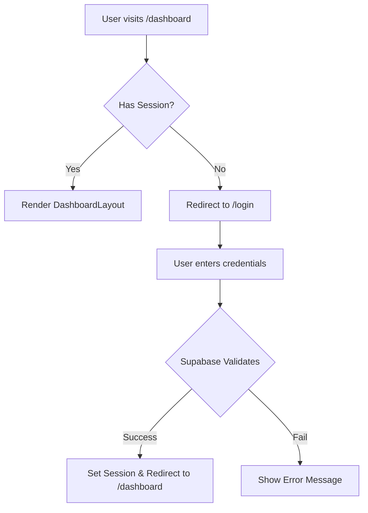

#  Task: Authentication & User Profiles Implementation

**Status:** Planned  
**Priority:** P0  
**Owner:** Engineering  

## 1. Context Summary
Currently, the application uses a mock `RequireAuth.tsx` component which hardcodes `isAuthenticated = true`. There is no real user management, login, or signup flow. Supabase is the chosen backend provider but is not integrated on the client side.

## 2. Multistep Development Prompt

### Iteration 1: Core Integration (MVP)
1.  **Install Dependencies:** Add `@supabase/supabase-js`.
2.  **Config:** Create `lib/supabase.ts` to initialize the client using `VITE_SUPABASE_URL` and `VITE_SUPABASE_ANON_KEY`.
3.  **Auth Context:** Create `components/auth/AuthProvider.tsx`.
    *   Use `useEffect` to listen to `supabase.auth.onAuthStateChange`.
    *   Provide `user` and `session` objects to the app via Context API.
4.  **Login Page:** Create `pages/auth/LoginPage.tsx`.
    *   Implement a simple Email/Password form using `supabase.auth.signInWithPassword`.
    *   Add a "Sign in with Google" button using `supabase.auth.signInWithOAuth`.
5.  **Protection:** Update `RequireAuth.tsx` to consume the real `AuthContext`. Redirect to `/login` if null.

### Iteration 2: User Experience
1.  **Signup Flow:** Create `pages/auth/SignupPage.tsx` with Name, Email, Password.
    *   Handle "Check your email for confirmation" state.
2.  **Persist Session:** Ensure token refresh works automatically (handled by Supabase JS, verify config).
3.  **Redirects:**
    *   If user accesses `/login` while authenticated, redirect to `/dashboard`.
    *   Preserve the intended destination when redirecting unauthenticated users to login (e.g., `?next=/dashboard/settings`).

### Iteration 3: Profile Management
1.  **Database:** Ensure `profiles` table exists in Supabase (linked to `auth.users`).
2.  **Profile Hook:** Create `useProfile` hook to fetch extended user data (role, avatar, full name) from the `profiles` table.
3.  **UI Integration:** Update `DashboardLayout` sidebar/header to show the real user's avatar and name.

## 3. Success Criteria
- [ ] `npm install @supabase/supabase-js` runs successfully.
- [ ] `.env.local` contains valid Supabase keys.
- [ ] User can sign up with email/password.
- [ ] User can log in and is redirected to Dashboard.
- [ ] Unauthenticated access to `/dashboard` redirects to `/login`.
- [ ] Reloading the page maintains the session.
- [ ] "Sign Out" button in Dashboard works and clears local storage.

## 4. Production Checklist
- **Security:** RLS policies on `profiles` table must be enabled (Users can only read/update their own data).
- **Config:** Environment variables set in Vercel/Netlify.
- **Error Handling:** Display clear error messages for "Invalid credentials" or "User already exists".
- **Loading States:** Show a full-screen spinner while checking initial session state to prevent "flash of unauthenticated content".

## 5. Testing Plan
1.  **Manual Test:** Open Incognito window. Try to access `/dashboard`. Verify redirect to login.
2.  **Manual Test:** Sign up with a temporary email. Verify confirmation flow.
3.  **Manual Test:** Log in. Close tab. Reopen. Verify still logged in.
4.  **Component Check:** Verify `AuthProvider` wraps the entire application in `index.tsx` or `App.tsx`.

## 6. Diagrams

