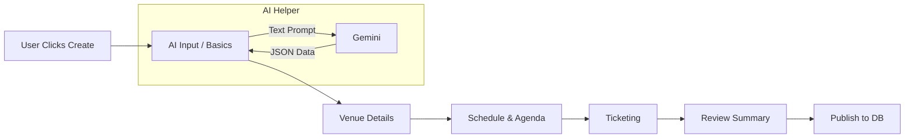

# Task: Event Creation Wizard UI

**Status:** Planned  
**Priority:** P1  
**Owner:** Frontend  

## 1. Context Summary
The docs mention a powerful "Maria" AI Event Wizard, but the current codebase only has a `VeoTrailerGenerator` and a simple "Create Event" button that links to a placeholder. We need the actual multi-step modal or page that captures event details.

## 2. Multistep Development Prompt

### Iteration 1: Structure & State (MVP)
1.  **Component:** Create `components/events/EventWizard.tsx` as a full-screen Modal or dedicated Route.
2.  **State Machine:** Define steps: `Intro` -> `Basics` -> `Venue` -> `Schedule` -> `Tickets` -> `Review`.
3.  **Navigation:** Implement "Next" and "Back" buttons with basic validation (fields required).
4.  **Basics Form:** Title, Description, Date/Time Picker (reuse `CalendarPicker`), Category dropdown.

### Iteration 2: The AI "Maria" Input
1.  **Chat Interface:** In the `Intro` step, add a large text area: "Describe your event...".
2.  **Integration:** Connect to Gemini API (mock for now or real if key exists).
    *   Prompt: "Extract event details from this text into JSON."
3.  **Auto-Fill:** When AI returns JSON, populate the `Basics` and `Venue` form fields automatically.
4.  **Feedback:** Show a "Magic" animation while AI is processing.

### Iteration 3: Advanced Steps
1.  **Venue:** Location search input (Google Maps style).
2.  **Tickets:** Dynamic list to add multiple ticket tiers (Name, Price, Quantity).
3.  **Preview:** A "Review" step that renders a mock `EventCard` showing how it will look.
4.  **Publish:** "Create Event" button that (mock) saves to database and redirects to the new Event Details page.

## 3. Success Criteria
- [ ] Wizard opens from Dashboard "Create Event" button.
- [ ] Multi-step navigation works smoothly.
- [ ] Form state persists between steps (using React Context or Zustand).
- [ ] "AI Auto-fill" button populates at least Title and Date from text input.
- [ ] Final "Publish" action logs the event object to console (until backend is ready).

## 4. Production Checklist
- **UX:** Progress bar indicating `%` complete.
- **Validation:** Prevent proceeding if "Title" or "Date" is missing.
- **Responsiveness:** Wizard must work on mobile (stack inputs, hide fancy sidebars).
- **Accessibility:** Keyboard navigation between form fields.

## 5. Testing Plan
1.  **Flow Test:** Start wizard, type "Fashion Show on Friday", click "Next". Verify fields are empty (if no AI) or filled (if AI wired). Manually fill rest. Finish.
2.  **Validation Test:** Try clicking "Next" on empty form. Expect error styles.
3.  **Cancel Test:** Click "X" or "Cancel". Confirm "Are you sure? Data will be lost" prompt appears.

## 6. Diagrams

