# Task: Service Booking Wizard ("The Shoot Flow")

**Status:** Planned  
**Priority:** P0  
**Owner:** Frontend  

## 1. Context Summary
This is the core revenue engine of FashionOS. It translates the "Airbnb for Fashion" vision into code. We need a multi-step wizard that allows users to book Photography, Video, or Web Design services. This flow is fully specified in `docs/01-shoot-booking-plan.md` and `docs/02-shoot-flow.md`.

## 2. Multistep Development Prompt

### Iteration 1: Wizard Shell & Routing
1.  **Route:** Create a new route `/book` or `/start-project` in `App.tsx`.
2.  **Layout:** Create a dedicated `WizardLayout.tsx` (minimal header, no footer, progress bar).
3.  **State Management:** Create a `BookingContext` to store:
    *   `serviceType` (Photo/Video/Web)
    *   `category` (Ecomm/Editorial)
    *   `quantity` (Number of looks)
    *   `logistics` (Date/Location)
4.  **Navigation:** Implement `Next`, `Back`, and `Save Draft` buttons.

### Iteration 2: Step-by-Step UI Implementation
*Follow the UI spec in `docs/02-shoot-flow.md`.*
1.  **Step 1 (Service):** Card grid selection (Photography, Video, Hybrid).
2.  **Step 2 (Category):** Visual grid (Lookbook, E-comm, Campaign).
3.  **Step 3 (Scope):** Slider or number input for "Number of Looks/Products".
    *   *Logic:* Display an estimated price summary sidebar that updates as quantity changes.
4.  **Step 4 (The Brief):** Textarea for creative direction.
    *   *AI Feature:* Add a "Polish Brief" button (mock for now) that cleans up the text.

### Iteration 3: Review & Mock Payment
1.  **Summary Screen:** "Receipt" style view showing all selections and final estimated cost.
2.  **Submission:** "Confirm Booking" button.
    *   *Action:* Log the booking object to console.
    *   *Redirect:* Go to `/dashboard/bookings` (or a Success page).

## 3. Success Criteria
- [ ] `/book` route is accessible.
- [ ] User can navigate forward/backward through all 5 steps.
- [ ] Selecting "10 Looks" updates the price in the sidebar (e.g., 10 * $50 = $500).
- [ ] Form state is preserved if user goes back a step.
- [ ] "Confirm" button triggers a success state/redirect.

## 4. Production Checklist
- **Mobile:** The summary sidebar must collapse into a bottom sheet or total bar on mobile.
- **Validation:** Disable "Next" button until a selection is made.
- **Edge Cases:** Handle "0 looks" or invalid dates.

## 5. Testing Plan
1.  **Flow Test:** Select "Photography" -> "E-comm" -> "50 Looks". Check price. Enter brief. Confirm.
2.  **Responsive Test:** Open on mobile view. Ensure "Next" button is always visible (sticky bottom).
3.  **State Test:** Fill step 1 & 2. Refresh page. (Optional: Does it persist? If not, ensure it redirects gracefully to Step 1).

## 6. Diagrams

```mermaid
flowchart LR
    Start[User Clicks 'Book Shoot'] --> Step1[Service Selection]
    Step1 --> Step2[Category & Vibe]
    Step2 --> Step3[Scope & Quantity]
    Step3 --> Step4[Logistics & Date]
    Step4 --> Step5[Brief & AI Polish]
    Step5 --> Review[Summary & Price]
    Review --> Payment[Checkout]
    Payment --> DB[Create Booking Record]
```

