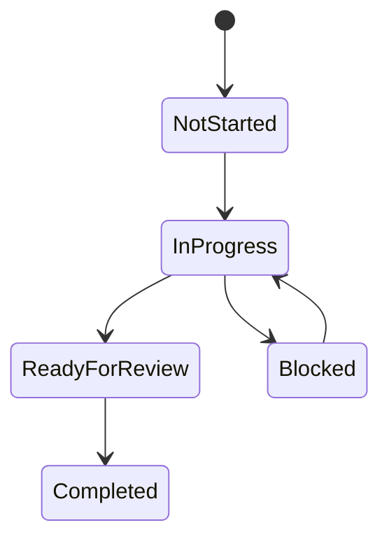

# 🪄 **Task 18: Progress Tracker Matrix**

**Status:** 🟢 Ongoing
**Priority:** P2
**Owner:** Project Manager

---

## **1. Context Summary**

This task involves maintaining the **Feature Matrix** (`docs/progress-tracker-matrix.md`).
It serves as the central source of truth for feature completion status (%) across all modules.

---

## **2. Prerequisites**

1.  `progress-tracker-matrix.md` file.
2.  Regular sync with dev team.

---

## **3. Maintenance Workflow**

### **Weekly Update**

**Trigger:** Weekly Sprint Review.
**Action:**
1.  Update status icons (⚪ 🟡 🔴 🔵 🟢).
2.  Update % Complete.
3.  Add notes on "Missing/Failing" items.
4.  Define "Next Actions".

---

## **4. Architecture & Data Flow**

### ✔ State Diagram (Feature Lifecycle)

