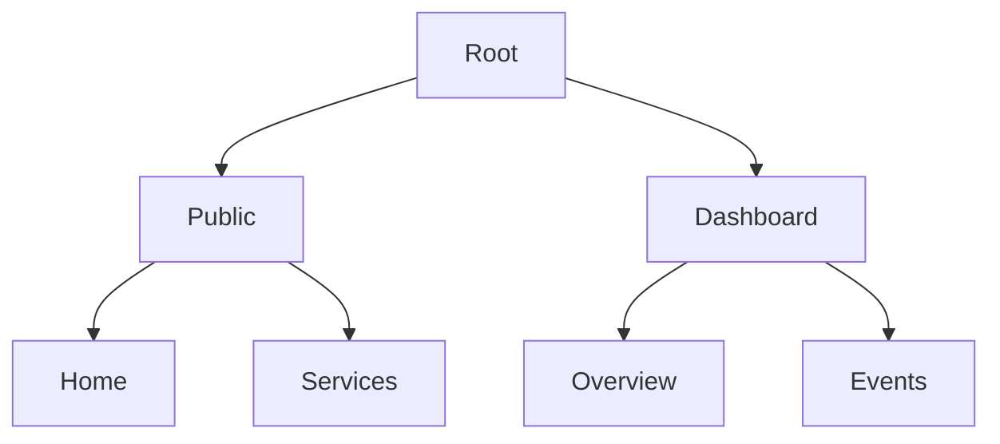

# 🪄 **Task 20: Sitemap & Architecture Definition**

**Status:** 🟢 Done (Maintenance Mode)
**Priority:** P3
**Owner:** Product

---

## **1. Context Summary**

This task maintains the **Visual Hierarchy** and **Route Map** of the application (`docs/sitemap.md`).
It ensures that new pages (e.g., `/start-project`) are documented and correctly placed in the navigation structure.

---

## **2. Prerequisites**

1.  `docs/sitemap.md`.
2.  Router configuration (`App.tsx`).

---

## **3. Maintenance Workflow**

### **Update Trigger**

**Trigger:** Adding a new Route.
**Action:**
1.  Add route to `sitemap.md`.
2.  Update Mermaid graph visual.
3.  Define if Public or Private (Dashboard).

---

## **4. Architecture & Data Flow**

### ✔ Sitemap Graph

