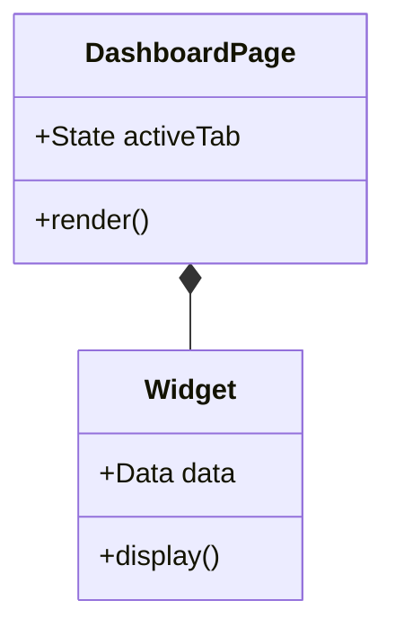

# 🪄 **Task 17: Dashboard Documentation**

**Status:** 🟢 Planned
**Priority:** P3
**Owner:** Frontend / Tech Writer

---

## **1. Context Summary**

This task involves creating and maintaining the technical documentation for the Dashboard Module.
It covers Component Architecture, AI Integration details, and Data Visualization logic.
Target file: `docs/dashboard-documentation.md`.

---

## **2. Prerequisites**

1.  Existing Dashboard code (`pages/dashboard/*`).
2.  AI Widget code (`components/dashboard/Widgets.tsx`).

---

## **3. Multistep Development Prompts**

### **Iteration 1 — Component Map**

**Goal:** Document UI structure.
**Prompt:**
1.  List all Dashboard sub-pages (Overview, Bookings, etc.).
2.  Document props and state for key components (`KPICard`, `Chart`).
3.  Explain Layout structure (`DashboardLayout`).

### **Iteration 2 — AI & Data Logic**

**Goal:** Document Internals.
**Prompt:**
1.  Explain `AICopilotWidget` integration (Gemini model, system prompts).
2.  Document data fetching patterns (Mocks vs Supabase).
3.  List known limitations and TODOs.

---

## **4. Architecture & Data Flow**

### ✔ Class Diagram (Dashboard)

