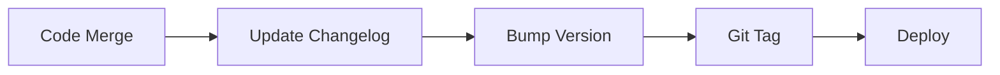

# 🪄 **Task 16: Changelog & Maintenance**

**Status:** 🟢 Ongoing
**Priority:** P3
**Owner:** All Developers

---

## **1. Context Summary**

This task defines the process for maintaining the `CHANGELOG.md` and keeping documentation in sync with code.
It ensures that every release is documented, versioned, and communicative.

---

## **2. Prerequisites**

1.  `CHANGELOG.md` file.
2.  Semantic Versioning standards (SemVer).

---

## **3. Maintenance Workflow**

### **Step 1 — Entry Creation**

**Trigger:** New Feature or Fix merged.
**Action:**
1.  Add entry under `[Unreleased]` or new version header.
2.  Format: `- **Category:** Description (PR #123)`.
3.  Categories: `Added`, `Changed`, `Deprecated`, `Removed`, `Fixed`, `Security`.

### **Step 2 — Versioning**

**Trigger:** Release to Production.
**Action:**
1.  Bump version number in `package.json`.
2.  Move `[Unreleased]` items to `[x.x.x] - YYYY-MM-DD`.
3.  Create git tag.

---

## **4. Architecture & Data Flow**

### ✔ Flowchart (Release Process)

