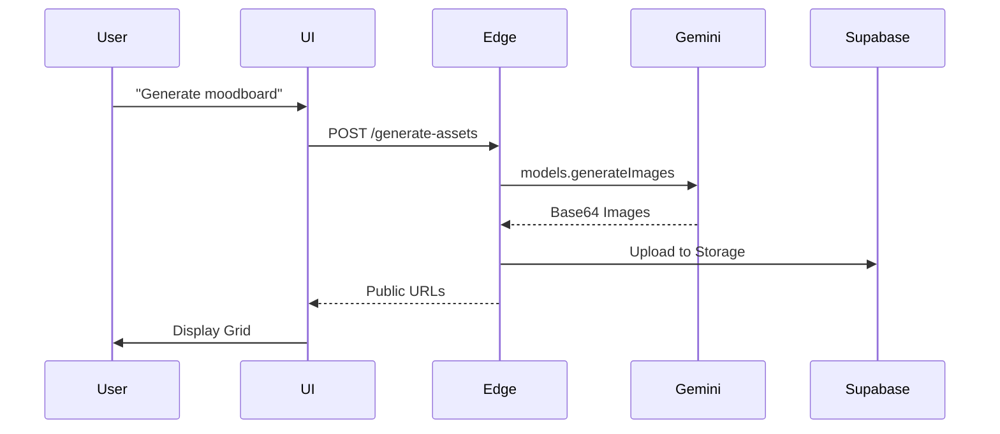
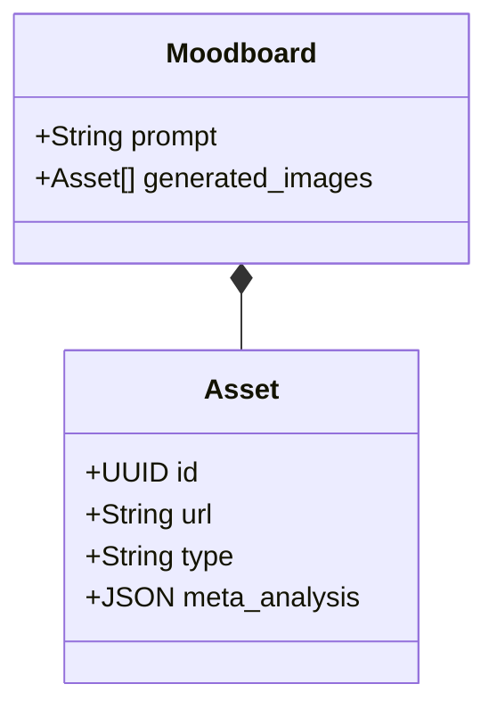
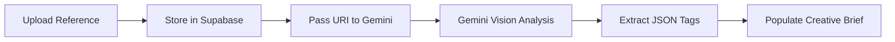

# 🪄 **Task 09: AI Creative Director (Vision & Gen)**

**Status:** 🟢 Planned
**Priority:** P1
**Owner:** AI Engineering

---

## **1. Context Summary**

This module brings **Visual Intelligence** to FashionOS.
It allows designers to **generate moodboards** from text and **analyze reference styles** from uploaded videos/images.
It lives in the `EventWizard` and `ShootBooking` flows.

---

## **2. Prerequisites (Reuse First)**

1.  Gemini Models: `gemini-3-pro-image-preview` (Generation), `gemini-3-pro-preview` (Vision/Video)
2.  Supabase Storage: For uploading reference files
3.  Edge Function: `generate-assets`, `analyze-media`

---

## **3. Multistep Development Prompts**

### **Iteration 1 — Moodboard Generator**

**Goal:** Visual Inspiration
**Prompt:**
1.  Create `components/creative/MoodboardGenerator.tsx`.
2.  Input: Text Prompt ("Cyberpunk runway, neon rain").
3.  Call Edge Function -> Gemini Image Model.
4.  Config: `numberOfImages: 4`, `aspectRatio: '1:1'`.
5.  UI: Display grid. Allow selecting an image to save to "Project Assets".

### **Iteration 2 — Style Analyzer (Video)**

**Goal:** Deconstruct References
**Prompt:**
1.  Upload Component for MP4/Images.
2.  Upload to Supabase Storage -> Get Public URL.
3.  Call Gemini Vision with URL.
4.  Prompt: "Analyze the lighting, color palette, and mood. Return JSON: { lighting: '...', colors: ['#hex'], mood: '...' }".
5.  Display analysis in the Creative Brief.

---

### **Success Criteria for This Task**

*   [ ] 4 images generated within 10 seconds
*   [ ] Video analysis returns accurate descriptive tags
*   [ ] Generated assets can be saved to the User's Gallery

---

### **Production-Ready Checklist**

*   [ ] Edge Function timeout handling (GenAI can be slow)
*   [ ] Image optimization (WebP)
*   [ ] Quota management (Prevent abuse)
*   [ ] Mobile layout tested

---

## **4. Architecture & Data Flow**

### ✔ Sequence Diagram (Image Gen)

### ✔ Class Diagram (Media Types)

### ✔ Flowchart (Vision Analysis)

