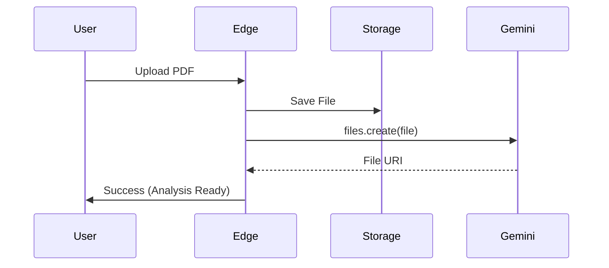
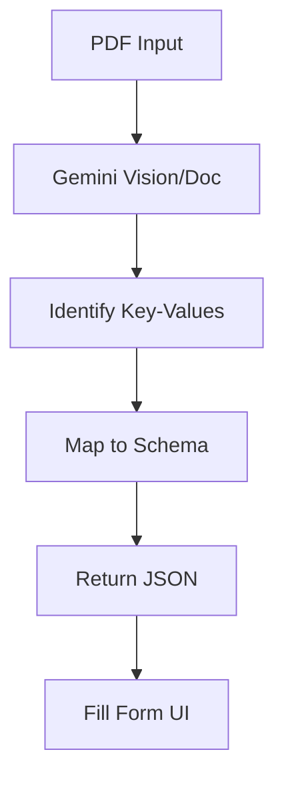
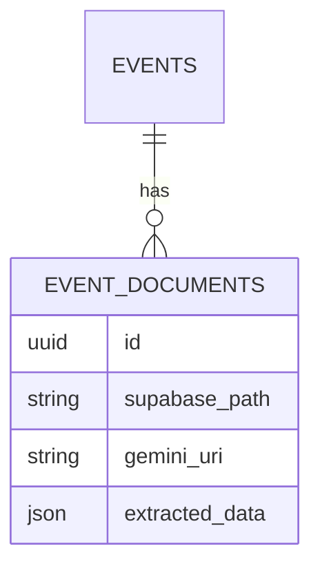

# 🪄 **Task 10: Intelligent Document Processing (Context)**

**Status:** 🟢 Planned
**Priority:** P1
**Owner:** Backend / AI

---

## **1. Context Summary**

This module enables FashionOS to "read" user documents.
It ingests Venue Contracts (PDF), Guest Lists (CSV), and Brand Guidelines.
It uses **Gemini Files API** and **RAG (File Search)** to answer questions and pre-fill forms.

---

## **2. Prerequisites (Reuse First)**

1.  Gemini Tools: `File Search`, `Files API`, `Document Processing`
2.  Supabase Storage: `documents` bucket
3.  Edge Function: `process-document`

---

## **3. Multistep Development Prompts**

### **Iteration 1 — File Ingestion Pipeline**

**Goal:** Upload & Index
**Prompt:**
1.  Create Edge Function `upload-context`.
2.  Flow: Client Upload -> Supabase Storage -> Gemini `files.create`.
3.  Store the `file.uri` mapping in Supabase `event_documents` table.

### **Iteration 2 — Contract Extraction**

**Goal:** Data Entry Automation
**Prompt:**
1.  User uploads Venue Contract (PDF).
2.  Gemini Prompt: "Extract: Total Fee, Capacity, Restrictions, Access Hours."
3.  Return JSON.
4.  Frontend: Auto-fill the "Venue" step in Event Wizard.

### **Iteration 3 — RAG / Chat with PDF**

**Goal:** Interactive Help
**Prompt:**
1.  In AI Copilot, allow context: "Attached Contract".
2.  User asks: "Is alcohol allowed?"
3.  Gemini retrieves answer from the specific file content using File Search tool.

---

### **Success Criteria for This Task**

*   [ ] PDF text extracted accurately (90%+)
*   [ ] Files uploaded to Gemini allow "Chat with Doc"
*   [ ] Extracted data maps correctly to DB fields

---

### **Production-Ready Checklist**

*   [ ] File size limits enforced (20MB)
*   [ ] Security: Only Owner can access file context
*   [ ] Cleanup: Delete files from Gemini when deleted in App
*   [ ] Error handling for unreadable PDFs

---

## **4. Architecture & Data Flow**

### ✔ Sequence Diagram (Ingestion)

### ✔ Flowchart (Extraction)

### ✔ ERD (Document Linking)

