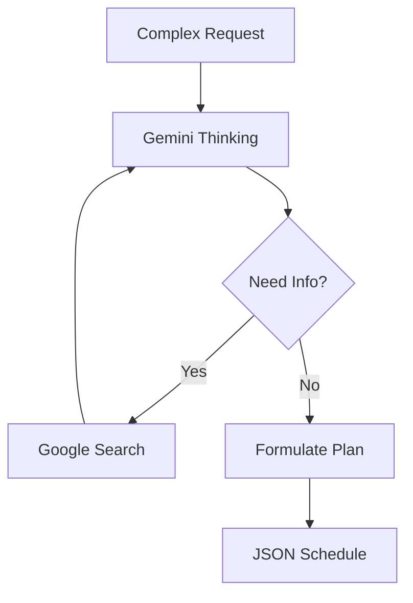
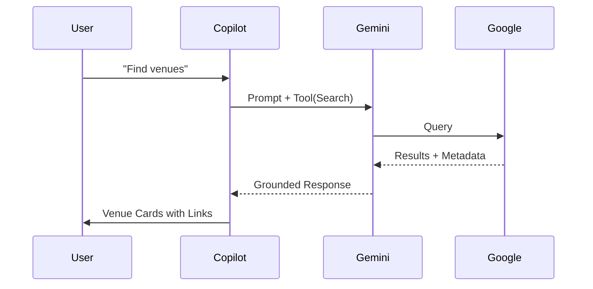
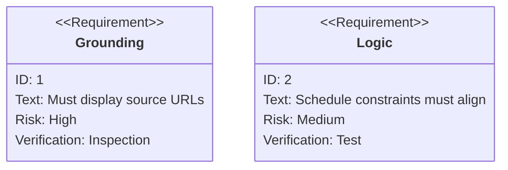

# 🪄 **Task 11: Strategic Planning Agent (Reasoning)**

**Status:** 🟢 Planned
**Priority:** P2
**Owner:** AI Engineering

---

## **1. Context Summary**

This module acts as the "Strategic Brain" of FashionOS.
It uses **Gemini Thinking Models** to solve complex logistics (Schedules) and **Google Search Grounding** to find real-world data (Venues, Trends).

---

## **2. Prerequisites (Reuse First)**

1.  Gemini Model: `gemini-3-pro-preview` (Thinking enabled)
2.  Tool: `googleSearch`
3.  Edge Function: `ai-copilot`

---

## **3. Multistep Development Prompts**

### **Iteration 1 — Venue Scout (Grounding)**

**Goal:** Real-world Data
**Prompt:**
1.  Input: "Rooftop venues in Brooklyn ~200 pax".
2.  Enable `tools: [{ googleSearch: {} }]`.
3.  Output: List of venues with Names, Ratings, Addresses, and **Source URLs** (mandatory display).
4.  UI: Render as `VenueCard` with "Add to Event" button.

### **Iteration 2 — Schedule Optimizer (Thinking)**

**Goal:** Logic & Constraints
**Prompt:**
1.  Input: "20 models, 2 hair/makeup artists, show at 8pm. Build schedule."
2.  Config: `thinking_config: { budget: 2048 }`.
3.  Reasoning: "20 models / 2 artists = 10 batches. 30min per face = 5 hours prep needed."
4.  Output: Detailed Call Times table (JSON).

---

### **Success Criteria for This Task**

*   [ ] Search results are real and clickable
*   [ ] Schedule logic holds up to scrutiny (no overlaps)
*   [ ] Thought process (if visible) shows logical steps

---

### **Production-Ready Checklist**

*   [ ] Grounding attribution displayed (Requirement)
*   [ ] Token limits managed for Thinking models
*   [ ] Fallback if Search fails
*   [ ] Mobile layout tested

---

## **4. Architecture & Data Flow**

### ✔ Flowchart (Reasoning Loop)

### ✔ Sequence Diagram (Venue Search)

### ✔ Requirement Diagram

