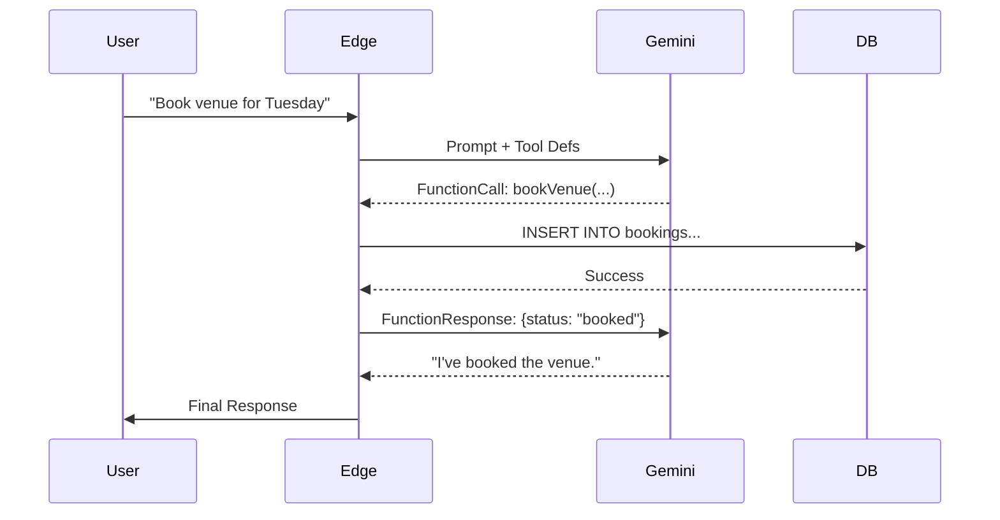
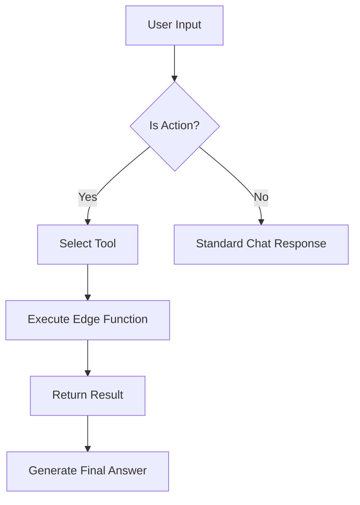
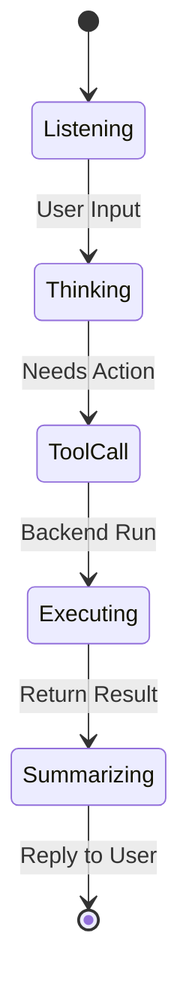

# 🪄 **Task 12: Autonomous Actions (Function Calling)**

**Status:** 🟢 Planned
**Priority:** P2
**Owner:** Backend / AI

---

## **1. Context Summary**

This module allows the AI Chat to **execute actions** in the database.
Instead of just suggesting "You should create a task," it says "I have created the task for you."
It uses **Gemini Function Calling** mapped to **Supabase Edge Functions**.

---

## **2. Prerequisites (Reuse First)**

1.  Edge Functions: `create-event`, `create-task`, `check-availability`
2.  Gemini Tool Config: `functionDeclarations`
3.  Supabase Tables: `tasks`, `events`

---

## **3. Multistep Development Prompts**

### **Iteration 1 — Tool Definition**

**Goal:** Schema Setup
**Prompt:**
1.  Define tools in `ai-copilot` Edge Function.
2.  `createTask(title, date, assignee)`
3.  `checkAvailability(resource_id, date)`
4.  Pass these definitions to `ai.models.generateContent`.

### **Iteration 2 — Execution Loop**

**Goal:** Action
**Prompt:**
1.  User: "Remind me to call the venue tomorrow."
2.  Gemini: Returns `FunctionCall: createTask('Call venue', '2025-xx-xx')`.
3.  Backend: Detects `functionCall`, executes DB insert.
4.  Backend: Sends `FunctionResponse` ("Task ID 123 created") back to Gemini.
5.  Gemini: "Done! I've added that to your task list."

### **Iteration 3 — Budget Calculator (Code Execution)**

**Goal:** Math Accuracy
**Prompt:**
1.  Enable `tools: [{ codeExecution: {} }]`.
2.  User: "If I have $10k and venue is $4k, models are $500 each, how many models can I book?"
3.  Gemini: Writes Python code to solve equation.
4.  Output: Precise number (not hallucinated).

---

### **Success Criteria for This Task**

*   [ ] Chat can create a database row
*   [ ] Math queries use Code Execution
*   [ ] "Human in the loop" confirmation for destructive actions

---

### **Production-Ready Checklist**

*   [ ] Edge Function security (verify User ID)
*   [ ] Tool descriptions refined for accuracy
*   [ ] Error handling (if DB fails)
*   [ ] Logging of all tool usage

---

## **4. Architecture & Data Flow**

### ✔ Sequence Diagram (Tool Call)

### ✔ Flowchart (Decision Logic)

### ✔ State Diagram (Action)

