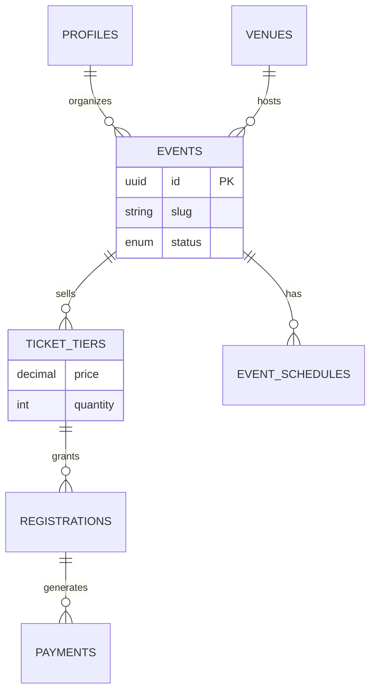
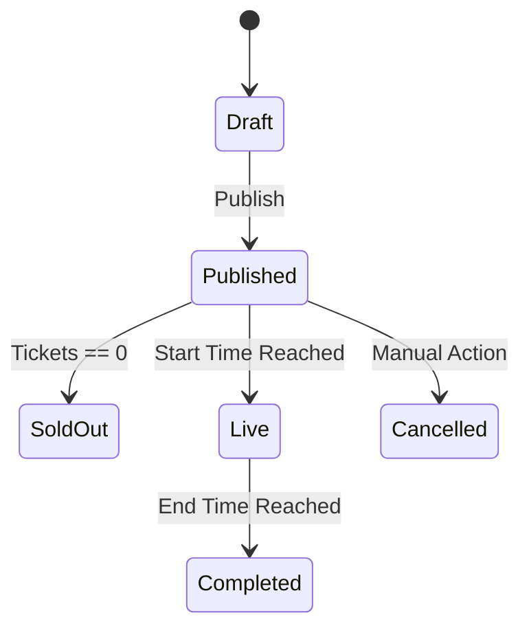

# 🪄 **Task 01: Event Management Schema**

**Status:** 🟢 Planned
**Priority:** P0
**Owner:** Database

---

## **1. Context Summary**

This module defines the data structure for **Events, Tickets, and Schedules**.
It supports the `EventWizard` and `EventsPage`.
It handles the relationships between Organizers, Venues, and Attendees.

---

## **2. Prerequisites (Reuse First)**

1.  Task 03 (Base Schema - Profiles/Shoots).
2.  Supabase SQL Editor.

---

## **3. Multistep Development Prompts**

### **Iteration 1 — Core Event Tables**

**Goal:** Define the Event entity.
**Prompt:**
1.  Create `venues` table (Reusable locations).
2.  Create `events` table (Title, Slug, Date, Status, Branding).
3.  Create `event_schedules` table (Run of show items).
4.  Index `organizer_id` and `slug`.

### **Iteration 2 — Ticketing & Registration**

**Goal:** Commerce & Access.
**Prompt:**
1.  Create `ticket_tiers` (Name, Price, Qty, Sales Start/End).
2.  Create `registrations` (Attendee link to Ticket).
3.  Create `payments` (Transaction record).
4.  Constraint: Check `quantity_sold` < `quantity_total` before insert.

### **Iteration 3 — Assets & Media**

**Goal:** Content storage.
**Prompt:**
1.  Create `event_assets` table (Images, Videos, Docs).
2.  Types: `image`, `video` (Veo), `document`.
3.  RLS: Public read for `is_featured`, private write.

---

### **Success Criteria for This Task**

*   [ ] Tables created successfully.
*   [ ] RLS policies ensure public can view published events but not drafts.
*   [ ] Organizers can manage only their own events.
*   [ ] Cascade deletes implemented (Delete Event -> Deletes Tickets).

---

### **Production-Ready Checklist**

*   [ ] SQL Migration saved.
*   [ ] Indexes on `slug`, `start_time` for fast lookups.
*   [ ] Enums used for `status` (`draft`, `published`, `cancelled`).
*   [ ] Real-time enabled for `registrations` (Live attendee count).

---

## **4. Architecture & Data Flow**

### ✔ ERD (Event Module)

### ✔ State Diagram (Event Status)

