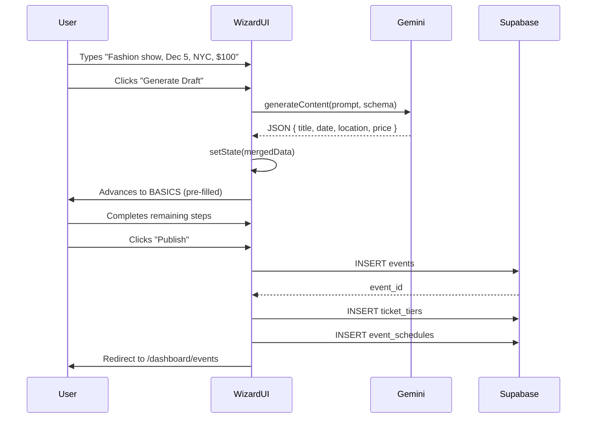
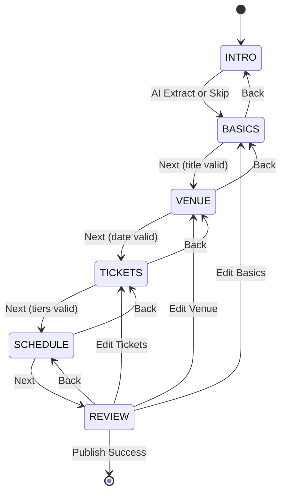
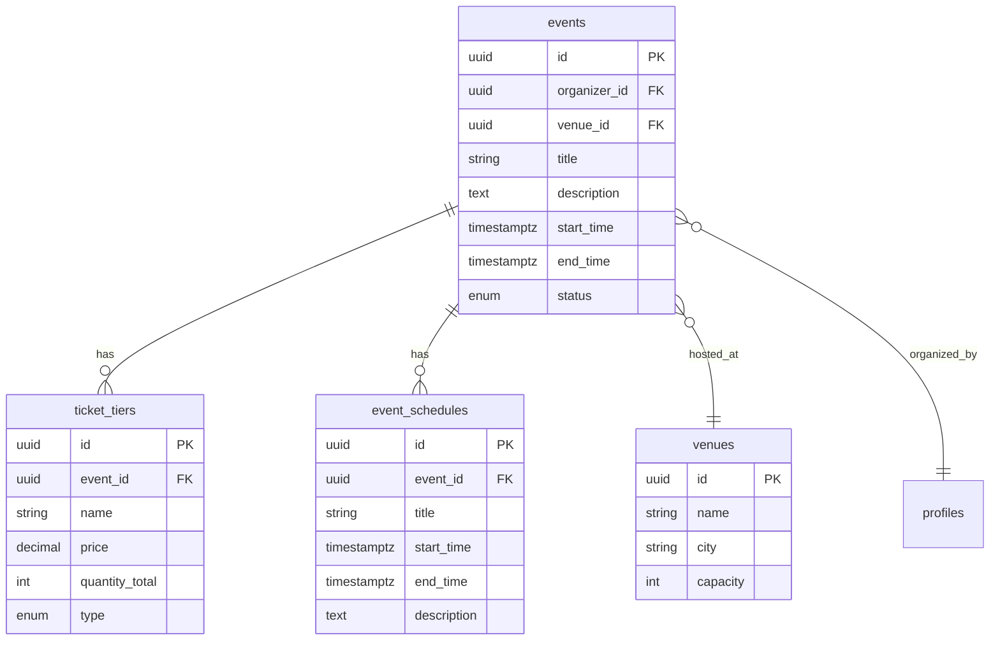

# 🪄 Task 02: Event Creation Wizard UI

**Status:** 🟢 Completed (MVP)  
**Priority:** P1  
**Owner:** Frontend / AI Engineering

## 📊 Progress Tracker

| Iteration | Feature | Status |
| :--- | :--- | :--- |
| **1** | Wizard Skeleton & State Machine | 🟢 Completed |
| **2** | AI Chat Integration (The "Magic Input") | 🟢 Completed |
| **3** | Dynamic Form Steps (Tickets & Venue) | 🟢 Completed |
| **4** | Review & Database Submission | 🟢 Completed |
| **4.5** | Dashboard & Public Access Links | 🟢 Completed |
| **5** | AI Enhancement (URL Context & File Search) | ⚪ Not Started |
| **6** | Post-Publish Actions (Veo Trailer) | ⚪ Not Started |

---

## 1. Context Summary

This module powers the Event Creation Wizard, the primary "Creator Mode" for FashionOS organizers. It transforms raw text input ("Fashion show next friday $50 tickets") or URLs into fully configured event listings through AI-powered extraction and structured form completion. The wizard integrates Gemini text generation, structured outputs, and Supabase event creation to eliminate manual data entry friction.

**Location:**
- UI Route: `/dashboard/events/new`
- Components: `components/events/EventWizard.tsx`, `components/events/wizard/*`
- Database: `events`, `ticket_tiers`, `event_schedules` tables
- Edge Functions: `create-event-draft` (optional, for AI pre-fill)
- Gemini: `gemini-2.5-flash` (text generation), `gemini-3-pro-preview` (structured output)

**Unlocks:**
- Rapid event creation (minutes vs hours)
- AI-assisted metadata extraction
- Pre-filled forms from natural language
- Integration with Event Planner dashboard

**User Journeys:**
- Organizer: Chat input → AI extraction → Review → Publish → Event appears in planner
- Designer: Create event → Link to shoot booking → Cross-promote

## 2. Prerequisites (Reuse First)

**Components:**
- `components/CalendarPicker.tsx` — date range selection (reuse for Step 3)
- `components/events/EventCard.tsx` — preview card (reuse for Step 6 Review)
- `components/events/VeoTrailerGenerator.tsx` — post-publish action (optional)
- `layouts/DashboardLayout.tsx` — container layout
- `pages/public/StartProjectPage.tsx` — UX patterns (sticky footer, progress bar)

**Database:**
- `supabase/schema/events` — event master record
- `supabase/schema/ticket_tiers` — pricing configuration
- `supabase/schema/event_schedules` — agenda items
- `supabase/schema/venues` — location lookup

**Hooks:**
- `hooks/useAuth.ts` — current user for `organizer_id`
- `hooks/useEvent.ts` — event CRUD operations (if exists)

**Gemini:**
- `text-generation` — natural language understanding
- `structured-output` — JSON schema extraction
- `url-context` — website analysis (optional, Step 1)

**Edge Functions:**
- `create-event-draft` — transactional insert (events + ticket_tiers + schedules)

**n8n Workflows:** None

## 3. Multistep Development Prompts

### 🟢 Iteration 1 — Wizard Skeleton & State Machine

**Goal:** Create the multi-step container, navigation logic, and state management foundation.

**Prompt:**
Create `components/events/EventWizard.tsx`:
- ✅ State object: `{ step: 'INTRO' | 'BASICS' | 'VENUE' | 'TICKETS' | 'SCHEDULE' | 'REVIEW', eventData: { title, description, start_time, end_time, venue_id, ticket_tiers: [], schedules: [] } }`
- ✅ Steps enum: `INTRO` (AI Chat), `BASICS` (Form), `VENUE` (Map/Date), `TICKETS` (Pricing), `SCHEDULE` (Agenda), `REVIEW` (Preview)
- ✅ Layout structure:
  - Top: Progress bar (reuse styles from `StartProjectPage.tsx`, show "Step X of 6")
  - Middle: Scrollable content area with `max-h-[calc(100vh-200px)]`
  - Bottom: Sticky footer with 'Back' (disabled on INTRO) and 'Next' buttons
- ✅ Navigation logic:
  - `handleNext()`: Validate current step, advance if valid
  - `handleBack()`: Go to previous step, preserve state
  - Validation: Disable Next if required fields empty (e.g., title on BASICS)
- ✅ Route: Add `/dashboard/events/new` to `App.tsx`, wrap with `RequireAuth`

**Files:**
- `components/events/EventWizard.tsx` (new)
- `components/events/wizard/types.ts` (new, TypeScript interfaces)
- `App.tsx` (add route)

**State:**
- `useState` for wizard state (step, eventData)
- `useNavigate` for post-submit redirect

**Validation:**
- Step 1 (INTRO): No validation (optional AI input)
- Step 2 (BASICS): `title` required, `description` optional
- Step 3 (VENUE): `start_time` required
- Step 4 (TICKETS): At least one tier required
- Step 5 (SCHEDULE): Optional
- Step 6 (REVIEW): All previous validations pass

**Mobile:**
- Sticky footer sits above mobile browser chrome (use `pb-safe` or `env(safe-area-inset-bottom)`)
- Progress bar shows on mobile (horizontal scroll if needed)

### 🟢 Iteration 2 — AI Chat Integration (The "Magic Input")

**Goal:** Parse natural language input into structured event data using Gemini.

**Prompt:**
Implement `INTRO` step in `EventWizard.tsx`:
- ✅ UI: Large textarea (min-height 120px) with placeholder "Describe your event... e.g., 'Sustainable Fashion Night in Medellín, 300 people, runway + networking'"
- Optional: File upload button (PDF contracts, venue docs) — use `FileSearch` API later
- Optional: URL input field (paste event page URL) — use `URL Context` API
- ✅ Button: "✨ Generate Draft with AI" (primary, with sparkle icon)
- ✅ Gemini Integration:
  - Initialize `GoogleGenAI` with `import.meta.env.VITE_GEMINI_API_KEY`
  - Model: `gemini-2.5-flash` (fast, cost-effective)
  - System Prompt: "You are an event planning assistant for FashionOS. Extract event details from user input into JSON. Return: title (string), description (string), start_time (ISO 8601), end_time (ISO 8601 or null), location (string), category (enum: runway_show, presentation, pop_up, trunk_show, workshop, networking, party), estimated_capacity (number), ticket_price_estimate (number)."
  - Schema: Use `responseMimeType: 'application/json'` and `responseSchema` matching the fields above
  - Error handling: If Gemini fails, show "AI extraction failed, please fill manually" and allow proceeding to BASICS
- ✅ Action: On success, merge returned JSON into `eventData` state and auto-advance to `BASICS` step
- ✅ Loading: Show "Analyzing your event..." spinner with pulse animation

**Files:**
- `components/events/EventWizard.tsx` (modify INTRO step)
- `lib/gemini.ts` (new, Gemini client wrapper)
- `components/ui/LoadingSpinner.tsx` (reuse or create)

**Components to Reuse:**
- `components/ui/Textarea.tsx` — large input field
- `components/ui/Button.tsx` — primary CTA

**API Operations:**
- `ai.models.generateContent({ model: 'gemini-2.5-flash', contents: userInput, config: { responseMimeType: 'application/json', responseSchema: {...} } })`

**Mobile:**
- Textarea expands on focus (mobile keyboard)
- Loading state shows full-screen overlay on mobile

### 🟢 Iteration 3 — Dynamic Form Steps (Tickets & Venue)

**Goal:** Build complex form steps with arrays (ticket tiers) and reusable components (calendar picker).

**Prompt:**
Build `VENUE` step:
- ✅ Reuse `components/CalendarPicker.tsx` for date selection
- ✅ Add time pickers: Start time (HH:MM), End time (HH:MM)
- ✅ Location input: Text field with autocomplete (future: integrate Google Places API)
- ✅ Venue selector: Dropdown or searchable select from `venues` table (query: `supabase.from('venues').select('id, name, city')`)
- ✅ Validation: `start_time` required, `end_time` must be after `start_time`

Build `TICKETS` step:
- ✅ Dynamic list: `eventData.ticket_tiers` array
- ✅ "Add Tier" button: Pushes `{ name: 'General', price: 0, quantity: 100, type: 'paid' }` to array
- ✅ Tier card: Inputs for Name, Price (currency), Quantity, Type (paid/free/donation)
- ✅ Delete button: Remove tier from array
- ✅ Live calculation: Show "Total Potential Revenue" = `Sum(tier.price * tier.quantity)` below list
- ✅ Validation: At least one tier required, price >= 0, quantity > 0

Build `SCHEDULE` step (optional):
- ✅ Dynamic list: `eventData.schedules` array
- "Add Schedule Item" button: Pushes `{ title: '', start_time: '', end_time: '', description: '' }`
- Schedule card: Inputs for Title, Start Time, End Time, Description
- Delete button: Remove item from array

**Files:**
- `components/events/wizard/WizardVenue.tsx` (new)
- `components/events/wizard/WizardTickets.tsx` (new)
- `components/events/wizard/WizardSchedule.tsx` (new, optional)
- `components/events/EventWizard.tsx` (import and render steps)

**Components to Reuse:**
- `components/CalendarPicker.tsx` — date selection
- `components/ui/Input.tsx` — text inputs
- `components/ui/Select.tsx` — dropdowns

**State:**
- `eventData.ticket_tiers` — array of tier objects
- `eventData.schedules` — array of schedule objects

**Form Validation:**
- Tickets: `tier.price >= 0`, `tier.quantity > 0`, `tier.name.length > 0`
- Venue: `start_time` exists, `end_time > start_time`

**Mobile:**
- Tier cards stack vertically on mobile
- Calendar picker uses mobile-native date picker if available

### 🟢 Iteration 4 — Review & Database Submission

**Goal:** Visualize final event using existing components and submit to Supabase.

**Prompt:**
Implement `REVIEW` step:
- ✅ Visual preview: Render `components/events/EventCard.tsx`, passing `eventData` as props
- ✅ Summary section:
  - Event details: Title, Date, Location, Description
  - Ticket tiers: List all tiers with prices and quantities
  - Estimated revenue: `Sum(tier.price * tier.quantity)`
  - Schedule: List all schedule items (if any)
- ✅ Edit buttons: "Edit Basics", "Edit Venue", etc. — navigate back to specific step
- ✅ Submit button: "Publish Event" (primary, large)
- Submission flow:
  - Show loading state: "Creating event..."
  - Call Supabase: `supabase.from('events').insert({ ...eventData, organizer_id: user.id, status: 'draft' }).select().single()`
  - On success: Insert ticket tiers (`supabase.from('ticket_tiers').insert(tiers.map(t => ({ ...t, event_id: event.id })))`)
  - On success: Insert schedules (`supabase.from('event_schedules').insert(schedules.map(s => ({ ...s, event_id: event.id })))`)
  - Redirect: `navigate('/dashboard/events')`
  - Toast: "Event created successfully!"
- Error handling: If insert fails, show error message and allow retry

**Files:**
- `components/events/wizard/WizardReview.tsx` (new)
- `components/events/EventWizard.tsx` (modify REVIEW step, add submit handler)

**Components to Reuse:**
- `components/events/EventCard.tsx` — preview card
- `components/ui/Button.tsx` — submit button
- `hooks/useToast.ts` — success/error notifications

**Database Operations:**
- `INSERT INTO events (title, description, start_time, end_time, venue_id, organizer_id, status) VALUES (...)`
- `INSERT INTO ticket_tiers (event_id, name, price, quantity_total, type) VALUES (...)`
- `INSERT INTO event_schedules (event_id, title, start_time, end_time, description) VALUES (...)`

**Mobile:**
- Review card scrolls vertically on mobile
- Submit button fixed at bottom (sticky)

### ⚪ Iteration 5 — AI Enhancement (URL Context & File Search)

**Goal:** Add advanced AI features for extracting event data from URLs and PDFs.

**Prompt:**
Enhance `INTRO` step with URL input:
- Add URL input field: "Or paste a URL (event page, venue site, sponsor deck)"
- Button: "✨ Analyze URL with AI"
- Gemini Integration:
  - Use `gemini-3-pro-preview` with `urlContext` tool (if available) or fetch URL content and pass to Gemini
  - Prompt: "Extract event details from this webpage: {url}. Return JSON with: title, description, date, location, ticket_prices, capacity."
  - Parse response and merge into `eventData`
- File upload (optional):
  - Add file input: Accept PDF, DOCX
  - Upload to Supabase Storage: `supabase.storage.from('event-docs').upload(file.name, file)`
  - Pass file URI to Gemini `FileSearch` API
  - Extract structured data from document

**Files:**
- `components/events/wizard/WizardIntro.tsx` (modify, add URL/file inputs)
- `lib/gemini.ts` (add URL context and file search methods)

**Gemini:**
- `url-context` — analyze webpage content
- `file-search` — RAG on uploaded documents

**Edge Functions:**
- Optional: `analyze-event-url` — server-side URL fetching and Gemini call

**Mobile:**
- URL input uses mobile keyboard (type="url")
- File upload uses native file picker

### ⚪ Iteration 6 — Post-Publish Actions (Veo Trailer)

**Goal:** Integrate Veo 3.1 trailer generation as optional post-publish action.

**Prompt:**
Add post-publish action in `WizardReview.tsx`:
- After successful event creation, show optional action: "Generate Event Trailer with AI"
- Button: "🎬 Generate 8s Trailer" (secondary)
- Integration: Reuse `components/events/VeoTrailerGenerator.tsx`
- Flow: Pass `eventData` to Veo generator, create 8-second video, store in `event_assets` table
- Success: Show preview of generated trailer with download/share options

**Files:**
- `components/events/wizard/WizardReview.tsx` (modify, add Veo action)
- `components/events/VeoTrailerGenerator.tsx` (reuse)

**Gemini:**
- Veo 3.1 API — video generation

**Database:**
- `event_assets` table — store video URL

**Mobile:**
- Trailer preview uses mobile-optimized video player

## 4. Success Criteria

**Functional Requirements:**
- ✅ User can navigate through all 6 wizard steps (INTRO → BASICS → VENUE → TICKETS → SCHEDULE → REVIEW)
- ✅ AI chat extracts event data from natural language and pre-fills form
- ✅ User can add/remove ticket tiers dynamically
- ✅ User can add/remove schedule items dynamically
- ✅ Review step shows accurate preview using EventCard component
- ✅ Event creation writes to `events`, `ticket_tiers`, and `event_schedules` tables
- ✅ Redirect to `/dashboard/events` after successful creation

**UX Requirements:**
- ✅ Progress bar shows current step (X of 6)
- ✅ Back button preserves form data when navigating backward
- ✅ Validation errors show inline below fields
- ✅ Loading states prevent double-submission
- ✅ Success toast confirms event creation

**Performance Metrics:**
- ✅ AI extraction completes in < 3s
- ✅ Form navigation is instant (< 100ms)
- ✅ Database insert completes in < 1s

**Reliability:**
- ✅ Form data persists in localStorage as draft (auto-save on blur)
- ✅ Network failures show retry option
- ✅ Invalid AI responses fall back to manual entry

**Security:**
- ✅ RLS policies ensure users can only create events as themselves (`organizer_id = auth.uid()`)
- ✅ Gemini API key stored in environment variable (not exposed)

**Mobile Completion:**
- ✅ All steps are mobile-responsive
- ✅ Sticky footer works on mobile browsers
- ✅ Calendar picker uses mobile-native UI when available

## 5. Production-Ready Checklist

- [ ] Component reuse verified (CalendarPicker, EventCard, Button, Input)
- [ ] Schema validated (`events`, `ticket_tiers`, `event_schedules` tables exist)
- [ ] Supabase RLS confirmed (users can only create events as themselves)
- [ ] Error states handled (AI failures, network errors, validation errors)
- [ ] Mobile layout tested (all steps, sticky footer, form inputs)
- [ ] Edge Function safe & retries enabled (if using `create-event-draft`)
- [ ] Loading, empty, error UI states implemented
- [ ] Logging + monitoring (track AI extraction success rate, form abandonment)
- [ ] No duplicate code (wizard steps share common form patterns)
- [ ] Follows naming conventions (PascalCase for components, camelCase for functions)

## 6. Architecture & Data Flow

### User Journey: Create Event via Wizard

```mermaid
userJourney
    title Event Creation Wizard Journey
    section AI Input
        Describe Event: 5: Organizer
        AI Extracts Data: 4: System
        Review AI Output: 5: Organizer
    section Form Completion
        Fill Basics: 4: Organizer
        Select Venue: 4: Organizer
        Configure Tickets: 3: Organizer
        Add Schedule: 3: Organizer
    section Review & Publish
        Preview Event: 5: Organizer
        Publish: 5: Organizer
        View in Dashboard: 5: Organizer
```

### Sequence Diagram: AI Extraction Flow



### State Diagram: Wizard Step Flow



### ERD: Event Wizard Data Model

