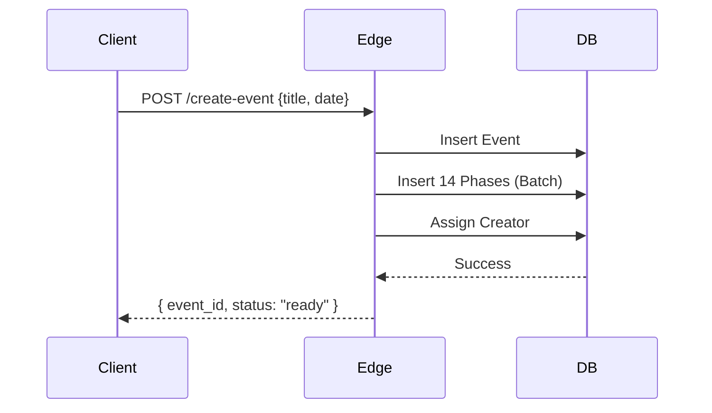
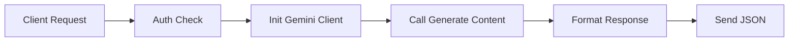

# 🪄 **Task 03: Edge Functions (Backend Logic)**

**Status:** 🟢 Planned
**Priority:** P0
**Owner:** Backend

---

## **1. Context Summary**

This module contains the **Server-Side Business Logic** running on Supabase Edge Functions (Deno).
It handles secure operations (Gemini API calls), complex transactions (Event Init), and data aggregation (Dashboard View).

---

## **2. Prerequisites (Reuse First)**

1.  Supabase CLI (`supabase functions`).
2.  `GEMINI_API_KEY` in secrets.
3.  Shared Cors headers `_shared/cors.ts`.

---

## **3. Multistep Development Prompts**

### **Iteration 1 — Setup & AI Copilot**

**Goal:** AI Proxy.
**Prompt:**
1.  Initialize `ai-copilot` function.
2.  Logic: Accept `prompt` + `context`. Call Gemini 2.5/3.0. Return text/JSON.
3.  Security: Verify Auth Header (User JWT).

### **Iteration 2 — Event Initialization**

**Goal:** Complex Write.
**Prompt:**
1.  Initialize `create-event` function.
2.  Logic: Insert Event -> Insert 14 Default Phases -> Insert Owner as Stakeholder.
3.  Transaction: Ensure all or nothing.

### **Iteration 3 — Dashboard Aggregation**

**Goal:** Performance.
**Prompt:**
1.  Initialize `get-event-planner-view`.
2.  Logic: Query Events + Tasks + KPIs + Alerts in parallel (`Promise.all`).
3.  Return single JSON object to frontend (eliminates waterfalls).

### **Iteration 4 — Logistics Logic**

**Goal:** Conflict Checking.
**Prompt:**
1.  Initialize `check-availability`.
2.  Logic: Query `*_availability` tables vs Requested Time.
3.  Return `{ available: boolean, conflict: string }`.

---

### **Success Criteria for This Task**

*   [ ] Functions deploy successfully to Supabase.
*   [ ] `ai-copilot` returns Gemini responses securely.
*   [ ] `create-event` creates all 14 phases instantly.
*   [ ] Dashboard load time < 500ms via Aggregation function.

---

### **Production-Ready Checklist**

*   [ ] Secrets set in production (`supabase secrets set`).
*   [ ] CORS headers configured correctly.
*   [ ] Error handling (try/catch with HTTP status codes).
*   [ ] Types shared between frontend and functions.

---

## **4. Architecture & Data Flow**

### ✔ Sequence Diagram (Create Event)

### ✔ Flowchart (AI Proxy)

