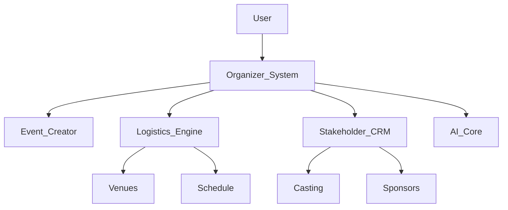

# 🪄 **Task 04: Organizer System Plan**

**Status:** 🟢 Planned
**Priority:** P1
**Owner:** Product Architect

---

## **1. Context Summary**

This module defines the **Master Plan** for the entire Fashion Show Organizer System.
It ties together Event Creation, Casting, Venues, Scheduling, Sponsors, and Media into a cohesive product.
It outlines the end-to-end workflow: **Before -> During -> After**.

---

## **2. Prerequisites (Reuse First)**

1.  All previous modules (Tasks 01-14).
2.  Gemini 3 Tools integration map.

---

## **3. Multistep Development Prompts**

### **Iteration 1 — System Overview & Modules**

**Goal:** Define the scope.
**Prompt:**
1.  Document the **End-to-End Workflow**.
2.  Define the 8 Core Modules (Creator, Venues, Casting, Scheduling, Sponsors, Media, Backstage, ROI).
3.  Map AI features to each module.

### **Iteration 2 — Database & AI Integration**

**Goal:** Technical Backbone.
**Prompt:**
1.  Finalize **Supabase Schema** (Tables + Relationships).
2.  Map **Gemini Tools** (Text, Image, Doc, Thinking) to specific user actions.
3.  Define Edge Functions required for automation.

### **Iteration 3 — UI/UX System Definition**

**Goal:** Visual Plan.
**Prompt:**
1.  Define **Main Dashboard** structure.
2.  Outline **7 Key Screens** (Event Dash, Venue Designer, Casting, Backstage, etc.).
3.  Specify Navigation and Responsive behavior.

---

### **Success Criteria for This Task**

*   [ ] Complete architectural blueprint exists.
*   [ ] All modules interact seamlessly (Data flows defined).
*   [ ] AI is not a gimmick but integral to the workflow.

---

### **Production-Ready Checklist**

*   [ ] Scalability plan included.
*   [ ] Security model (RLS) defined for all modules.
*   [ ] User Roles (Admin, Editor, Viewer) defined.

---

## **4. Architecture & Data Flow**

### ✔ Mermaid System Map

