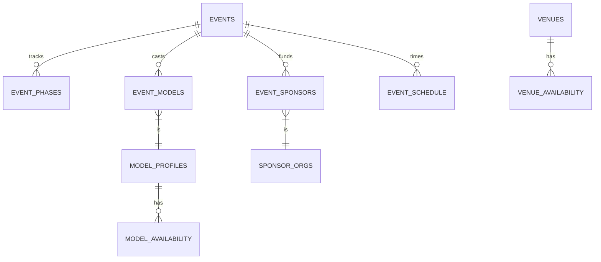

# 🪄 **Task 05: Advanced Production Schema**

**Status:** 🟢 Planned
**Priority:** P1
**Owner:** Database

---

## **1. Context Summary**

This is the **Advanced Schema** expansion for the Fashion Show Planner.
It adds depth to the Core Schema (Task 03/06) to handle **Complex Logistics**: Casting, Venues, Sponsorships, and Detailed Scheduling (Rehearsals, Call Times).

---

## **2. Prerequisites (Reuse First)**

1.  Task 03 & 06 Schemas (Base layers).
2.  `uuid-ossp` extension.

---

## **3. Multistep Development Prompts**

### **Iteration 1 — Stakeholders & CRM**

**Goal:** People Management.
**Prompt:**
1.  Create `organizer_teams` and `stakeholders` tables.
2.  Create `sponsor_organizations` and `fashion_brands`.
3.  Create `model_agencies` and `model_profiles` (Detailed measurements).

### **Iteration 2 — Logistics & Assignments**

**Goal:** Connecting People to Events.
**Prompt:**
1.  Create `event_stakeholders` (Crew assignment).
2.  Create `event_sponsors` (Levels, Deliverables JSON).
3.  Create `event_models` (Look count, fitting status).
4.  Create `event_designers`.

### **Iteration 3 — Scheduling & Availability**

**Goal:** Time Management.
**Prompt:**
1.  Create `event_phases` (The 14-step timeline).
2.  Create `tasks` and `task_assignees`.
3.  Create `event_schedule` (Master Run of Show) and `call_times`.
4.  Create `*_availability` tables (Venue, Model, Designer) for conflict detection.

---

### **Success Criteria for This Task**

*   [ ] All 24+ tables created successfully.
*   [ ] Relationships correctly defined (Foreign Keys).
*   [ ] RLS Policies enabled for Multi-tenancy (Teams see their own data).
*   [ ] Indexes optimized for Date Range queries (Availability).

---

### **Production-Ready Checklist**

*   [ ] SQL Migration file saved.
*   [ ] Conflict detection view (`casting_conflicts`) created.
*   [ ] Enum types defined for all statuses/roles.
*   [ ] Triggers for `updated_at`.

---

## **4. Architecture & Data Flow**

### ✔ ERD (Advanced Logistics)



### ✔ Requirement Diagram

```mermaid
requirementDiagram
    requirement ConflictDetection {
        id: 1
        text: "Must detect if Model is booked elsewhere"
        risk: High
        verifymethod: Test View
    }
    requirement Security {
        id: 2
        text: "Models only see their own call times"
        risk: Medium
        verifymethod: Policy Check
    }
```
