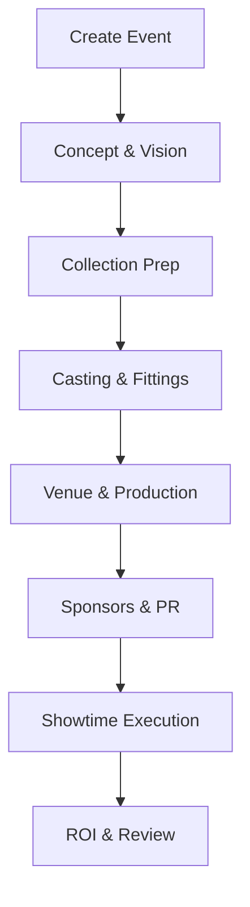
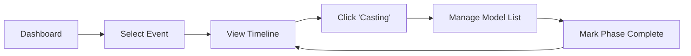

# 🪄 **Task 06: Fashion Show Workflow Implementation**

**Status:** 🟢 Planned
**Priority:** P2
**Owner:** Product / Operations

---

## **1. Context Summary**

This module implements the **16-step Production Workflow** for fashion shows within the Planner.
It breaks down the event lifecycle into actionable phases: **Concept → Casting → Production → Showtime → ROI**.
It guides the user (Organizer) through the complexities of running a show.

---

## **2. Prerequisites (Reuse First)**

1.  `EventWizard` (Task 05).
2.  `MobilePlanner` (Task 08).
3.  Schema: `event_phases` table (from Task 09).

---

## **3. Multistep Development Prompts**

### **Iteration 1 — Timeline Initialization**

**Goal:** Auto-generate the plan.
**Prompt:**
1.  When Event is created, trigger Edge Function.
2.  Insert 14 default `event_phases` (Concept, Budget, Collection, Casting... Post-Event).
3.  Set default status to `not_started`.

### **Iteration 2 — Phase Detail Views**

**Goal:** Actionable screens per phase.
**Prompt:**
1.  **Casting Phase:** Link to Model Directory & Casting Sheets.
2.  **Venue Phase:** Link to Floorplan Editor.
3.  **Sponsors Phase:** Link to Sponsor CRM.
4.  UI: Timeline view showing progress of each phase.

### **Iteration 3 — Stakeholder Mapping**

**Goal:** Role assignment.
**Prompt:**
1.  Map stakeholders to phases (e.g., Stylist -> Collection Prep).
2.  Allow assigning "Phase Owners".
3.  Dashboard shows "My Active Phases".

---

### **Success Criteria for This Task**

*   [ ] Creating an event automatically populates the Timeline.
*   [ ] Organizer can track progress across all 16 steps.
*   [ ] Specific phases link to their respective tools (Casting, Venue).

---

### **Production-Ready Checklist**

*   [ ] Templates configurable (Runway vs Presentation vs Pop-up).
*   [ ] Progress bars reflect task completion within phases.
*   [ ] Notifications when a phase becomes "At Risk" (Date approaching).

---

## **4. Architecture & Data Flow**

### ✔ Mermaid Flowchart (Workflow)

### ✔ User Journey (Organizer)

