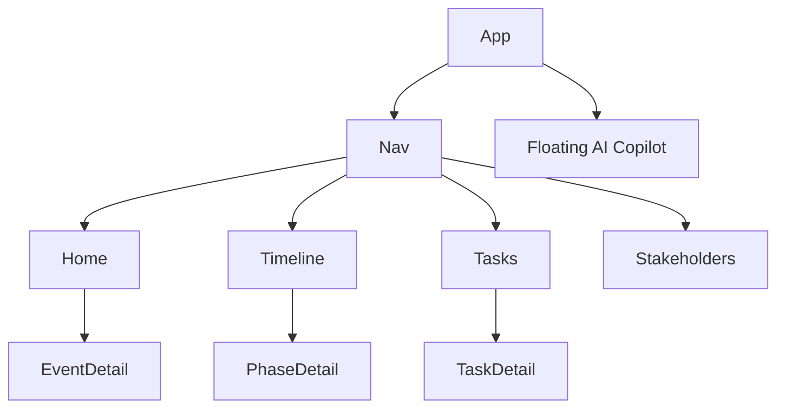
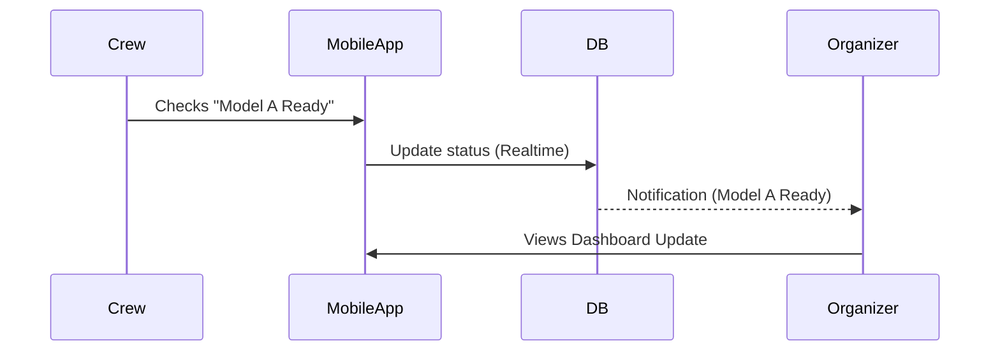

# 🪄 **Task 07: Mobile Planner App**

**Status:** 🟢 Planned
**Priority:** P1
**Owner:** Frontend (Mobile)

---

## **1. Context Summary**

This module is the **Mobile-First Interface** for the Fashion Show Planner.
It allows organizers, backstage crew, and designers to manage the event **on the go**.
Key features: Timeline tracking, Task management, Backstage checklists, and AI Copilot access.

---

## **2. Prerequisites (Reuse First)**

1.  `layouts/MobileLayout.tsx` — Safe areas, Bottom Nav.
2.  `components/BottomNav.tsx` — Navigation.
3.  Edge Functions: `get-event-planner-view`.
4.  Supabase: `tasks`, `event_phases`, `backstage_items`.

---

## **3. Multistep Development Prompts**

### **Iteration 1 — App Shell & Navigation**

**Goal:** Mobile Foundation.
**Prompt:**
1.  Create `MobileLayout` with sticky Bottom Nav (Home, Timeline, Tasks, More).
2.  Implement `HeaderBar` with dynamic actions.
3.  Setup "Home Dashboard" with Hero Card (Current Event) and Progress Cards (Timeline status).

### **Iteration 2 — Timeline & Tasks**

**Goal:** Core Planning.
**Prompt:**
1.  **Timeline Screen:** Vertical list of 14 phases with status pills. Bottom sheet to edit status.
2.  **Tasks Screen:** Tabbed view (Today/All). Task Cards with checkboxes. FAB for "+ New Task".

### **Iteration 3 — Backstage Mode**

**Goal:** Show Day Execution.
**Prompt:**
1.  Create `BackstagePlannerScreen`.
2.  Sections: Call Times, Run of Show, Quick Changes.
3.  Interactive Checklists (Accessories check, Model ready).
4.  Real-time sync (Supabase Realtime) for crew coordination.

### **Iteration 4 — AI Copilot Integration**

**Goal:** Assistant.
**Prompt:**
1.  Floating "✨" FAB.
2.  Opens Bottom Sheet Chat.
3.  Capabilities: "Draft email", "Suggest schedule", "Check conflicts".
4.  Renders structured response cards.

---

### **Success Criteria for This Task**

*   [ ] App feels native (touch targets, animations).
*   [ ] Bottom navigation works smoothly.
*   [ ] Backstage changes sync instantly to other devices.
*   [ ] AI Copilot is accessible from any screen.

---

### **Production-Ready Checklist**

*   [ ] Touch targets > 44px.
*   [ ] Safe area handling (Notch/Home bar).
*   [ ] Offline support (TanStack Query persistence) - *Nice to have*.
*   [ ] Haptic feedback on task completion.

---

## **4. Architecture & Data Flow**

### ✔ Sitemap Structure

### ✔ User Journey (Show Day)

