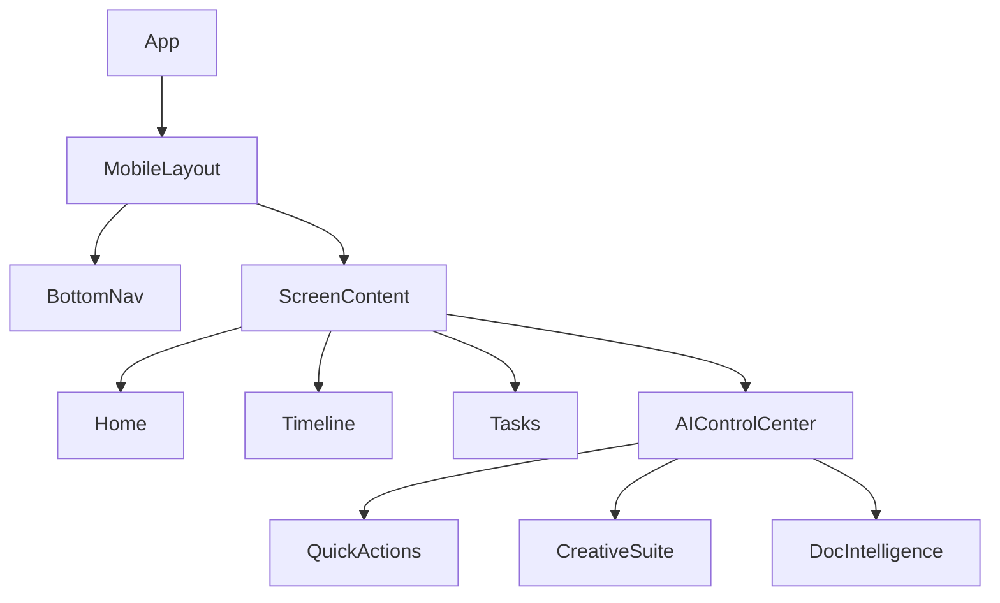
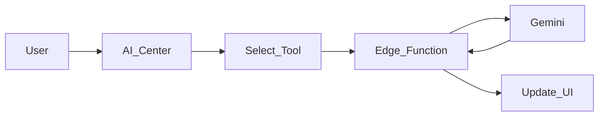

# 🪄 **Task 08: Mobile Planner Architecture**

**Status:** 🟢 Planned
**Priority:** P1
**Owner:** Frontend / UX

---

## **1. Context Summary**

This module defines the **UI Architecture** for the Mobile Fashion Show Planner app.
It maps the Screens, Components, and Data Hooks required to build the mobile experience defined in Task 08.
It creates the **AI Control Center** specification.

---

## **2. Prerequisites (Reuse First)**

1.  React Component Library.
2.  `MobileLayout` component.
3.  Gemini 3 Tools.

---

## **3. Multistep Development Prompts**

### **Iteration 1 — Screen & Component Mapping**

**Goal:** Structure.
**Prompt:**
1.  Create file structure `src/screens/planner/*`.
2.  Map Screens: `HomeScreen`, `TimelineScreen`, `TasksScreen`.
3.  Create Reusable Cards: `EventHeroCard`, `TaskCard`, `TimelinePhaseCard`.

### **Iteration 2 — Data Hooks Strategy**

**Goal:** Data Binding.
**Prompt:**
1.  Define Hooks: `useCurrentEvent`, `useEventTimeline`, `useEventTasks`.
2.  Connect hooks to Supabase Views/Functions (`get-event-planner-view`).

### **Iteration 3 — AI Control Center Design**

**Goal:** Central Intelligence.
**Prompt:**
1.  Create `AiControlCenterScreen`.
2.  Sections: Quick Actions, Creative Generators, Doc Intelligence, Search/RAG.
3.  UI: Card grid (Desktop) / Stack (Mobile).
4.  Integration: Connect "Ask" buttons to `ai-copilot` Edge Function.

---

### **Success Criteria for This Task**

*   [ ] Component tree matches the Mermaid diagram.
*   [ ] Hooks provide clean data interface for UI.
*   [ ] AI Control Center layout is responsive and accessible.

---

### **Production-Ready Checklist**

*   [ ] Shared components extracted to `components/ui`.
*   [ ] Icons consistent (Lucide).
*   [ ] Loading skeletons for all dashboard cards.

---

## **4. Architecture & Data Flow**

### ✔ Mermaid Diagram (Component Tree)

### ✔ Flowchart (AI Workflow)

