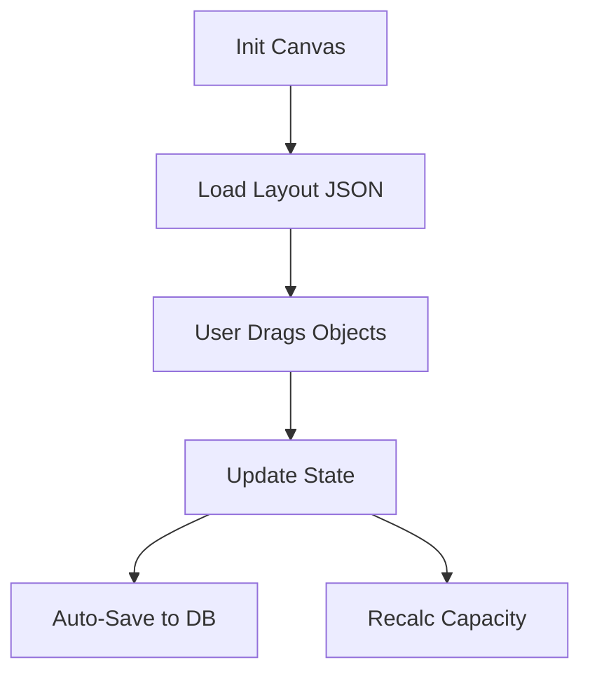
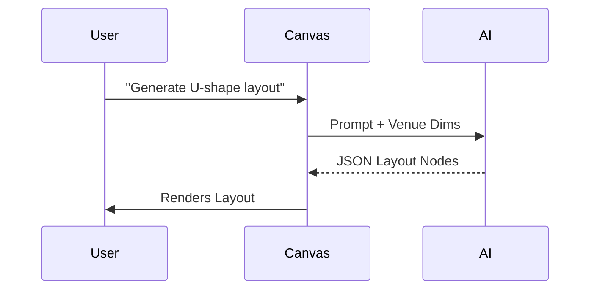

# 🪄 **Task 09: Venue & Floorplan System**

**Status:** 🟢 Planned
**Priority:** P3
**Owner:** Frontend / Visuals

---

## **1. Context Summary**

This module enables **Interactive Venue Management**.
It includes a **Floorplan Editor** (Canvas) to arrange Runways, Seating, and Backstage areas.
It uses AI to **generate layouts** and **optimize flow**.

---

## **2. Prerequisites (Reuse First)**

1.  Canvas Lib: `react-konva` or similar.
2.  Gemini Vision (for CAD conversion).
3.  Schema: `venues`, `venue_floorplans`.

---

## **3. Multistep Development Prompts**

### **Iteration 1 — Floorplan Editor (Canvas)**

**Goal:** Drag & Drop.
**Prompt:**
1.  Create `FloorplanEditor` component.
2.  Tools: Runway segment, Seat block, Wall, DJ Booth.
3.  Features: Drag, Rotate, Snap-to-grid.

### **Iteration 2 — AI Layout Generator**

**Goal:** Speed.
**Prompt:**
1.  Sidebar Input: "Industrial warehouse, 300 seats, U-shape runway."
2.  Call Edge Function -> Gemini Structured Output.
3.  Return JSON coordinates -> Render on Canvas.

### **Iteration 3 — Tech Specs & Capacity**

**Goal:** Logistics.
**Prompt:**
1.  Auto-calculate Capacity based on seating blocks.
2.  **Safety Check:** AI code execution to validate aisle widths vs fire code.
3.  Generate "Tech Rider" list (Power, Audio zones).

---

### **Success Criteria for This Task**

*   [ ] User can drag runway and seats onto canvas.
*   [ ] Capacity updates in real-time.
*   [ ] AI generates a valid layout JSON from text.

---

### **Production-Ready Checklist**

*   [ ] Autosave logic for canvas state.
*   [ ] Mobile view (Read-only or simplified).
*   [ ] Export to PDF/PNG.

---

## **4. Architecture & Data Flow**

### ✔ Flowchart (Editor)

### ✔ Interaction Diagram

