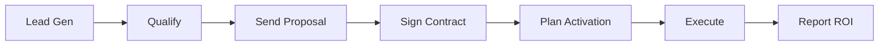
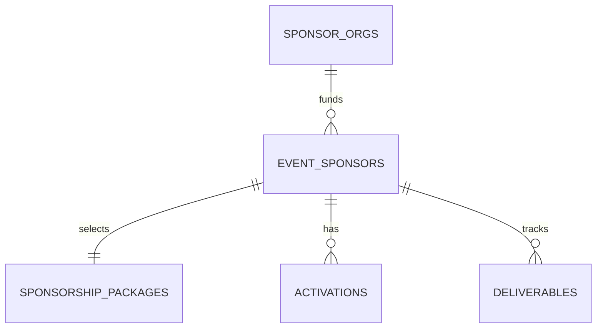

# 🪄 **Task 10: Sponsorship System**

**Status:** 🟢 Planned
**Priority:** P2
**Owner:** Product / Sales

---

## **1. Context Summary**

This module manages the **Commercial Side** of fashion events.
It tracks Sponsor Leads, Packages (Gold/Silver), Contracts, Activations (Booths), and ROI reporting.
It integrates with the Planner (Activations) and Event Schema (Sponsors).

---

## **2. Prerequisites (Reuse First)**

1.  Schema: `sponsor_organizations`, `event_sponsors`.
2.  Components: `SponsorCard`, `KanbanBoard`.
3.  AI Tools: `Document Extraction` (Contracts), `Text Gen` (Pitches).

---

## **3. Multistep Development Prompts**

### **Iteration 1 — CRM & Leads**

**Goal:** Sales Pipeline.
**Prompt:**
1.  Create `SponsorLeadsScreen`.
2.  Kanban Board: New -> Qualified -> Proposed -> Signed.
3.  Card: Brand Logo, Category, Estimated Budget.

### **Iteration 2 — Packages & Contracting**

**Goal:** Deal Closing.
**Prompt:**
1.  Create `SponsorPackagesScreen`.
2.  Define Tiers (Title, Gold, Partner).
3.  Upload Contract (PDF) -> AI Extract Deliverables.

### **Iteration 3 — Activations & Deliverables**

**Goal:** Execution.
**Prompt:**
1.  Create `ActivationsManager`.
2.  Map Activations (Booth, Lounge) to Venue Floorplan.
3.  Track Deliverables (Logo on Step-and-repeat, Social Posts).

### **Iteration 4 — Sponsor Portal**

**Goal:** External View.
**Prompt:**
1.  Create `SponsorPortal` (Restricted view).
2.  Dashboard: ROI Stats, Upload Assets button, Download Report.
3.  View: "My Activations".

---

### **Success Criteria for This Task**

*   [ ] Sales team can track leads through the funnel.
*   [ ] Sponsors can be linked to Events with specific Packages.
*   [ ] Deliverables are tracked (uploaded/approved).
*   [ ] Sponsor Portal works for external users (RLS).

---

### **Production-Ready Checklist**

*   [ ] Contract storage secure (Private bucket).
*   [ ] Automated reminders for deliverables.
*   [ ] ROI calculations (Social reach + Booth visits).

---

## **4. Architecture & Data Flow**

### ✔ User Journey (Sponsorship)

### ✔ ERD (Sponsor Module)

