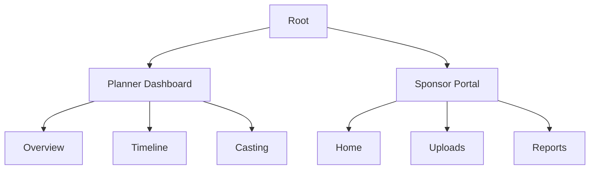

# 🪄 **Task 11: Dashboard & Sponsor Portal UI**

**Status:** 🟢 Planned
**Priority:** P1
**Owner:** Design / Frontend

---

## **1. Context Summary**

This module specifies the **High-Fidelity UI/UX** for the Planner Dashboard and the External Sponsor Portal.
It ensures the "High-Fashion Tech" aesthetic is applied consistently across internal and external views.

---

## **2. Prerequisites (Reuse First)**

1.  Design Tokens (Colors, Typography).
2.  Chart Components (`recharts` or similar).
3.  `layouts/DashboardLayout.tsx`.

---

## **3. Multistep Development Prompts**

### **Iteration 1 — Sponsor Portal UI**

**Goal:** External Brand Experience.
**Prompt:**
1.  Create `layouts/SponsorLayout.tsx` (Clean, branded).
2.  **Dashboard:** Hero Banner (Tier Badge), KPI Tiles (Reach, ROI).
3.  **Deliverables:** Upload List with Status Pills.
4.  **Activations:** Map View + Details Card.

### **Iteration 2 — Planner Dashboard UI**

**Goal:** Internal Command Center.
**Prompt:**
1.  **Readiness Score:** Radial progress chart.
2.  **Timeline:** Horizontal gantt-style progress bar.
3.  **Alerts:** Critical notifications (Missing Models, Unpaid Bills).

### **Iteration 3 — Visualization Components**

**Goal:** Data Storytelling.
**Prompt:**
1.  Create `KpiTile`, `BarChart`, `PieChart` components styled for FashionOS.
2.  Use "Soft Pastel" background palette for charts.
3.  Ensure responsive behavior (Stack on mobile, Grid on desktop).

---

### **Success Criteria for This Task**

*   [ ] Sponsor Portal looks premium and distinct from internal tools.
*   [ ] Dashboards load fast and handle empty states gracefully.
*   [ ] Charts are readable and match the brand palette.

---

### **Production-Ready Checklist**

*   [ ] Accessibility (Contrast ratios on pastel colors).
*   [ ] Mobile responsiveness for charts.
*   [ ] Print styles (for downloading reports).

---

## **4. Architecture & Data Flow**

### ✔ Sitemap (Dashboards)

