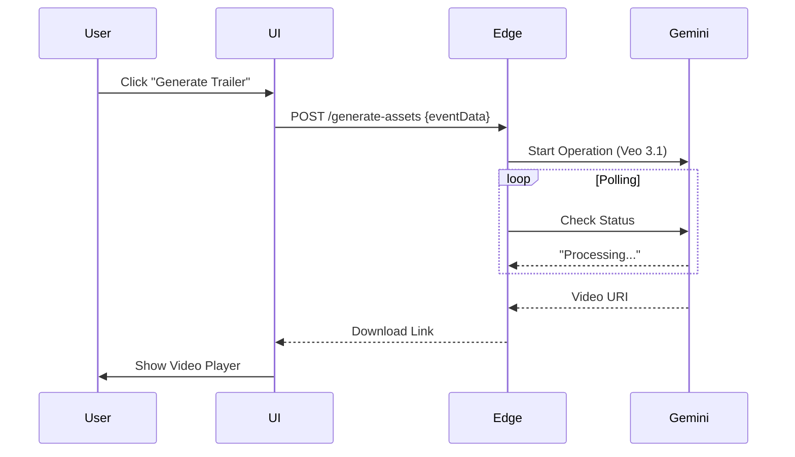
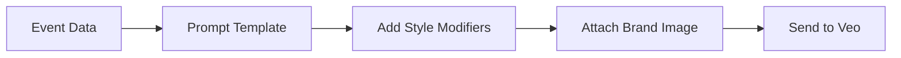

# 🪄 **Task 12: Veo 3.1 Event Trailers**

**Status:** 🟢 Planned
**Priority:** P1
**Owner:** AI Engineering

---

## **1. Context Summary**

This module integrates **Google Veo 3.1** to auto-generate cinematic 8-second trailers for events.
It lives in the Event Dashboard (`/dashboard/events/:id`).
It allows organizers to click "Generate Trailer" and receive a high-quality vertical video for social media (Instagram Reels/TikTok) based on their event description.

---

## **2. Prerequisites (Reuse First)**

1.  Gemini Model: `veo-3.1-fast-generate-preview` or `veo-3.1-generate-preview`.
2.  `components/events/VeoTrailerGenerator.tsx` — UI Component.
3.  Edge Function: `generate-assets` (wraps the long-running operation).
4.  Supabase Storage: `event_assets` bucket.

---

## **3. Multistep Development Prompts**

### **Iteration 1 — Backend Wrapper**

**Goal:** Secure API Call.
**Prompt:**
1.  Update `generate-assets` Edge Function.
2.  Input: `eventPrompt`, `imageBase64` (Brand Logo/Hero).
3.  Call `ai.models.generateVideos`.
4.  Implement polling loop (Veo takes ~60s).
5.  Return: `videoUri`.

### **Iteration 2 — Prompt Engineering**

**Goal:** Cinematic Output.
**Prompt:**
1.  Create a "Prompt Builder" utility.
2.  Template: "Cinematic fashion event trailer for {{title}}. Vibe: {{mood}}. Style: High fashion runway, slow motion, 4k, highly detailed."
3.  Ensure Aspect Ratio is set to `9:16` (Vertical).

### **Iteration 3 — Frontend Integration**

**Goal:** User Experience.
**Prompt:**
1.  Integrate `VeoTrailerGenerator` component into Event Details.
2.  State: `generating` -> `polling` -> `complete`.
3.  Show preview player when done.
4.  "Download" and "Save to Gallery" actions.

---

### **Success Criteria for This Task**

*   [ ] Video generates successfully from Event Data.
*   [ ] Polling mechanism prevents timeout errors.
*   [ ] API Key is secure (server-side only).
*   [ ] Video is relevant to the prompt (Style/Vibe match).

---

### **Production-Ready Checklist**

*   [ ] Error handling for API quotas/limits.
*   [ ] Loading UI (Veo takes time, need reassuring progress indicator).
*   [ ] Storage: Save generated video to Supabase Storage to avoid re-generation costs.
*   [ ] Mobile responsive player.

---

## **4. Architecture & Data Flow**

### ✔ Sequence Diagram (Generation)

### ✔ Flowchart (Prompt Logic)

