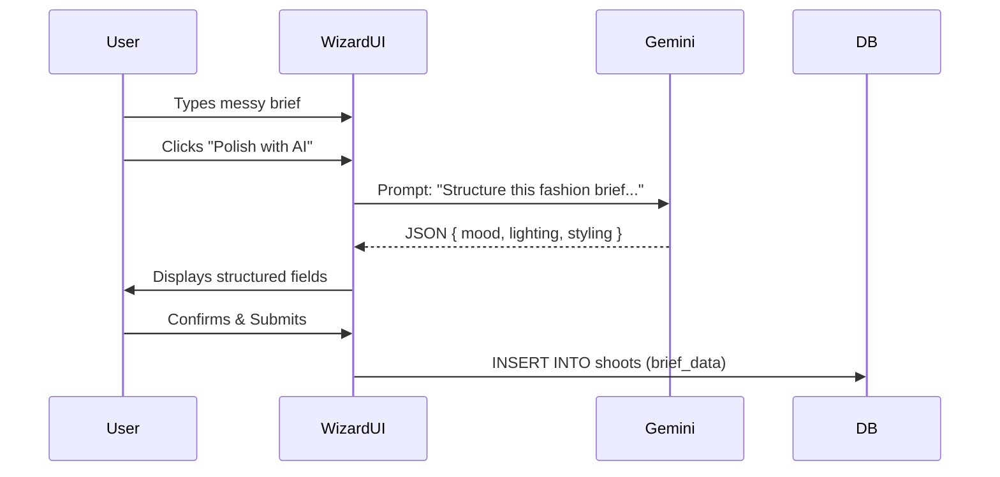
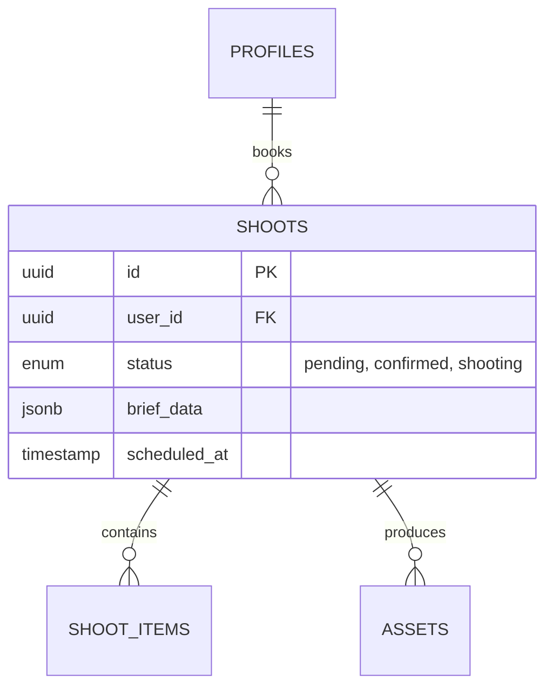

# 🪄 **Task 01: Shoot Booking Platform**

**Status:** 🟢 Planned
**Priority:** P0
**Owner:** Product / Engineering

---

## **1. Context Summary**

This module implements the **"Airbnb for Fashion Production"** engine. It powers the `/start-project` (Booking Wizard) and `/dashboard/bookings` routes.
It enables Designers/Brands to discover packages, customize shoots (Photo/Video/Hybrid), input creative briefs via AI, and manage the entire booking lifecycle from request to asset delivery.

It unlocks:
*   **Standardized Booking:** Replaces email chains with a structured wizard.
*   **Automated Quoting:** Real-time pricing based on looks/hours.
*   **Creative Alignment:** AI-polished briefs to ensure studio teams understand the vision.

---

## **2. Prerequisites (Reuse First)**

1.  `layouts/PublicLayout.tsx` — For the wizard wrapper.
2.  `layouts/DashboardLayout.tsx` — For the client/admin views.
3.  `components/Button.tsx`, `components/FadeIn.tsx` — UI primitives.
4.  `supabase/schema/shoots` — Core table (see `task-shoot-schema.md`).
5.  `supabase/schema/shoot_items` — Granular items per shoot.
6.  Gemini: `text-generation` — For the "Brief Polisher".
7.  Edge Functions: `create-booking`, `calculate-quote`.

---

## **3. Multistep Development Prompts**

### **Iteration 1 — Marketing & Discovery**

**Goal:** Enable users to view services and pricing.
**Prompt:**
1.  Create `pages/public/StartProjectPage.tsx` (The Landing/Wizard Entry).
2.  Implement **Service Menu**: Photo vs Video vs Hybrid cards.
3.  Implement **Pricing Calculator**: Simple inputs (Looks count) updating a "Total Estimate" sidebar.
4.  **Mobile:** Ensure specific stack layout for mobile users.

### **Iteration 2 — The Booking Wizard (Logic)**

**Goal:** Capture structured booking data.
**Prompt:**
1.  Build Multi-step Form State (`useBookingWizard`).
2.  **Step 1 Scope:** Service Type & Category (E-comm vs Editorial).
3.  **Step 2 Volume:** Slider for "Number of Looks".
4.  **Step 3 Logistics:** Date Picker (mock availability) & Location toggle (Studio A/B).
5.  **Step 4 Creative Brief:** Textarea with "AI Polish" button (Gemini integration).

### **Iteration 3 — Transaction & Database**

**Goal:** Persist data and handle payment intent.
**Prompt:**
1.  Connect "Confirm" button to `shoots` table in Supabase.
2.  Status flow: `draft` -> `requested`.
3.  Integrate **Stripe Checkout** (mock or test mode) for deposit.
4.  Redirect to `/dashboard/bookings` upon success.

### **Iteration 4 — Dashboards (Client & Admin)**

**Goal:** Management views.
**Prompt:**
1.  **Client View:** List of active shoots, timeline status (Booked -> Shooting -> Editing).
2.  **Admin View:** Calendar of all shoots, "Approve/Reschedule" actions.
3.  **Asset Library:** Grid view in dashboard to see placeholder "Deliverables".

---

### **Success Criteria for This Task**

*   [ ] User can complete the Wizard from "Select Service" to "Payment".
*   [ ] "AI Polish" transforms raw text into structured brief sections.
*   [ ] `shoots` record is created in Supabase with correct JSON metadata.
*   [ ] Pricing calculator updates dynamically without lag.
*   [ ] Admin can see the new booking in their dashboard.

---

### **Production-Ready Checklist**

*   [ ] Component reuse verified (Button, Card, Inputs).
*   [ ] Schema validated (Zod schemas for booking form).
*   [ ] Supabase RLS confirmed (Users only see their own shoots).
*   [ ] Mobile layout tested (Wizard steps are touch-friendly).
*   [ ] Loading states on AI operations.
*   [ ] Error handling for failed database writes.

---

## **4. Architecture & Data Flow**

### ✔ User Journey (Booking)

```mermaid
graph TD
    A[Designer Lands on Start Project] --> B[Select Service Type]
    B --> C[Input Quantity & Date]
    C --> D[Draft Creative Brief]
    D --> E{Use AI Polish?}
    E -- Yes --> F[Gemini Structures Brief]
    E -- No --> G[Keep Raw Text]
    F --> G
    G --> H[Review & Pay Deposit]
    H --> I[Booking Confirmed (DB Insert)]
    I --> J[Redirect to Dashboard]
```

### ✔ Sequence Diagram (AI Briefing)



### ✔ ERD (Shoot Booking)


