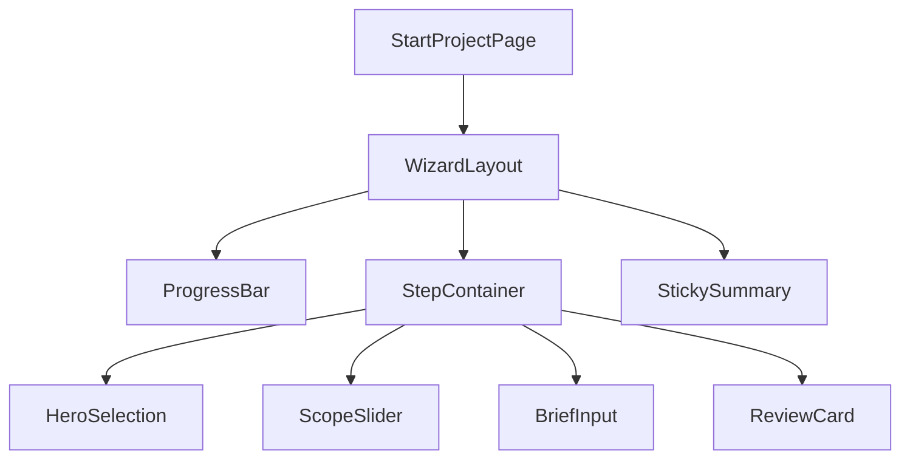
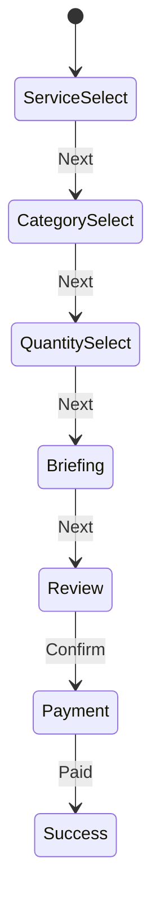
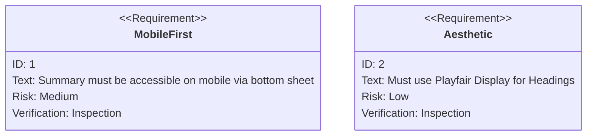

# 🪄 **Task 02: Shoot Booking UI/UX Implementation**

**Status:** 🟢 Planned
**Priority:** P0
**Owner:** Frontend / Design

---

## **1. Context Summary**

This module defines the specific **Visual Interface and User Experience** for the Booking Wizard defined in Task 01.
It focuses on the "FashionOS Premium" aesthetic—minimalist, editorial, and high-functioning.
It lives in `pages/public/StartProjectPage.tsx` and its sub-components.

---

## **2. Prerequisites (Reuse First)**

1.  `components/Button.tsx` — Primary/Secondary variants.
2.  `components/FadeIn.tsx` — Animations.
3.  `hooks/useBookingWizard.ts` — State management (to be created).
4.  **Design Tokens:** `Playfair Display` (Headings), `Inter` (Body), `#FBF8F5` (Cream bg).

---

## **3. Multistep Development Prompts**

### **Iteration 1 — Visual Foundation**

**Goal:** Base layout and "Hook" screen.
**Prompt:**
1.  Implement **Design System** colors and fonts in Tailwind config.
2.  Create **Screen 0 (Entry):** Split screen. Left: Copy + CTA. Right: Cinematic video loop (use placeholder).
3.  Ensure Mobile Stack layout vs Desktop Split layout.

### **Iteration 2 — Selection Components**

**Goal:** Interactive selection cards.
**Prompt:**
1.  Create `CardSelectionGrid` component for Shoot Type (Photo/Video).
2.  Create `ImageCardGrid` for Category (Lookbook/Ecomm) with background images and hover overlays.
3.  Implement selection state styling (`ring-2 ring-purple-500`).

### **Iteration 3 — The "Magic Box" Briefing UI**

**Goal:** AI-enhanced input.
**Prompt:**
1.  Build **Screen 5 (The Brief)**.
2.  Layout: Large minimalist textarea.
3.  Add "✨ Polish Brief with Gemini" button (floating inside or below area).
4.  Implement transition animation when AI replaces text with structured data.

### **Iteration 4 — Summary & Receipt UI**

**Goal:** Trust and Verification.
**Prompt:**
1.  Build **Sticky Sidebar (Desktop) / Bottom Sheet (Mobile)** for "Estimated Cost".
2.  Create "Receipt" visual style (jagged edge effect css).
3.  Ensure real-time updates as user changes "Quantity" slider in Step 3.

---

### **Success Criteria for This Task**

*   [ ] UI matches "FashionOS Premium" aesthetic (Fonts, Spacing).
*   [ ] Mobile experience uses Bottom Sheets for summary, not sidebars.
*   [ ] AI Polish button has loading state and smooth transition.
*   [ ] Navigation (Back/Next) is persistent and accessible.

---

### **Production-Ready Checklist**

*   [ ] Accessibility: Focus states on custom cards.
*   [ ] Responsiveness: Tested on iPhone SE, Pixel, iPad, Desktop.
*   [ ] Performance: Images optimized (WebP).
*   [ ] Animations: `framer-motion` or CSS transitions used sparingly but effectively.

---

## **4. Architecture & Data Flow**

### ✔ Component Hierarchy

### ✔ State Diagram (Wizard)

### ✔ Requirement Diagram (UX)

