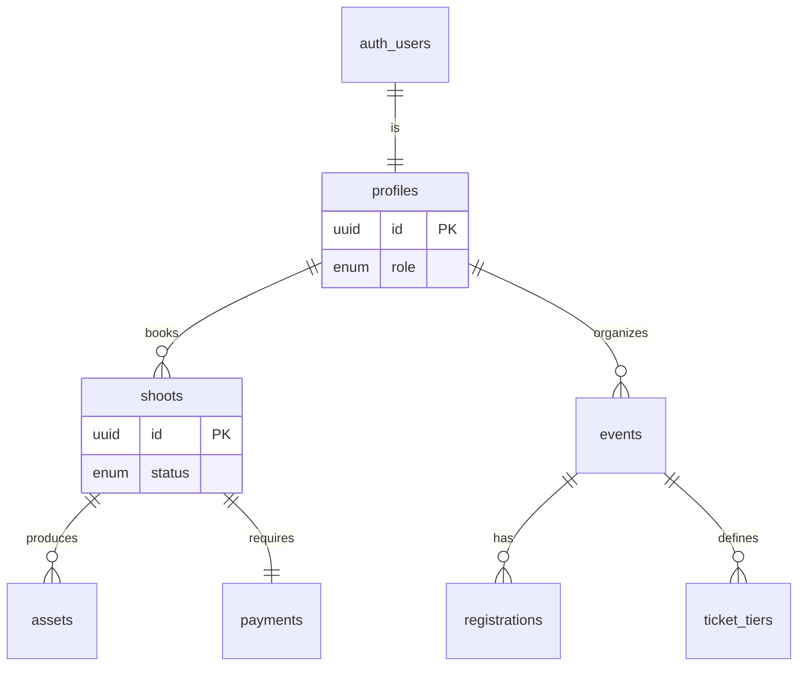
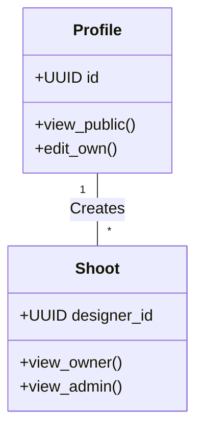

# 🪄 **Task 03: Shoot Database Schema**

**Status:** 🟢 Planned
**Priority:** P0
**Owner:** Backend / Database

---

## **1. Context Summary**

This module defines the data structure for the **Booking System**, **Events**, and **Directory**.
It creates the Supabase tables, enums, and RLS policies required to store bookings, user profiles, and production assets.
It is the foundational layer for `Task 01`, `Task 05`, and `Task 07`.

---

## **2. Prerequisites (Reuse First)**

1.  Supabase Project (initialized).
2.  Supabase SQL Editor.
3.  `uuid-ossp` extension.

---

## **3. Multistep Development Prompts**

### **Iteration 1 — Core Identity & Directory**

**Goal:** User Roles and Public Profiles.
**Prompt:**
1.  Enable `uuid-ossp`.
2.  Create `user_role` enum (`designer`, `model`, `admin`).
3.  Create `profiles` table (extends `auth.users`).
4.  Create `designer_profiles` and `model_profiles` tables for the Directory.
5.  Enable RLS: "Profiles viewable by everyone, editable by owner".

### **Iteration 2 — Shoot Bookings (Transactional)**

**Goal:** The Booking Engine.
**Prompt:**
1.  Create Enums: `shoot_type`, `shoot_status` (`draft`, `confirmed`, `shooting`).
2.  Create `studios` table (Venues).
3.  Create `shoots` table (The main booking record).
4.  Create `payments` table (Financial audit trail).
5.  RLS: "Designers view own shoots", "Admins view all".

### **Iteration 3 — Event & Assets**

**Goal:** Event Management & Media.
**Prompt:**
1.  Create `events` table (Runways/Popups).
2.  Create `ticket_tiers` and `registrations` tables.
3.  Create `assets` table (Media storage metadata).
4.  RLS: "Public view published events", "Organizer manage own events".

---

### **Success Criteria for This Task**

*   [ ] All tables created with correct Foreign Keys.
*   [ ] Enums used for status fields to prevent invalid states.
*   [ ] RLS policies prevent data leaks (User A cannot see User B's shoot).
*   [ ] Indexes created for common queries (`designer_id`, `status`).

---

### **Production-Ready Checklist**

*   [ ] SQL migration file saved.
*   [ ] `on delete cascade` used appropriate (e.g., deleting a shoot deletes its assets).
*   [ ] Timestamps (`created_at`, `updated_at`) auto-managed.
*   [ ] Policies tested with mock users.

---

## **4. Architecture & Data Flow**

### ✔ ERD (Entity Relationship Diagram)

### ✔ Class Diagram (RLS Logic)

