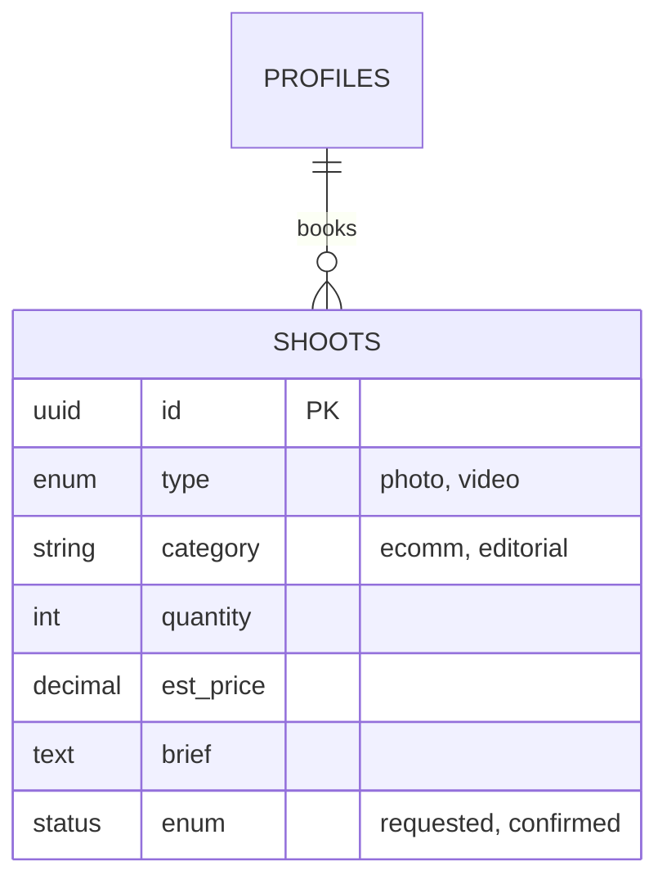
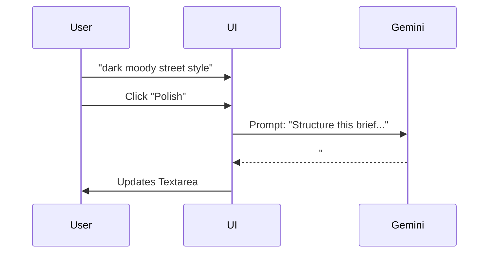

# 🪄 **Task 04: Service Booking Wizard (The Shoot Flow)**

**Status:** 🟢 Planned
**Priority:** P0
**Owner:** Frontend / Business Logic

---

## **1. Context Summary**

This is the "Airbnb" engine of FashionOS. It resides at `/start-project`.
It allows Brands/Designers to book **Photography, Video, or Web Services**.
It standardizes the briefing process using AI, calculates estimated costs, and creates a "Draft Booking" in the database.

---

## **2. Prerequisites (Reuse First)**

1.  `layouts/PublicLayout.tsx` — Public header/footer
2.  `components/Button.tsx` — Standard UI
3.  `components/FadeIn.tsx` — Animations
4.  Gemini: `text-generation` (Brief Polish)
5.  Supabase: `shoots` table (See Task 03 Schema)

---

## **3. Multistep Development Prompts**

### **Iteration 1 — Visual Selection (Service & Category)**

**Goal:** Scope Definition
**Prompt:**
1.  Create `pages/public/StartProjectPage.tsx`.
2.  **Step 1:** 3-Card Grid (Photography, Video, Web).
3.  **Step 2:** Visual Grid based on Step 1 (e.g., if Photo selected -> Ecomm, Editorial, Campaign).
4.  Use high-quality unsplash images for category backgrounds.

### **Iteration 2 — Scope & Calculator**

**Goal:** Pricing Transparency
**Prompt:**
1.  **Step 3:** Number Input (Looks / Seconds / Pages).
2.  **Sidebar:** Sticky "Estimated Cost" panel.
    *   Logic: `Base Fee + (Quantity * Unit Price)`.
    *   Update real-time as user changes quantity.

### **Iteration 3 — AI Briefing**

**Goal:** Quality Inputs
**Prompt:**
1.  **Step 4:** Creative Brief Textarea.
2.  Add "✨ AI Polish" button.
3.  **Gemini Logic:** "Rewrite this brief to be professional and structured. Add headings: Concept, Mood, Tech Specs."
4.  Replace textarea content with AI output.

### **Iteration 4 — Submission**

**Goal:** Database Write
**Prompt:**
1.  **Step 5:** Review Summary.
2.  "Confirm Booking" button.
3.  Action: Insert into `shoots` table with `status: 'requested'`.
4.  Redirect to `/dashboard/bookings` (requires Auth check, or "Guest Checkout" flow).

---

### **Success Criteria for This Task**

*   [ ] Pricing calculator accurate based on Service Type
*   [ ] AI Polish button improves text quality
*   [ ] Data persists between steps
*   [ ] Database record created on submit

---

### **Production-Ready Checklist**

*   [ ] Component reuse verified
*   [ ] Schema validated (Zod)
*   [ ] Supabase RLS confirmed
*   [ ] Mobile layout tested (Sidebar becomes Bottom Sheet)

---

## **4. Architecture & Data Flow**

### ✔ User Journey (Booking)

```mermaid
graph LR
    A[Start Project] --> B[Select Photo/Video]
    B --> C[Select Category]
    C --> D[Input Quantity]
    D --> E[Write Brief (AI Assist)]
    E --> F[Review Quote]
    F --> G[Submit to DB]
```

### ✔ ERD (Shoot Record)



### ✔ Sequence Diagram (AI Polish)


