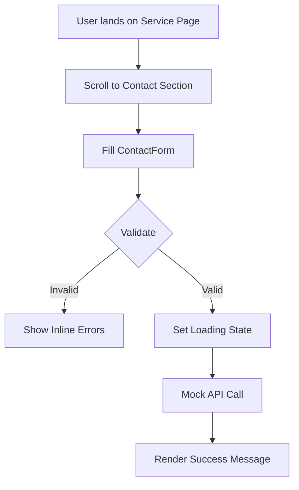

# Task 05: Functional Marketing Forms

**Status:** Planned  
**Priority:** P2  
**Owner:** Frontend  

## 1. Context Summary
The marketing pages (`PhotographyPage`, `VideoProductionPage`, `SocialPage`) contain static HTML forms. These need to be converted into React components with state management, validation, and mock submission handling. This serves as a lighter lead-gen alternative to the full Booking Wizard (Task 04).

## 2. Multistep Development Prompt

### Iteration 1: Reusable Form Component
1.  **Component:** Create `components/forms/ContactForm.tsx`.
2.  **Props:** `title`, `serviceType` (hidden field), `onSubmit` handler.
3.  **Fields:** Name, Email, Company, Budget Range (Dropdown), Message (Textarea).
4.  **Styling:** Match the existing premium aesthetic (minimal borders, lots of whitespace).

### Iteration 2: Validation & State
1.  **State:** Use `useState` or a library like `react-hook-form`.
2.  **Validation:**
    *   Email must be valid format.
    *   Message cannot be empty.
3.  **Feedback:** Show inline error messages in red text below fields.

### Iteration 3: Submission Logic
1.  **Handler:** Implement `handleSubmit`.
2.  **Loading:** Show spinner on button while "submitting".
3.  **Success:** Replace form with a "Thank You" success message/card upon completion.
4.  **Integration:** Replace the hardcoded forms in `PhotographyPage.tsx` etc., with this new component.

## 3. Success Criteria
- [ ] Form renders correctly on all Service pages.
- [ ] Clicking "Submit" without data triggers validation errors.
- [ ] Valid submission shows "Sending..." then "Success" state.
- [ ] No page reload on submit (SPA behavior).

## 4. Production Checklist
- **Spam Protection:** (Future) Add Captcha or Honeypot field.
- **Accessibility:** All inputs have associated `<label>` (visible or aria-label). Focus states are visible.
- **Error Handling:** If API fails (mock error), show "Something went wrong, please try again".

## 5. Testing Plan
1.  **Happy Path:** Fill all fields validly. Submit. Verify success message.
2.  **Validation:** Leave email empty. Submit. Verify "Email is required".
3.  **Edge Case:** Enter extremely long text in textarea. Verify UI doesn't break.

## 6. Diagrams

