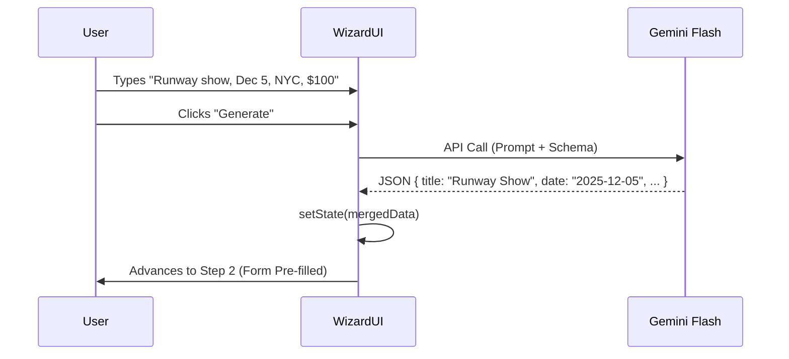

# 🪄 Task 02: Event Creation Wizard UI

**Status:** 🟢 Completed
**Priority:** P1  
**Owner:** Frontend / AI Engineer  

## ✅ Completed Prerequisites (Ready to Use)
The following components are **already built** and must be reused to ensure design consistency and speed:
1.  **`components/CalendarPicker.tsx`**: Complete date range logic. **Must use** for Step 3 (Venue/Date).
2.  **`components/events/EventCard.tsx`**: Fully styled. **Must use** for Step 6 (Review Preview).
3.  **`components/events/VeoTrailerGenerator.tsx`**: Functional. Use as a post-publish action or "Bonus" step.
4.  **`layouts/DashboardLayout.tsx`**: The container exists; this page lives at `/dashboard/events/new`.
5.  **`pages/public/StartProjectPage.tsx`**: **Visual Reference**. Copy the UX patterns from here (Sticky Footer, Progress Bar, large touch targets).

---

## 1. Context Summary
We need to build `EventWizard.tsx`. This is the "Creator Mode" for FashionOS. It replaces a static form with an AI-first experience where users can dump raw text ("Fashion show next friday $50 tickets") or URLs, and the system auto-fills the complex database fields.

**Target Route:** `/dashboard/events/new`

---

## 2. Multistep Development Prompts

### Iteration 1: Wizard Skeleton & State Machine
**Goal:** Create the container, navigation, and state management.
**Prompt:**
"Create `components/events/EventWizard.tsx`.
1.  **State:** Use a comprehensive state object matching the `events` table (Title, Date, Description, Location, TicketTiers[], Schedule[]).
2.  **Steps Enum:** `INTRO` (AI Chat), `BASICS` (Form), `VENUE` (Map/Date), `TICKETS` (Pricing), `REVIEW` (Card Preview).
3.  **Layout:**
    *   Top: Progress bar (reuse styles from `StartProjectPage`).
    *   Middle: Scrollable content area.
    *   Bottom: Sticky footer with 'Back' and 'Next' buttons.
4.  **Navigation:** Implement basic validation (e.g., disable Next if Title is empty on Basics step).
5.  **Route:** Add the route to `App.tsx`."

### Iteration 2: AI Chat Integration (The "Magic Input")
**Goal:** Parse natural language into structured state.
**Prompt:**
"Implement the `INTRO` step in `EventWizard.tsx`.
1.  **UI:** A large textarea with a '✨ Generate Draft' button.
2.  **Gemini Integration:**
    *   Initialize `GoogleGenAI` with `process.env.API_KEY`.
    *   Model: `gemini-2.5-flash`.
    *   **System Prompt:** 'You are an event planning assistant. Extract event details from the user input into JSON. Return fields: title, description, date (ISO), location, category (Runway, Party, Workshop), ticket_price_estimate.'
    *   **Schema:** Use `responseMimeType: 'application/json'` and a defined `responseSchema`.
3.  **Action:** On success, merge the returned JSON into the wizard state and auto-advance to `BASICS` step.
4.  **Loading:** Show a 'Analyzing...' spinner state."

### Iteration 3: Dynamic Form Steps (Tickets & Venue)
**Goal:** Handle complex arrays and reused components.
**Prompt:**
"Build the `TICKETS` and `VENUE` steps in `EventWizard.tsx`.
1.  **Venue:** Reuse `CalendarPicker` for the date selection. Add a text input for Location.
2.  **Tickets:**
    *   Create a dynamic list for Ticket Tiers.
    *   'Add Tier' button pushes `{ name: 'General', price: 0, quantity: 100 }` to array.
    *   Inputs for Name, Price, Quantity.
    *   Live Calc: Show 'Total Potential Revenue' (Sum of Price * Qty).
3.  **Schedule:** Simple list of 'Time' + 'Activity' inputs."

### Iteration 4: Review & Mock Submission
**Goal:** Visualize the result using existing assets.
**Prompt:**
"Implement the `REVIEW` step.
1.  **Visuals:** Render the existing `EventCard` component, passing the current wizard state as props to preview the listing.
2.  **Summary:** List the Ticket Tiers and estimated revenue below the card.
3.  **Submit:**
    *   'Publish Event' button.
    *   Action: `console.log` the final JSON payload.
    *   Redirect: `useNavigate` to `/dashboard/events`.
    *   Toast: 'Event Created Successfully'."

---

## 3. Architecture & Data Flow

### Sequence Diagram: AI Chat Flow

---

## 4. Production Checklist
- [x] **State Preservation:** If I go Back from Step 3 to 2, my data persists.
- [x] **Mobile:** Sticky footer sits correctly above mobile browser chrome.
- [x] **Error Handling:** If Gemini fails, allow manual entry (don't block the user).
- [x] **Types:** All state interfaces strictly defined in `types.ts`.
