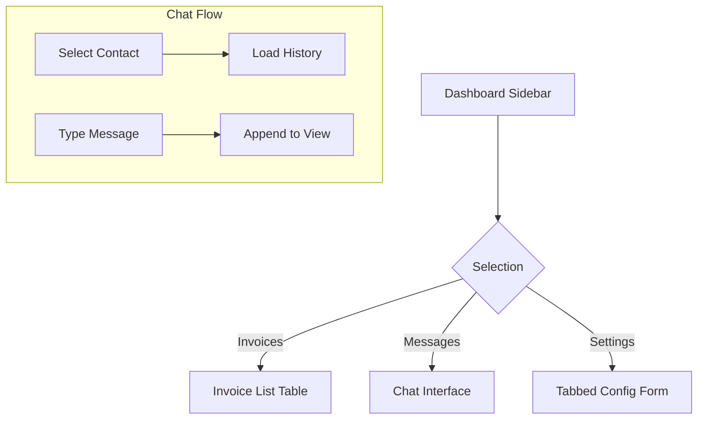

# Task: Dashboard Modules Expansion

**Status:** Planned  
**Priority:** P2  
**Owner:** Frontend  

## 1. Context Summary
Currently, the Dashboard has several placeholder routes (`DashboardPlaceholder`) for critical features like Invoices, Messages, Settings, Feedback, Social, and Directory CRM. These need functional UIs.

## 2. Multistep Development Prompt

### Iteration 1: Invoices & Financials
1.  **Component:** Create `pages/dashboard/DashboardInvoices.tsx`.
2.  **UI:** Table layout similar to `DashboardFinancials` but focused on documents.
3.  **Actions:** "Create Invoice" button (opens modal form), "Download PDF" (mock action).
4.  **Status:** Badges for "Paid", "Pending", "Overdue".

### Iteration 2: Messages (Inbox)
1.  **Component:** Create `pages/dashboard/DashboardMessages.tsx`.
2.  **Layout:** Two-column layout (Sidebar: Conversation List, Main: Chat Window).
3.  **Mock Data:** List of recent contacts (Models, Photographers).
4.  **Interaction:** Clicking a contact loads their chat history. "Send" button appends a new message bubble locally.

### Iteration 3: Settings & Profile
1.  **Component:** Create `pages/dashboard/DashboardSettings.tsx`.
2.  **Tabs:** Profile, Account, Notifications, Billing.
3.  **Forms:**
    *   Avatar upload (UI only).
    *   Input fields for Name, Title, Bio.
    *   Toggle switches for Email Notifications.

## 3. Success Criteria
- [ ] `DashboardPlaceholder` is removed from `App.tsx` for these routes.
- [ ] Invoices page lists mock invoices with status colors.
- [ ] Messages page allows selecting a conversation and "sending" a text.
- [ ] Settings page allows switching tabs and editing text inputs.
- [ ] All new pages inherit `DashboardLayout` structure.

## 4. Production Checklist
- **Empty States:** "No invoices found" or "No messages yet" screens.
- **Mobile:** Messages layout typically needs to switch views (List -> Chat) on mobile, not side-by-side.
- **Performance:** Chat lists can get long; consider virtualization if list > 100 items (future).

## 5. Testing Plan
1.  **Navigation:** Click Sidebar links. Verify correct page loads.
2.  **Mobile Check:** View Invoices table on mobile. Ensure it scrolls horizontally or stacks.
3.  **Input Check:** Type in chat box. Press Enter. Verify message appears.

## 6. Diagrams

