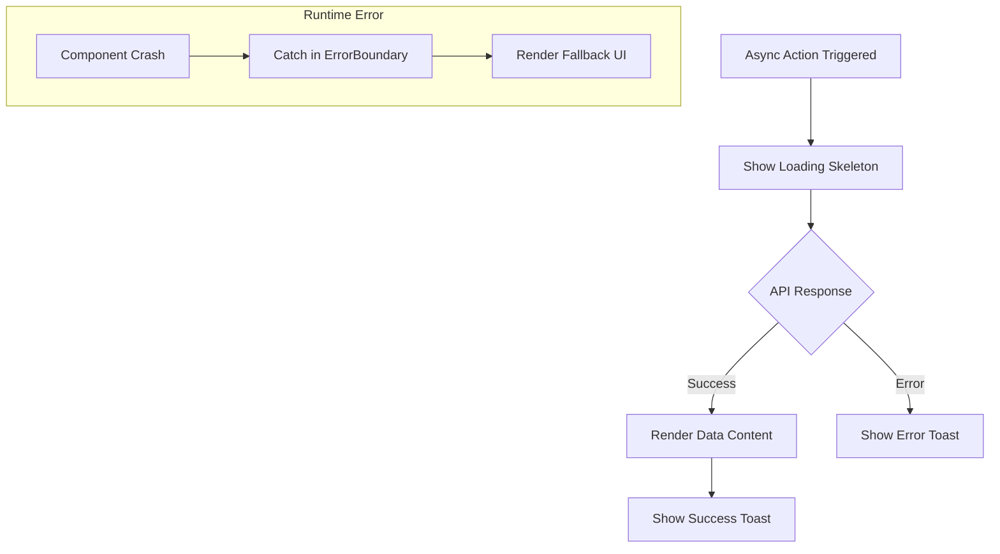

# Task: UI Polish & Reliability

**Status:** Planned  
**Priority:** P3  
**Owner:** Frontend / Design  

## 1. Context Summary
The app currently lacks global feedback mechanisms (Toasts), unified loading states (Skeletons), and safety nets (Error Boundaries). This task focuses on elevating the "feel" of the app to match its "Premium" visual design.

## 2. Multistep Development Prompt

### Iteration 1: Loading Skeletons
1.  **Component:** Create `components/ui/Skeleton.tsx`.
    *   Simple div with gray background and pulse animation (`animate-pulse`).
2.  **Implementation:**
    *   Create `EventCardSkeleton` (image box + text lines).
    *   Create `DashboardChartSkeleton` (box).
3.  **Usage:** Replace simple "Loading..." text in `DashboardOverview` and `EventsPage` with these skeletons during data fetch.

### Iteration 2: Toast Notifications
1.  **Library:** Install `react-hot-toast` or build a simple Context-based Toaster.
2.  **Global Provider:** Wrap `App.tsx`.
3.  **Usage:** Trigger toasts on:
    *   Form submission success ("Message Sent!").
    *   Event creation ("Draft Saved").
    *   Auth errors ("Login Failed").

### Iteration 3: Error Boundaries
1.  **Component:** Create `components/ui/ErrorBoundary.tsx`.
2.  **UI:** A friendly "Something went wrong" screen with a "Reload Page" button.
3.  **Usage:** Wrap top-level Routes or major Dashboard modules to prevent white-screen crashes.

## 3. Success Criteria
- [ ] Skeletons appear while data is "loading" (simulate with `setTimeout`).
- [ ] Toast appears at top-right or bottom-center when actions occur.
- [ ] App does not crash completely if a component throws an error; fallback UI is shown.

## 4. Production Checklist
- **Performance:** Toast library should be lightweight.
- **Visuals:** Skeletons should match the dimensions of the content they replace to minimize layout shift (CLS).
- **Consistency:** All success messages use Green, errors use Red, info uses Blue/Gray.

## 5. Testing Plan
1.  **Load Test:** Artificial delay in data fetch. Verify Skeletons breathe/pulse.
2.  **Toast Test:** Trigger a toast. Verify it auto-dismisses after 3-5 seconds.
3.  **Crash Test:** Intentionally throw an error in a child component. Verify Error Boundary catches it.

## 6. Diagrams

