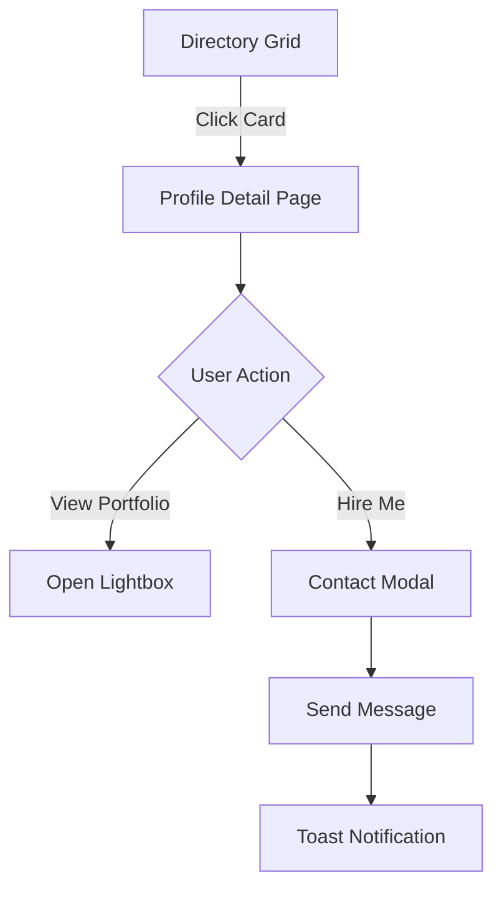

# Task: Directory Profiles & Advanced Search

**Status:** Planned  
**Priority:** P1  
**Owner:** Frontend  

## 1. Context Summary
The `DirectoryPage` currently displays a static grid of mock cards. We need to turn this into a functional talent network with individual profile pages, detailed portfolios, and a working search/filter engine.

## 2. Multistep Development Prompt

### Iteration 1: Profile Detail View
1.  **Route:** Add `/directory/:id` to `App.tsx`.
2.  **Page Component:** Create `pages/public/ProfileDetailPage.tsx`.
3.  **UI Structure:**
    *   **Header:** Large cover image, Avatar, Name, Role, Location, "Hire Me" button.
    *   **Stats:** Rating, Reviews Count, Response Time.
    *   **Portfolio Grid:** Masonry layout of high-res images.
    *   **About:** Bio text and specialized tags (e.g., "Sustainable", "Film Photography").
4.  **Navigation:** Update `DirectoryPage` cards to link to this new route.

### Iteration 2: Search & Filter Logic
1.  **State:** Lift filter state (Category, Location, Price) to a custom hook `useDirectoryFilter`.
2.  **Search Bar:** Implement text search that filters the mock `DIRECTORY_ITEMS` array by name or role.
3.  **Filter Sidebar:** Create a responsive sidebar (desktop) / drawer (mobile) for:
    *   Role (Checkbox list)
    *   Location (Dropdown)
    *   Rate (Range slider)
4.  **Empty State:** Design a "No creatives found" state with a "Reset Filters" button.

### Iteration 3: Connection Flow
1.  **"Hire Me" Action:**
    *   Clicking "Hire Me" or "Message" on a profile should open a modal.
    *   **Modal Content:** Simple contact form (Subject, Message, Budget).
2.  **Feedback:** Show a success toast "Message Sent to [Name]" after submission.

## 3. Success Criteria
- [ ] Clicking a card on `/directory` opens the correct profile details.
- [ ] Profile page shows unique data (Name, Images) for that ID.
- [ ] Search bar allows finding "Elena" or "Photographer".
- [ ] "Hire Me" button opens a contact interaction.
- [ ] Mobile view stacks the profile layout correctly (Header -> Actions -> Portfolio).

## 4. Production Checklist
- **SEO:** (Future) Dynamic `<title>` and `<meta>` tags based on the profile name.
- **Performance:** Image optimization for the portfolio grid (lazy loading).
- **Data:** Ensure fallback if a profile ID doesn't exist (404 page).

## 5. Testing Plan
1.  **Navigation Test:** Go to Directory -> Click Card -> Verify URL is `/directory/1` -> Verify Name matches.
2.  **Search Test:** Type "Model". Verify only models are shown. Type "Gibberish". Verify empty state.
3.  **Responsiveness:** Check Profile Page on mobile. Ensure "Hire Me" is easily tappable.

## 6. Diagrams

